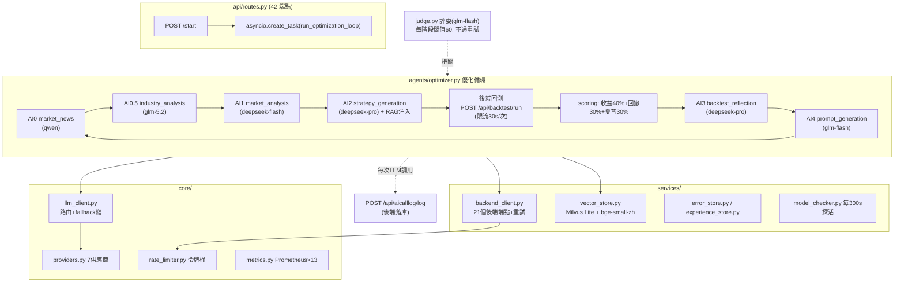
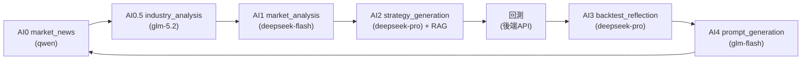
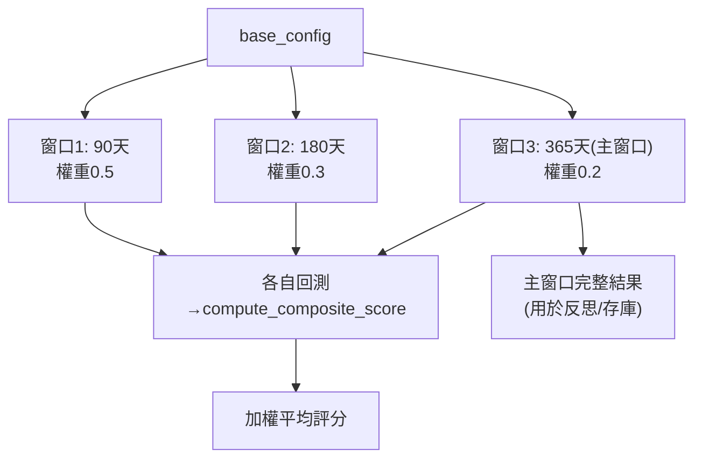
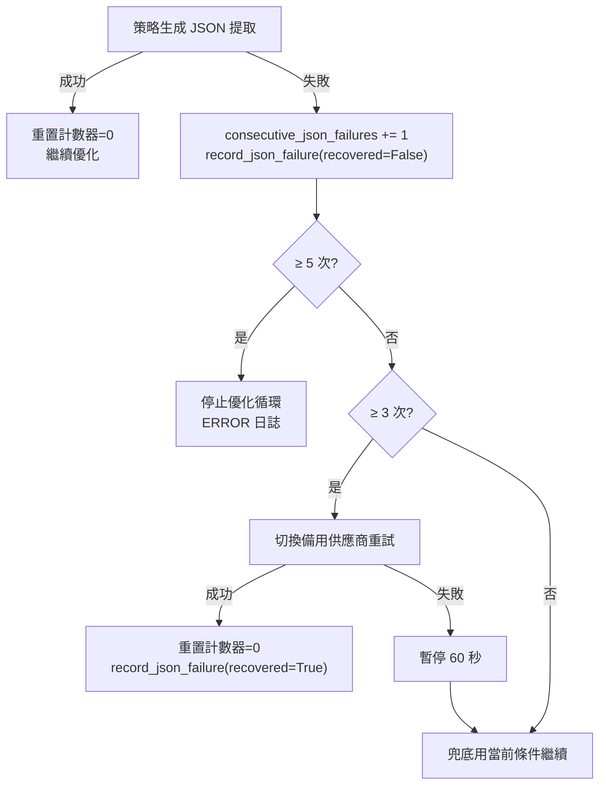
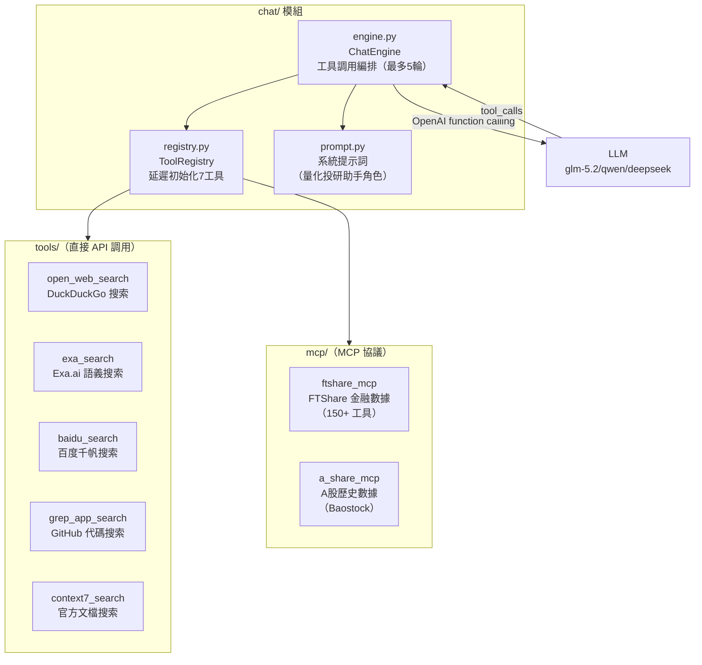

# Agent 服務專題（LLM 路由與優化循環 + AI 聊天 + 數據質量）

> 對應代碼：`agent/app/`
> 服務：FastAPI，端口 8100，前綴 `/api/agent`，Swagger `:8100/docs`
> 定位：無人值守的選股策略自動優化循環——用多個 LLM 分工生成/反思策略，用後端回測 API 驗證，用向量庫記憶經驗。
> **新增**：AI 聊天引擎（`agent/app/chat/`）— ToolCalling + 8 工具 + SSE 流式 + 思考動畫，為前端懸浮聊天卡片提供投研問答能力。
> **新增**：數據質量監控（`agent/app/services/data_quality.py`）— 10 條 SQL 規則 + AI 總結，零幻覺風險。
> **新增**：本地市場數據工具（`agent/app/chat/tools/local_market_data.py`）— AI 聊天優先查詢本地數據庫。

---

## 1. 架構



**技術棧**：FastAPI + LangGraph 風格優化循環（6 個 AI stage 串聯 + 評委把關）、多模型 LLM 路由、向量庫 RAG 記憶、Prometheus 可觀測性。

---

## 2. LLM 供應商（7 個）

完整定義見 `core/providers.py:37-128`。

| ID | 顯示名稱 | 模型 ID | 價格 in/out ($/1M tok) | 特性 | 接入方式 |
|----|----------|---------|------------------------|------|----------|
| `deepseek-pro` | DeepSeek V4-Pro | `deepseek-reasoner` | 0.44 / 0.87 | 推理最強 | OpenAI 兼容 |
| `deepseek-flash` | DeepSeek V4-Flash | `deepseek-chat` | 0.14 / 0.28 | 性價比 | OpenAI 兼容 |
| `glm-5.2` | GLM-5.2 | `glm-5.2` | 0.55 / 1.85 | JSON 最穩 | OpenAI 兼容 |
| `glm-flash` | GLM-4.5-Flash | `glm-4.5-flash` | **免費** | 快 | OpenAI 兼容 |
| `qwen` | Qwen3.6 | `qwen-plus` | 0.33 / 1.95 | 中文金融 | OpenAI 兼容 |
| `qoder` | Qoder Lite | `qoder-lite` | 免費 | 無 JSON 模式 | SDK |
| `devin` | Devin GLM-5.2-High | `glm-5.2-high` | 免費 | 高延遲（輪詢最多 72s） | session API |

### 2.1 路由決策樹（`llm_client.py`）

```
1. 用戶指定（POST /providers/stage {stage, provider}）→ 用之
2. 階段默認（STAGE_DEFAULT_PROVIDERS）→ 用之
3. 自動鏈（免費 OpenAI 兼容 > 付費 OpenAI 兼容 > SDK/session）：
   glm-flash → deepseek-flash → qwen → glm-5.2 → deepseek-pro → qoder → devin
任一步失敗 → 沿自動鏈 fallback，記 agent_llm_fallback_total
```

### 2.2 階段默認映射（`providers.py:133-142`）

| 階段 | 默認供應商 | 理由 |
|------|-----------|------|
| `market_news` | qwen | 中文金融文本 |
| `industry_analysis` | glm-5.2 | JSON 穩定 |
| `market_analysis` | deepseek-flash | 性價比 |
| `strategy_generation` | **deepseek-pro** | 最關鍵，推理最強 |
| `backtest_reflection` | **deepseek-pro** | 深度推理 |
| `prompt_generation` / `judge` / `monitor` | glm-flash | 免費夠用 |

超時：Pro 模型 120s、其他 60s；JSON 模式按供應商能力啟用；不支持流式。

---

## 3. 優化循環（6 個 AI stage）

完整編排見 `agents/optimizer.py:312-833`，LangGraph 風格串聯 6 個 AI stage + 評委把關。



### 3.1 各 stage 詳解（`optimizer.py:402-681`）

| 階段 | 輸入 | 輸出 | 格式 | 代碼行 |
|------|------|------|------|--------|
| AI0 market_news | 實時市場數據、板塊表現、財經新聞、歷史迭代 | market_regime / sentiment / 多空因素 | JSON | `:406-413` |
| AI0.5 industry_analysis | AI0 結果、行業列表、行業股票代碼 | favorable_industries + filtered_codes | JSON | `:418-433` |
| AI1 market_analysis | 市場數據、多日形態、上輪反思 | 市場形態/趨勢/波動率/策略類型 | 自然語言 | `:438-449` |
| AI2 strategy_generation | AI1 + 當前條件 + RAG top3 經驗 | reasoning + criteria（49 字段） | JSON | `:474-486` |
| （回測） | criteria + config → 後端 | BacktestResultDto → 綜合評分 | — | `:607-648` |
| AI3 backtest_reflection | 回測統計、評分、條件、市場環境 | 優缺點/收益來源/改進方向 | 自然語言 | `:653-664` |
| AI4 prompt_generation | 反思、統計、評分 | 下輪調整指引 | 自然語言 | `:670-681` |

每階段輸出經 **judge**（7 維規則+LLM、閾值 60、強制 binary 判斷）把關，不通過則重試（`max_attempts=2`）。

### 3.2 評分與收斂

**綜合評分**（`scoring.py`）：`收益 35% + 回撤控制 25% + 夏普 20% + 超額收益 10% + 交易活躍度 10%`

```python
return_score = min(max(total_return * 2, -50), 100)      # 正收益 0-100，負收益 -50-0
drawdown_score = max(100 - max_drawdown * 2, 0)           # 回撤 0%=100分，50%+=0分
sharpe_score = min(max(sharpe * 25 + 50, 0), 100)         # 夏普 0=50分，2+=100分
excess_score = min(max(excess_return * 3, -30), 100)      # 超額收益（相對基準 alpha），正 0-100，負 -30-0
trade_score = min(total_trades * 10, 100)                 # 交易活躍度：0 筆=0分（懲罰空倉），≥10 筆=100 分
composite = return_score * 0.35 + drawdown_score * 0.25 + sharpe_score * 0.20 + excess_score * 0.10 + trade_score * 0.10
```

> **新增維度**（避免「假穩健」空倉策略被獎勵）：
> - **超額收益（excessReturn）**：相對基準的 alpha，鼓勵主動管理貢獻
> - **交易活躍度（totalTrades）**：0 筆交易 = 0 分，懲罰通過不交易來規避回撤的空倉策略

**探索策略**（`optimizer.py:738-769`）：
- 本輪 ≥ best → 以本輪為新起點
- 本輪 < best → **回退 best_criteria** 重新探索（防漂移，但可能困於局部最優）

**狀態持久化**：checkpoint 落 `data/optimizer_checkpoint.json`，重啟可恢復；內存迭代列表上限 100 輪（`:704-709`）。

---

## 4. 多窗口評分（Phase 5 新增）

啟用 `multi_window_backtest=true` 時，用 3 個不同時間窗口回測取加權均值，降低單一窗口隨機性。

### 4.1 窗口與權重（`optimizer.py:143-146`）

```python
MULTI_WINDOW_DAYS = [90, 180, 365]        # 短/中/長窗口（天）
MULTI_WINDOW_WEIGHTS = [0.5, 0.3, 0.2]    # 權重（短窗權重最高）
```

### 4.2 加權計算（`optimizer.py:149-165`）

```python
def _weighted_average_score(scores, weights):
    weighted = sum(s * w for s, w in zip(scores, weights))
    return round(weighted / sum(weights), 2)
```

### 4.3 窗口配置構建（`optimizer.py:168-191`）

`_build_window_config(base_config, days)` 以 `endDate` 為基準，將 `startDate` 回推 `days` 天，保留其餘配置不變。

### 4.4 多窗口回測執行（`optimizer.py:194-222`）



- 對 3 個窗口分別調用 `backend_client.run_backtest()`
- 各窗口用 `compute_composite_score()` 計算評分
- 加權平均得到最終評分
- **主窗口**（365 天，最長窗口）的完整回測結果用於後續反思和存庫

### 4.5 在循環中的應用（`optimizer.py:614-623`）

```python
if settings.multi_window_backtest:
    composite_score, backtest_result = await _run_multi_window_backtest(
        new_criteria, state.current_config
    )
else:
    backtest_result = await backend_client.run_backtest(new_criteria, state.current_config)
    composite_score = compute_composite_score(backtest_result.get("statistics", {}))
```

---

## 5. Stagnant 終止（Phase 5 新增）

連續 N 輪無實質進展時自動停止優化循環，避免空轉燒 token。

### 5.1 配置

| 配置項 | 默認 | 說明 |
|--------|------|------|
| `max_stagnant_iterations` | `0`（不限制） | 連續無進展自動停止閾值（`config.py:50`） |
| `STAGNANT_SCORE_DELTA_THRESHOLD` | `1.0` | Δscore 低於此值視為「無實質進展」（`optimizer.py:146`） |

### 5.2 檢測邏輯（`optimizer.py:728-735`）

```python
delta_score = composite_score - state.best_score
if delta_score < STAGNANT_SCORE_DELTA_THRESHOLD:   # < 1.0
    stagnant_count += 1
else:
    stagnant_count = 0                              # 有進展則重置
```

### 5.3 終止檢查（`optimizer.py:776-784`）

```python
if settings.max_stagnant_iterations > 0 and stagnant_count >= settings.max_stagnant_iterations:
    state.status_message = f"連續 {stagnant_count} 輪無進展，優化循環已自動停止"
    break
```

> **注意**：`delta_score` 需在 `best_score` 更新前計算（`:731` 註釋強調），否則本輪成為新最佳時 delta=0 會誤計為無進展。

---

## 6. JSON 失敗保護（Phase 4 新增 P4-7）

防止 LLM 持續返回無效 JSON 導致空轉燒 token。三級保護機制（`optimizer.py:381-398, 495-598`）：

| 閾值 | 常量 | 默認值 | 行為 | 代碼行 |
|------|------|--------|------|--------|
| 連續失敗 ≥ 3 次 | `_JSON_FAILURE_WARN_THRESHOLD` | 3 | 切換備用供應商重試策略生成 | `:531-583` |
| 備用也失敗 | `_JSON_FAILURE_PAUSE_SECONDS` | 60 秒 | 暫停 60 秒後繼續下一輪 | `:586-598` |
| 連續失敗 ≥ 5 次 | `_JSON_FAILURE_STOP_THRESHOLD` | 5 | 停止優化循環 | `:520-528` |

### 6.1 流程



### 6.2 備用供應商選擇（`optimizer.py:293-309`）

`_pick_backup_provider()` 選擇與當前 `strategy_generation` 供應商不同的備用，優先 JSON 穩定的免費供應商（glm-flash），其次按降級鏈順序。

### 6.3 Prometheus 指標

`agent_json_failure_total`（`metrics.py:196-198`），標籤 `stage` 和 `recovered`（true/false）：

```
agent_json_failure_total{recovered="false",stage="strategy_generation"} 3
agent_json_failure_total{recovered="true",stage="strategy_generation"} 1
```

---

## 7. services 層

### 7.1 backend_client.py
- 調用後端 21 個端點；screener/backtest 600s 超時，讀類 5-30s
- 重試：3 次指數退避（1/2/4s），僅 5xx 與網絡錯誤重試
- 每次請求先過 `rate_limiter.acquire(endpoint)`——**令牌桶**：回測 1 次/30s、選股 1 次/5s、讀 5 次/s
- 每次 LLM 調用結果回寫 `POST /api/aicalllog/log`（fire-and-forget）

### 7.2 vector_store.py（RAG 經驗庫）
- Embedding：`BAAI/bge-small-zh-v1.5`（512 維中文，~95MB，首次啟動自動下載）
- 存儲：**Milvus Lite 嵌入式**（`data/milvus_lite.db`，無需獨立服務）
- 檢索：COSINE，top_k=3，min_similarity=0.3，且只召回達標的**成功經驗**
- 去重：內容哈希精確去重 + 相似度 ≥0.98 近似去重；上限 1000 條
- **Collection 自動載入**：`_ensure_collection()` 在 collection 已存在時自動調用 `load_collection()`，解決長時間空閒後 collection 被 release 導致 search 失敗的問題

### 7.3 其他
- `error_store.py`：`data/error_experiences.json`（200 條上限）
- `model_checker.py`：APScheduler 每 300s 探活全供應商
- `charter.py`：Agent 憲章（第一輪全文，後續輪摘要防上下文爆炸）
- `safety.py`：攔截投資建議措辭、檢測 prompt injection、加免責聲明
- `monitor.py` / `monitor_ai.py`：節點生命週期 AOP 監控→告警

### 7.4 wallstreetcn_client.py（華爾街見聞新聞抓取）
- 數據來源：華爾街見聞（wallstreetcn.com）公開 API，**無需 API Key**
- API 端點：
  - 最新文章：`https://api-one-wscn.awtmt.com/apiv1/content/information-flow?channel=global&accept=article&limit=10`
  - 頭條文章：`https://api-one-wscn.awtmt.com/apiv1/content/carousel/information-flow?channel=global&limit=10`
  - 熱文：`https://api-one-wscn.awtmt.com/apiv1/content/articles/hot?period=all`
  - 搜索：`https://api-one-wscn.awtmt.com/apiv1/search/article?query={keyword}&limit=10`
  - 7x24 快訊：`https://api-one.wallstcn.com/apiv1/content/lives?channel={channel}&limit=200`
- 頻道：`global-channel`（全球）、`a-stock-channel`（A股）、`us-stock-channel`（美股）、`forex-channel`（外匯）、`commodity-channel`（商品）、`hk-stock-channel`（港股）
- 數據清洗：去 HTML 標籤、規範化日期、提取摘要
- 來源標注：所有新聞標注來源為「華爾街見聞」，引用格式：`華爾街見聞，[標題]，[YYYY-MM-DD]，https://wallstreetcn.com/articles/[id]`
- 自動降級：API 不可用時返回空列表，不影響優化循環

### 7.5 news_store.py（財經新聞存儲/檢索）
- **MySQL + Milvus 向量庫雙寫**
- MySQL：寫入 `financial_news` 表（URI 去重，`ON DUPLICATE KEY UPDATE` 語義）
- Milvus：寫入 `financial_news_vectors` collection
  - 每篇文章 = 1 個向量（embed = 標題 + 摘要 + 關鍵實體）
  - metadata：日期/來源/頻道/URL/URI
  - HNSW 索引 + COSINE 距離
  - 30 天 TTL（自動清理過期新聞）
  - 最多保留 10000 條向量（`NEWS_MAX_VECTORS`）
- 與 `vector_store.py` 共享 embedding 模型（`BAAI/bge-small-zh-v1.5`，避免重複載入）
- 自動降級：Milvus/MySQL 不可用時靜默跳過，不影響優化循環
- 配置項：`NEWS_TTL_DAYS=30`、`NEWS_MAX_VECTORS=10000`

### 7.6 market_news.py 階段集成
- `market_news` 階段調用 `_fetch_wallstreetcn_news()`，策略：
  1. 優先從向量庫語義檢索與當前市場環境相關的新聞
  2. 若向量庫不可用或無數據，直接抓取最新 A 股新聞
  3. 按強弱勢行業關鍵詞補充搜索
- 構建市場環境查詢文本：指數表現 + 強勢/弱勢行業
- 所有失敗靜默處理，返回空字符串不影響優化循環

---

## 8. 可觀測性

### 8.1 Prometheus 指標（`GET /api/agent/metrics`，`core/metrics.py`）

共 **13 個指標**：

| 指標 | 類型 | 標籤 |
|------|------|------|
| `agent_optimization_iterations_total` | Counter | — |
| `agent_optimization_score` | Gauge | — |
| `agent_optimization_current_iteration` | Gauge | — |
| `agent_stage_duration_seconds` | Histogram | stage |
| `agent_stage_judge_score` | Gauge | stage |
| `agent_llm_calls_total` | Counter | provider, model |
| `agent_llm_duration_seconds` | Histogram | provider, model |
| `agent_llm_fallback_total` | Counter | provider |
| `agent_rag_operations_total` | Counter | operation, status |
| `agent_rag_search_duration_seconds` | Histogram | — |
| `agent_backend_calls_total` | Counter | endpoint |
| `agent_backend_errors_total` | Counter | endpoint |
| `agent_backend_retry_total` | Counter | endpoint |
| **`agent_json_failure_total`** | Counter | stage, recovered |

配套：`docs/prometheus.yml`（scrape 配置）+ `docs/grafana-agent-dashboard.json`（現成儀表盤）。

### 8.2 三層日誌
1. Prometheus 指標（聚合視角）
2. `ai_call_log` 表（每次 LLM 調用全文，前端 /agent-dashboard 可視化）
3. monitor 事件流（`GET /monitor/events`，時間軸/Gantt）

---

## 9. API 端點

完整 26 個端點（`api/routes.py`），前綴 `/api/agent`：

| 方法 | 路徑 | 說明 |
|------|------|------|
| `POST` | `/api/agent/start` | **啟動優化循環**（可攜帶初始 criteria/config） |
| `POST` | `/api/agent/stop` | 停止優化循環 |
| `GET` | `/api/agent/status` | 當前優化狀態 |
| `GET` | `/api/agent/history` | 歷史迭代列表 |
| `GET` | `/api/agent/history/{iteration}` | 指定迭代詳情 |
| `POST` | `/api/agent/criteria` | 更新選股條件 |
| `GET` | `/api/agent/criteria` | 當前選股條件 |
| `POST` | `/api/agent/config` | 更新回測配置（校驗日期範圍） |
| `GET` | `/api/agent/data-range` | 數據庫日期範圍 |
| `GET` | `/api/agent/health` | 健康檢查（後端/LLM/RAG/限流） |
| `GET` | `/api/agent/metrics` | **Prometheus 指標端點** |
| `POST` | `/api/agent/model/check` | 觸發模型探活 |
| `GET` | `/api/agent/providers` | 供應商列表+狀態 |
| `POST` | `/api/agent/providers/stage` | 設置階段供應商 |
| `POST` | `/api/agent/providers/stage/reset` | 重置階段供應商 |
| `GET` | `/api/agent/monitor` | 監控概覽 |
| `GET` | `/api/agent/monitor/events` | 監控事件流 |
| `GET` | `/api/agent/monitor/timeline` | 時間軸 |
| `GET` | `/api/agent/monitor/errors` | 錯誤記錄 |
| `GET` | `/api/agent/monitor/analyze` | AI 分析異常 |
| `POST` | `/api/agent/monitor/alerts/{id}/resolve` | 解決告警 |
| `GET` | `/api/agent/news/search` | 新聞搜索 |
| `POST` | `/api/agent/news/sync` | **觸發華爾街見聞新聞同步**（抓取 + MySQL + Milvus） |
| `GET` | `/api/agent/news/wallstreetcn/search` | 華爾街見聞搜索（實時，不入庫） |
| `GET` | `/api/agent/news/wallstreetcn/latest` | 華爾街見聞最新新聞（實時，不入庫） |
| `POST` | `/api/agent/news/vector-search` | 向量庫語義檢索新聞（需 Milvus） |

> **啟動優化**：`POST /api/agent/start`（`routes.py:135-172`）即為優化循環入口，可攜帶 `criteria` 和 `config`，日期會校驗是否在數據庫覆蓋範圍內。

---

## 10. 配置（agent/.env）

完整清單見 `agent/.env.example`，配置類 `core/config.py:26-77`：

| 組 | 變量 | 默認 | 說明 |
|----|------|------|------|
| **LLM 密鑰** | `DEVIN_API_KEY` | "" | Devin session API |
| | `QODER_PERSONAL_ACCESS_TOKEN` | "" | Qoder SDK |
| | `DEEPSEEK_API_KEY` | "" | DeepSeek V4-Pro/Flash |
| | `GLM_API_KEY` | "" | GLM-5.2/4-Flash |
| | `QWEN_API_KEY` | "" | Qwen3.6 |
| **聊天工具** | `EXA_API_KEY` | "" | Exa.ai 語義搜索（每日 150 次免費） |
| | `BAIDU_QIANFAN_API_KEY` | "" | 百度千帆 AI 搜索 |
| | `FTSHARE_MCP_URL` | `https://market.ft.tech/gateway/mcp` | FTShare MCP 服務地址（無需 Key） |
| | `A_SHARE_MCP_URL` | `http://localhost:8101/mcp` | a-share-mcp 服務地址（需本地啟動） |
| **後端** | `BACKEND_API_URL` | `http://localhost:8090/TradingWorkstation` | **帶前綴** |
| | `BACKEND_TIMEOUT` | 600 | 後端調用超時（秒） |
| | `BACKEND_MAX_RETRIES` | 3 | 最大重試次數 |
| **循環** | `OPTIMIZATION_INTERVAL` | 5 | 優化循環間隔（秒） |
| | `MAX_ITERATIONS` | 0 | 最大迭代次數，0=無限 |
| | `MODEL_CHECK_INTERVAL` | 300 | 模型檢查間隔（秒） |
| | **`MAX_STAGNANT_ITERATIONS`** | 0 | 連續無進展停止閾值，0=不限制（Phase 5） |
| | **`MULTI_WINDOW_BACKTEST`** | false | 多窗口回測評分（Phase 5） |
| **限流** | `RATE_LIMIT_BACKTEST` | 0.033 | 回測 1 次/30s |
| | `RATE_LIMIT_SCREENER` | 0.2 | 選股 1 次/5s |
| | `RATE_LIMIT_READ` | 5.0 | 讀 5 次/s |
| **RAG** | `EMBEDDING_MODEL` | `BAAI/bge-small-zh-v1.5` | 中文 embedding |
| | `RAG_TOP_K` | 3 | 檢索返回數量 |
| | `RAG_MIN_SIMILARITY` | 0.3 | 最低相似度 |
| **新聞** | `NEWS_TTL_DAYS` | 30 | 新聞保留天數（過期自動清理） |
| | `NEWS_MAX_VECTORS` | 10000 | 最多保留向量數 |
| **監控** | `LOG_LEVEL` | INFO | DEBUG/INFO/WARNING/ERROR |
| | `ENABLE_METRICS` | true | Prometheus 指標 |
| **環境** | `ENVIRONMENT` | development | development/staging/production |
| **服務** | `AGENT_PORT` | 8100 | 服務端口 |

> **生產環境校驗**（`config.py:109-133`）：`ENVIRONMENT=production` 時檢查至少一個 LLM key、後端 URL 非 localhost、端口範圍等。

---

## 11. 運行與測試

```bash
cd agent && pip install -r requirements.txt
cp .env.example .env   # 填至少一個 LLM key
python -m uvicorn app.main:app --host 0.0.0.0 --port 8100
python -m pytest tests/          # 398 個測試，覆蓋率門檻 40%
```

### 11.1 測試覆蓋（200+ 個測試）

| 測試文件 | 測試數 | 覆蓋場景 |
|----------|--------|----------|
| `test_backend_client.py` | 12 | 後端客戶端初始化/重試/健康/數據範圍 |
| `test_charter_fewshot.py` | 9 | Agent 憲章/few-shot 示例 |
| `test_config_metrics.py` | 14 | 配置驗證/Prometheus 指標格式 |
| `test_experience_store.py` | 18 | RAG 經驗格式化/可用性/去重/保留 |
| `test_json_extractor.py` | 15 | JSON 提取/容錯/fallback |
| `test_judge.py` | 21 | 評委規則檢查/評分 |
| `test_llm_client.py` | 13 | LLM 客戶端/降級鏈/路由 |
| **`test_optimizer_multi_window.py`** | **24** | **多窗口評分/stagnant 終止（Phase 5）** |
| `test_providers.py` | 19 | 供應商註冊表/階段路由/API key |
| `test_rate_limiter.py` | 6 | 令牌桶限流 |
| `test_routes_validation.py` | 8 | 日期範圍校驗 |
| `test_safety.py` | 15 | 安全掃描/sanitize/JSON 檢查 |
| `test_scoring.py` | 7 | 綜合評分計算（含超額收益/交易活躍度） |
| `test_state.py` | 11 | 狀態持久化/截斷/序列化 |
| `test_user_config_preservation.py` | 5 | 用戶配置保留 |
| **`test_news_store.py`** | — | **新聞存儲/檢索/URI 去重/降級（news 模塊）** |
| **`test_wallstreetcn_client.py`** | — | **華爾街見聞抓取/數據清洗/降級（news 模塊）** |
| **`test_chat.py`** | **16** | **聊天引擎/工具註冊表/系統提示詞（chat 模組）** |

**Phase 5 多窗口測試**（`test_optimizer_multi_window.py`，24 個）：
- `TestWeightedAverageScore`（7）：權重計算/邊界條件/常量一致性
- `TestBuildWindowConfig`（7）：窗口構建/不可變性/字段保留/異常處理
- `TestRunMultiWindowBacktest`（4）：三窗口調用/加權正確/主窗口選擇
- `TestMultiWindowFlagInLoop`（3）：啟用/禁用切換
- `TestStagnantTermination`（3）：無限制/3輪停止/進展重置

---

## 12. 已知限制與注意事項

| # | 事項 |
|---|------|
| 1 | CORS 白名單硬編碼 localhost:3010/3000（`main.py:47-53`）——部署到非 localhost 需改代碼 |
| 2 | 無限循環會持續消耗付費 token——長時間無人值守前先設 per-stage 供應商為免費模型 |
| 3 | JSON 失敗保護閾值為硬編碼（3/60/5），不可按階段調整——高 JSON 依賴階段與低依賴階段共用同一閾值 |
| 4 | 單區間回測評分有過擬合風險——多窗口評分（Phase 5）可緩解，但高分策略仍建議手動複測 |
| 5 | `data/` 目錄（Milvus + checkpoint + 錯誤庫）是 Agent 的全部記憶——備份/遷移時帶上 |
| 6 | Markov 一階假設（景氣度預測）：下一狀態只依賴當前狀態，長記憶性被忽略，應視為方向性參考 |
| 7 | **防死循環**（`optimizer.py`）：連續 2+ 輪生成與 best 完全相同的策略時，自動注入強變異 next_prompt（擴展行業/加止損/降低調倉頻率/調整 minTurn/minVolumeRatio），打破局部最優 |
| 8 | **空倉懲罰**（`scoring.py`）：0 筆交易 = 0 分（交易活躍度維度），防止通過不交易規避回撤的「假穩健」策略被高分獎勵 |
| 9 | **華爾街見聞新聞**（`wallstreetcn_client.py`）：使用公開 API 無需 API Key，但需遵守 llms.txt 引用規範（須注明來源：華爾街見聞，[標題]，[日期]，URL） |
| 10 | **AI 聊天工具**（`chat/`）：a-share-mcp 需本地啟動 MCP 服務（默認端口 8101），否則該工具返回錯誤提示；Context7 公開 API 可能尚未完全開放，搜索失敗時優雅降級 |

---

## 13. AI 聊天引擎（chat/ 模組）

> 對應代碼：`agent/app/chat/`
> 定位：為前端懸浮聊天卡片提供 ToolCalling + SSE 流式投研問答能力。

### 13.1 架構



### 13.2 工具調用流程

1. 前端發送 `POST /api/agent/chat/stream`（消息歷史 + 可選 provider）
2. `ChatEngine` 構建 system prompt + tool definitions + 歷史消息
3. 調用 LLM（OpenAI function calling 格式）
4. 若 LLM 返回 `tool_calls` → 執行工具 → 將結果餵回 LLM → 重複（最多 5 輪）
5. LLM 返回最終文本 → SSE 流式輸出（content 塊 + done 事件）
6. 前端收到 done 事件後，調用 Java 後端保存 AI 回復

### 13.3 SSE 事件協議

| 事件類型 | 字段 | 說明 |
|----------|------|------|
| `tool_start` | tool, arguments | 工具開始執行 |
| `tool_end` | tool, success, citations, error | 工具執行完成（含引用來源） |
| `content` | text | 文本塊（打字機效果，20 字/塊） |
| `done` | provider, model, citations, tool_calls_log, tokens | 全部完成（含所有引用 + 工具鏈） |
| `error` | message | 錯誤 |
| `thinking` | round, message | AI 思考中（每輪 LLM 調用前發送，前端顯示脈動大腦動畫） |

### 13.4 8 個工具

| 分類 | 工具名 | 顯示名 | 數據源 | API Key |
|------|--------|--------|--------|---------|
| Tools | `local_market_data` | 本地市場數據 | 後端 REST API（行情/行業/新聞/選股） | 無需（本地數據） |
| Tools | `open_web_search` | 全網資訊檢索 | DuckDuckGo Lite HTML 解析 | 無需 |
| Tools | `exa_search` | Exa 深度語義搜索 | Exa.ai API | `EXA_API_KEY`（每日 150 次免費） |
| Tools | `baidu_search` | 百度中文資訊搜索 | 百度千帆 AI 搜索 API | `BAIDU_QIANFAN_API_KEY` |
| Tools | `grep_app_search` | 開源代碼搜索 | grep.app API | 無需 |
| Tools | `context7_search` | Context7 文檔搜索 | Context7 API | 無需 |
| MCP | `ftshare_mcp` | FTShare 金融數據 | FTShare MCP（streamableHttp） | 無需（公開服務） |
| MCP | `a_share_mcp` | A股歷史數據 | a-share-mcp（本地 MCP 服務） | 無需（需本地啟動） |

**`local_market_data` 工具支持的 action**：

| action | 說明 | 數據來源 |
|--------|------|----------|
| `market_overview` | 市場概覽（指數 + 漲跌家數） | 後端 `/api/stock/market-overview` |
| `index_history` | 指數歷史 | 後端 `/api/stock/index-history` |
| `sector_performance` | 板塊表現 | 後端 `/api/stock/sector-performance` |
| `industry_prosperity` | 行業景氣度 | 後端 `/api/stock/industry-prosperity` |
| `rotation_signals` | 輪動信號 | 後端 `/api/stock/rotation` |
| `market_breadth` | 市場廣度 | 後端 `/api/stock/market-breadth` |
| `local_news` | 本地新聞 | 後端 `/api/news` |
| `screener` | 選股器 | 後端 `/api/screener/run` |
| `data_range` | 數據範圍 | 後端 `/api/stock/data-range` |

### 13.5 支持 function calling 的供應商

僅以下供應商用於聊天（按優先級排序）：

| 供應商 | 模型 | 說明 |
|--------|------|------|
| `glm-5.2` | GLM-5.2 | JSON 最穩定，默認首選 |
| `qwen` | Qwen3.6 | 中文金融文本最佳 |
| `deepseek-flash` | DeepSeek V4-Flash | 性價比高 |
| `deepseek-pro` | DeepSeek V4-Pro | 推理最強 |

### 13.6 系統提示詞要點

- 角色：頂尖量化交易與智能投研助手
- 核心目標：結合實時網路資訊 + 金融數據接口，提供基於真實數據的分析
- **本地數據優先**：回答金融問題時優先使用 `local_market_data` 工具查詢本地數據庫
- 工具調用規則：禁止僅憠訓練數據回答金融事實類問題
- 數據交叉驗證：先調用本地數據 + 金融 MCP 獲取基本面，再調用搜索補充市場情緒
- 輸出規範：必須標註數據來源，優先使用 Markdown 表格
- 容錯機制：數據不可用時明確告知，嚴禁編造

### 13.7 數據質量監控（data_quality）

`agent/app/services/data_quality.py` 提供 10 條 SQL 規則的數據質量檢查：

| 規則名 | 檢測內容 | 目標表 |
|--------|----------|--------|
| `dup_stock_daily` | 重複行（code+date+adjustflag） | stock_daily |
| `dup_index_daily` | 重複行（code+date+frequency） | index_daily |
| `dup_financial_news` | 重複新聞（URI 去重） | financial_news |
| `invalid_price_stock` | 非法價格（負數或零） | stock_daily |
| `invalid_price_index` | 非法價格（負數或零） | index_daily |
| `stale_adjustflag2` | 前復權陳舊化 | stock_daily |
| `missing_industry` | 行業缺失 | stock_industry |
| `missing_dates_latest_stock` | 最新日期缺口 | stock_daily |
| `table_row_counts` | 表行數統計 | 全部 |
| `data_range` | 數據範圍 | stock_daily |

**設計原則**：
- SQL 規則做檢測（100% 準確，零幻覺風險）
- 免費 LLM 僅做自然語言總結（不檢測）
- 每條規則使用獨立數據庫連接，避免一個超時影響後續

**API 端點**：
- `GET /api/agent/data-quality/rules` — 獲取規則列表
- `POST /api/agent/data-quality/run` — 執行檢查
- `POST /api/agent/data-quality/run-with-ai-summary` — 執行檢查 + AI 總結

### 13.8 AI 優化階段工具調用（StageToolCaller）

`agent/app/agents/stages/tool_caller.py` 提供 `StageToolCaller`，讓 AI 優化各階段能調用聊天工具 + MCP + 記錄引用出處。

**設計目標**：
1. 讓 AI 優化各階段（market_news / industry_analysis / market_analysis / strategy_generation）能像聊天引擎一樣調用工具
2. 每次工具調用都記錄引用來源（citations），確保數據真實性可追溯
3. 工具調用結果注入到階段的 prompt 中，讓 LLM 基於真實數據生成分析

**與聊天引擎的區別**：
- 聊天引擎：LLM 自主決定調用哪些工具（function calling 循環）
- 階段工具調用器：階段代碼主動調用特定工具（確定性調用，不依賴 LLM 決策）

**各階段工具調用**：

| 階段 | 調用工具 | 用途 |
|------|----------|------|
| AI 0 market_news | `open_web_search` | 補充實時新聞（識別漲幅最大行業做搜索） |
| AI 0.5 industry_analysis | `local_market_data` (action=industry_prosperity) | 補充行業景氣度數據 |
| AI 1 market_analysis | `local_market_data` (action=market_overview) | 補充市場概覽數據 |
| AI 2 strategy_generation | `local_market_data` (action=screener) | 補充選股數據 |

**引用記錄流程**：
1. 階段調用 `_call_tool(tool_name, **kwargs)` → `StageToolCaller.call()`
2. 工具返回 `ToolResult`（含 content + citations）
3. citations 自動收集到 `_tool_caller.citations`
4. 引用摘要注入到 LLM prompt（`_get_tool_citations_summary()`）
5. 階段結束時 citations 寫入 `StageResult.citations` 和 `ai_call_log.output_json.tool_calls`
