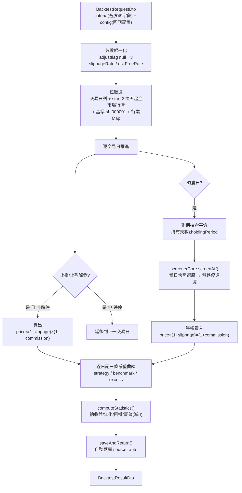

# 回測引擎專題（Backtest Engine）

> 對應代碼：`java/src/main/java/com/quantization/module/backtest/`
> 核心入口：`BacktestService.runBacktest()`（`BacktestService.java:79-286`）
> 定位：**研究級信號驗證工具**，非交易級撮合模擬。使用前必讀 §6 方法論限制。

---

## 1. 回測流程總覽

回測引擎模擬「調倉日選股 → 等權買入 → 持有 → 止損/止盈 → 賣出 → 統計」的完整閉環，以收盤價撮合、逐日估值淨值曲線。



### 1.1 各階段對應代碼行號

| 階段 | 代碼位置 | 說明 |
|------|----------|------|
| 參數歸一化 | `BacktestService.java:80-97` | adjustflag null→3、slippageRate、riskFreeRate 提取 |
| 數據準備 | `:99-163` | 交易日曆、調倉日列表、全市場行情載入、基準指數 |
| 止損/止盈 | `:178-205` | 跌停延後賣出、滑點下浮 |
| 調倉平倉 | `:208-227` | 持有期到期判斷、滑點下浮 |
| 選股+買入 | `:229-258` | 漲跌停過濾、滑點上浮、等權分配 |
| 估值記錄 | `:261-279` | 收盤價估值（不含滑點）、基準累計 |
| 統計計算 | `:281-282` | 調用 `computeStatistics()` |
| 自動落庫 | `:285` | 調用 `saveAndReturn()` |

---

## 2. 配置參數（BacktestConfigDto）

完整字段定義見 `dto/BacktestConfigDto.java:20-32`，record 含 11 個字段：

| 字段 | 類型 | 默認 | 說明 |
|------|------|------|------|
| `startDate` | `LocalDate` | — | 回測起始日期 |
| `endDate` | `LocalDate` | — | 回測結束日期 |
| `rebalanceInterval` | `int` | — | 調倉間隔（交易日數） |
| `holdingPeriod` | `int` | — | 持有期（交易日），到期強制平倉 |
| `maxPositions` | `int` | — | 最大持倉數 |
| `initialCapital` | `double` | — | 初始資金 |
| `commissionBps` | `double` | — | 手續費基點（1bp=0.01%，買賣雙邊收取） |
| `stopLossPct` | `Double` | `null` | 止損百分比，null=不啟用 |
| `takeProfitPct` | `Double` | `null` | 止盈百分比，null=不啟用 |
| **`riskFreeRate`** | `Double` | **0.02** | 無風險年化利率，用於夏普比率計算（Phase 4 新增） |
| **`slippageBps`** | `Integer` | **0** | 滑點基點，買入上浮/賣出下浮（Phase 4 新增） |

### 2.1 默認值與空安全

`BacktestConfigDto` 的緊湊構造器（`:38-41`）對新增字段做空安全處理：

```java
public BacktestConfigDto {
    if (riskFreeRate == null) riskFreeRate = DEFAULT_RISK_FREE_RATE;  // 0.02
    if (slippageBps == null) slippageBps = DEFAULT_SLIPPAGE_BPS;     // 0
}
```

並提供 `effectiveRiskFreeRate()`（`:44-46`）和 `effectiveSlippageBps()`（`:49-51`）方法，保證永遠返回非 null 值。`BacktestService` 在 `:89-90` 使用這兩個方法提取有效值。

### 2.2 請求示例

```json
{
  "criteria": { "...": "ScreenerCriteriaDto，49 字段，adjustflag 可空默認 3" },
  "config": {
    "startDate": "2025-01-01",
    "endDate": "2025-06-30",
    "rebalanceInterval": 5,
    "holdingPeriod": 10,
    "maxPositions": 10,
    "initialCapital": 1000000,
    "commissionBps": 3,
    "stopLossPct": null,
    "takeProfitPct": null,
    "riskFreeRate": 0.02,
    "slippageBps": 10
  }
}
```

---

## 3. 滑點模型（Phase 4 新增）

滑點模擬買賣時的價格偏移，`slippageRate = effectiveSlippageBps() / 10000.0`（`BacktestService.java:89`）。

| 方向 | 成交價公式 | 代碼位置 | 說明 |
|------|-----------|----------|------|
| **買入** | `price × (1 + slippageRate)` | `:249` | 上浮滑點，模擬買入衝擊成本 |
| **賣出** | `price × (1 - slippageRate)` | `:201, :220` | 下浮滑點，模擬賣出衝擊成本 |
| 估值 | `price`（不含滑點） | `:265` | 逐日以收盤價估值持倉市值 |

**示例**：`slippageBps=10`（1bp=0.01%），買入成交價 = `price × 1.001`，賣出成交價 = `price × 0.999`。

> ⚠️ **限制**：固定 bps 滑點模型，非市場衝擊模型（不隨成交量/流動性變化）。真實大單交易的滑點會顯著高於固定 bps 值，見 §6。

---

## 4. 漲跌停約束（Phase 4 新增）

漲跌停閾值 `LIMIT_THRESHOLD = 9.9`（`BacktestService.java:60`），即 `|pctChg| ≥ 9.9` 視為漲跌停。

| 場景 | 規則 | 代碼位置 | 理由 |
|------|------|----------|------|
| **買入選股** | `|pctChg| ≥ 9.9` 跳過 | `:232-240` | 漲停買不進、跌停不選 |
| **止損賣出** | `pctChg ≤ -9.9` 延後到下一交易日 | `:186-190` | 跌停板無法成交，延後賣出 |

選股時多取候選（`candidateLimit = maxPositions × 3`，`:230`），過濾漲跌停後仍有足夠標的填充倉位。

---

## 5. 夏普比率（Phase 4 改進）

夏普比率現在扣除無風險利率（`computeStatistics()`，`:345-385`）：

```
sharpe = (mean(日收益) - rf/252) / std(日收益) × √252
```

| 步驟 | 代碼行 | 說明 |
|------|--------|------|
| 日收益序列 | `:369-374` | `cur/prev - 1`，小數形式 |
| 日均收益 | `:377` | `dailyReturns` 算術平均 |
| 日標準差 | `:378` | 总體標準差（除以 N） |
| 日無風險利率 | `:379` | `riskFreeRate / 252.0` |
| 年化夏普 | `:380` | `(mean - dailyRiskFree) / std × √252` |

- `riskFreeRate` 默認 `0.02`（`DEFAULT_RISK_FREE_RATE`，`:34`）
- `rf=0` 時與原公式一致；`rf>0` 時夏普更低（更保守）
- `std=0` 時夏普返回 0（避免除零）

### 5.1 其他統計指標

| 指標 | 公式 | 代碼行 |
|------|------|--------|
| `totalReturn` | `(final/initial - 1) × 100` | `:353` |
| `annualReturn` | `(pow(final/initial, 1/years) - 1) × 100` | `:358` |
| `benchmarkReturn` | 基準同式（上證綜指） | `:354` |
| `excessReturn` | `totalReturn - benchmarkReturn` | `:355` |
| `maxDrawdown` | `max((peak - v)/peak) × 100` | `:360-366` |
| `rebalanceCount` | 調倉次數 | `:382` |
| `totalTrades` | 買賣總筆數 | `:383` |

---

## 6. 方法論限制（使用者必讀）

| # | 限制 | 影響 | 狀態 |
|---|------|------|------|
| 1 | **止損/止盈假設觸發價成交** | 漲跌停/流動性不足時可能無法成交，止損保護效果被高估——尤其連續跌停場景 | 已加跌停延後賣出（§4），但極端行情仍樂觀 |
| 2 | **ST/行業 survivorship bias** | `stock_industry` 存當前分類（非時點值），`excludeSt=true` 過濾的是「現在的 ST 股」而非「當時的 ST 股」；已退市股不出現在回測中 | 數據源限制，難修 |
| 3 | **固定 bps 滑點模型** | 非市場衝擊模型，不隨成交量/流動性變化；大單真實滑點顯著高於固定值 | 已加 `slippageBps` 配置，但模型簡化 |
| 4 | **無最小手數** | 股數可為任意小數，小資金回測偏樂觀 | 可接受的研究簡化 |
| 5 | **等權配置** | 無按流動性/波動率加權 | 設計選擇 |
| 6 | **基準固定上證綜指** | 中小盤策略應對比中證500/1000 | 建議配置化 |
| 7 | **無分紅/資金費處理** | 長周期回測分紅缺失使收益低估 | 已知限制 |

> **結論**：回測結果適合**策略相對比較與參數方向判斷**，絕對收益數字不可直接外推實盤。

---

## 7. 結果落庫（Phase 4 新增）

`runBacktest()` 結束時自動調用 `saveAndReturn()`（`:412-432`），將結果寫入 `backtest_strategy` 表：

| 步驟 | 代碼行 | 說明 |
|------|--------|------|
| 序列化 | `:414-416` | criteria/config/result → JSON 三列 |
| 命名 | `:419-420` | `回測-yyyyMMdd-HHmmss` |
| source | `:424` | 固定 `auto`（區分 `manual` 手動保存） |
| 保存 | `:427` | `strategyRepository.save(entity)` |
| 容錯 | `:428-430` | 落庫失敗僅記 WARN 日誌，**不影響結果返回** |

### 7.1 查詢最近記錄

`listRecentRuns(int limit)`（`:294-299`）按創建時間倒序返回最近 N 次記錄，對應 `GET /api/backtest/recent`。

> **注意**：`/run-and-save` 端點（`BacktestController.java:62-66`）自 Phase 4 後與 `/run` 行為等價（`runBacktest` 已內置自動落庫），保留路徑僅為 API 兼容性。

---

## 8. API 端點

| 方法 | 路徑 | 說明 | 代碼位置 |
|------|------|------|----------|
| `POST` | `/api/backtest/run` | 運行回測（自動落庫） | `BacktestController.java:46-49` |
| `POST` | `/api/backtest/run-and-save` | 等價於 `/run`（兼容保留） | `:62-66` |
| `GET` | `/api/backtest/recent?limit=20` | 最近 N 次回測記錄 | `:87-91` |
| `POST` | `/api/backtest/strategies` | 手動保存策略（source=manual） | `:75-78` |
| `GET` | `/api/backtest/strategies?source=` | 策略列表 | `:99-103` |
| `GET` | `/api/backtest/strategies/{id}` | 策略詳情 | `:112-115` |
| `DELETE` | `/api/backtest/strategies/{id}` | 刪除策略 | `:124-127` |

> ⚠️ **context-path**：實際請求需帶 `/TradingWorkstation` 前綴，如 `POST /TradingWorkstation/api/backtest/run`。

### 8.1 請求/響應格式

**請求**：`BacktestRequestDto`（`criteria: ScreenerCriteriaDto` + `config: BacktestConfigDto`）

**響應**：`ApiResponse<BacktestResultDto>`，統一信封 `{code, message, data}`

`BacktestResultDto`（`dto/BacktestResultDto.java:17-25`）含：
- `config`：回測配置回顯
- `strategyCurve` / `benchmarkCurve` / `excessCurve`：三條 `EquityPoint[]{date, value}` 淨值曲線
- `rebalances`：`RebalanceEvent[]{date, bought[], sold[], held[]}` 調倉明細
- `statistics`：`BacktestStatistics`（8 個指標，見 §5）
- `logLines`：過程摘要（含滑點/無風險利率信息，`:391-401`）

---

## 9. 測試覆蓋

`BacktestServiceTest`（`src/test/java/com/quantization/test/BacktestServiceTest.java`）共 **7 個測試**，使用 Mockito mock `StockService` 避免數據庫依賴：

| 測試方法 | 行號 | 覆蓋場景 |
|----------|------|----------|
| `runBacktestBuildsMetricsAndCurves` | `:57-97` | 完整回測生成曲線/調倉/統計，驗證 logLines 含「無風險利率」 |
| `stopLossTriggersExit` | `:100-139` | 止損觸發平倉（構造 low=entry×0.92 觸發 5% 止損） |
| `emptyDataReturnsEmptyResult` | `:142-162` | 空數據返回空結果 |
| `runBacktestAutoPersistsResult` | `:165-203` | 自動落庫：驗證 `save()` 調用、resultJson 非空、source=auto |
| `listRecentRunsReturnsLimitedRecords` | `:206-225` | listRecentRuns 返回限制條數、調用 findRecentRuns |
| `slippageAppliedToFillPrice` | `:228-258` | 滑點配置生效：logLines 含「滑點：50 bp」 |
| `sharpeDeductsRiskFreeRate` | `:261-289` | rf=0 vs rf=0.5，高 rf 夏普更低 |

---

## 10. 性能與運維注意

- **內存**：單次回測全市場載入內存（3354 股 × ~540 日 ≈ 180 萬記錄），建議 JVM `-Xmx4g`
- **超時**：回測是同步請求，前端 `proxyTimeout: 180s`、agent 端 600s 超時——調長回測區間時注意兩處
- **確定性**：引擎確定性，同一請求兩次結果應相同（若不同檢查數據是否被同步任務更新）
- **緩存**：後端 Caffeine 緩存 TTL 30s，同步後最多等 30s 或重啟後端

---

## 11. 常見問題

| 問題 | 原因/解法 |
|------|-----------|
| `NullPointerException: adjustflag() is null` | 舊版本 bug，已修（Service 層 `:97` 默認 3）；若復現檢查是否走了舊 jar |
| 回測結果為空曲線 | 回測區間內無交易日數據——先查 `/api/agent/data-range` 或 stock_daily 日期範圍 |
| 回測超時 | 區間過長/選股條件過鬆導致調倉頻繁；縮短區間或加大 `rebalanceInterval` |
| 夏普比舊版偏高 | Phase 4 前未減無風險利率，現已修正（默認 rf=0.02） |
| 滑點未生效 | 檢查 `slippageBps` 是否為 null/0；用 `effectiveSlippageBps()` 確認 |

---

## 12. 滾動窗口集成權重適應（forecast 模塊）

> 對應代碼：`ForecastService.computeAdaptiveWeights()` / `inverseMaeWeights()`
> 配置：`app.forecast.adaptive-weights`（默認 `false`）、`app.forecast.rolling-window-days`（默認 `60`）

### 12.1 背景與動機

行業景氣度多模型預測（ARIMA + Holt-Winters + 線性回歸）的集成權重，Phase 4 默認固定為 0.35/0.35/0.30。回測端點（`/api/stock/industry-prosperity/forecast/backtest`）會計算各模型 per-model MAE 並給出逆 MAE 最優權重供參考，但**生產預測不自動回饋**——設計上是為了避免過擬合到特定回測區間（look-ahead bias）。

Phase 4 後續新增**滾動窗口逆 MAE 動態權重**，在嚴格避免 look-ahead bias 的前提下讓生產預測自適應近期模型表現。

### 12.2 算法

啟用 `adaptive-weights=true` 後，對每個行業的景氣度序列：

1. **滾動窗口**：取過去 `rolling-window-days`（默認 60）個時間點作為評估窗口 `[evalStart, n)`。
2. **one-step-ahead 預測**：對窗口內每個時間點 t，用 `data[0..t-1]`（截至 t 的歷史）預測 `data[t]`，分別得到 ARIMA/HW/LR 三個模型的預測值。
3. **per-model MAE**：累計各模型絕對誤差，除以窗口內時間點數得到 MAE。
4. **逆 MAE 歸一化**：`w_i = (1/mae_i) / sum(1/mae_j)`，MAE 越小（模型越準）權重越大。
5. **動態權重應用**：用這三個權重加權三個模型的未來預測得到整合預測。

### 12.3 look-ahead bias 防護設計

| 防護點 | 實現 |
|--------|------|
| 每個預測點只用歷史 | `Arrays.copyOf(data, t)` 只含索引 0..t-1，不包含目標值 `data[t]` |
| 評估窗口只取歷史區間 | `evalStart = max(10, n - windowDays)`，窗口 `[evalStart, n)` 全部是已發生的歷史 |
| 不接觸未來預測目標 | 權重計算與未來 `forecastDays` 預測完全隔離——權重只用歷史算，再用於未來 |
| 數據不足安全回退 | 序列過短或所有 MAE≈0 時回退到固定權重 0.35/0.35/0.30，永不拋異常 |

### 12.4 配置與兼容性

```yaml
app:
  forecast:
    adaptive-weights: ${FORECAST_ADAPTIVE_WEIGHTS:false}   # 默認關閉，保持 Phase 4 行為
    rolling-window-days: ${FORECAST_ROLLING_WINDOW_DAYS:60} # 僅 adaptive=true 時生效
```

- `adaptive-weights=false`（默認）：行為與 Phase 4 完全一致，使用固定權重。
- `adaptive-weights=true`：啟用滾動窗口動態權重。
- 緩存鍵含 `adaptive/fixed` + `rollingWindowDays` 後綴，切換配置不會命中彼此的緩存。

### 12.5 DTO 變更

`ProsperityForecastDto` 新增頂層 `weightSource`（"fixed" 或 "adaptive"）；`IndustryForecast` 新增 `arimaWeight` / `holtWintersWeight` / `linearWeight` 三個字段，標識該行業集成預測實際使用的權重。固定模式下所有行業權重均為 0.35/0.35/0.30；自適應模式下各行業權重依其歷史序列動態計算。

### 12.6 測試覆蓋

`ForecastAdaptiveWeightsTest`（`src/test/java/com/quantization/test/ForecastAdaptiveWeightsTest.java`）共 7 個測試：

| 測試方法 | 覆蓋場景 |
|----------|----------|
| `weightSourceLabel_fixedWhenAdaptiveOff` | `adaptive=false` 時標籤為 "fixed" |
| `weightSourceLabel_adaptiveWhenAdaptiveOn` | `adaptive=true` 時標籤為 "adaptive" |
| `computeAdaptiveWeights_weightsSumToOne` | 動態權重三分量和為 1.0、均在 [0,1] |
| `computeAdaptiveWeights_insufficientData_fallsBackToFixed` | 數據不足回退固定權重 |
| `computeAdaptiveWeights_linearTrend_favorsLinearRegression` | 純線性趨勢下線性回歸權重更高 |
| `computeAdaptiveWeights_doesNotThrow_onEdgeCases` | 短序列/常數序列不拋異常 |
| `computeAdaptiveWeights_variousWindowSizes_sumToOne` | 不同窗口大小權重和均為 1.0 |

---

## 12. AutoML 嚴格日期隔離 Out-of-Sample 評估

> 對應代碼：`ForecastService.autoTuneRotationPrediction()`（`ForecastService.java`）
> 端點：`GET /api/stock/rotation-prediction/automl`

### 12.1 設計動機

AutoML 用 15 組合網格搜索（lookback×forward = 5×3）尋找最佳輪動預測參數。早期版本的 tune/eval 分離不嚴格——內部回測用近期窗口，調參和評估數據有重疊，導致 in-sample 過擬合風險：評估段表現可能被調參段數據「污染」。

### 12.2 嚴格日期隔離設計

採用**日期隔離 out-of-sample 評估**，將數據嚴格分為兩個不重疊區間：

```
時間軸 ──────────────────────────────────────────►
        ├── 區間 A（調參 tune） ──┤├── 區間 B（評估 eval） ──┤
        tuneStart          tuneEnd  evalStart          evalEnd
```

| 階段 | 區間 | 數據使用 | 目的 |
|------|------|----------|------|
| **調參（tune）** | 區間 A [tuneStartDate, tuneEndDate] | 只用區間 A 的數據做 15 組合網格搜索 | 選出綜合評分最高的參數組合 |
| **評估（eval）** | 區間 B [evalStartDate, evalEndDate] | 只用區間 B 的數據，用選出的最佳參數跑回測 | 報告真正的 out-of-sample 表現 |

**關鍵保證**：
- 區間 B 必須在區間 A 之後（`evalStartDate > tuneEndDate`），兩者完全不重疊
- 評估階段絕不接觸區間 A 的數據——數據拉取從 `evalStartDate` 開始，不拉取之前的數據
- 回溯窗口 [T-lookback, T] 也嚴格限制在區間 B 內（預測日期 T 至少是區間 B 內第 lookbackDays 個交易日）
- 前瞻驗證窗口 [T+1, T+forward] 可延伸到區間 B 之後（已預留緩衝數據，屬於「未來驗證」而非調參數據）

### 12.3 默認分割（不傳日期參數時）

不傳日期參數時，以當前日期為終點、向前回溯 `backtestDays` 天為總區間，按 70/30 分割：

| 參數 | 默認值 | 說明 |
|------|--------|------|
| `backtestDays` | 90 | 總回測天數 |
| 區間 A（調參） | 前 70%（約 63 天） | `today - backtestDays` ~ `today - backtestDays×30%` |
| 區間 B（評估） | 後 30%（約 27 天） | `today - backtestDays×30% + 1天` ~ `today` |

### 12.4 自定義區間

通過可選查詢參數指定兩個區間：

```
GET /api/stock/rotation-prediction/automl
    ?backtestDays=180
    &tuneStartDate=2025-01-01
    &tuneEndDate=2025-06-30
    &evalStartDate=2025-07-01
    &evalEndDate=2025-09-30
```

若傳入的區間有重疊（`evalStartDate ≤ tuneEndDate`），系統自動將 `evalStartDate` 調整到 `tuneEndDate + 1天` 以保證不重疊。

### 12.5 輸出結構

`RotationAutoMlDto` 新增兩個字段標明區間：

| 字段 | 說明 |
|------|------|
| `tuneRange` | 調參區間 A 的日期範圍描述（如 `"2025-01-01 ~ 2025-06-30"`） |
| `evalRange` | 評估區間 B 的日期範圍描述（如 `"2025-07-01 ~ 2025-09-30"`） |

`ParamCombination` 中的 `evalHitRate` 和 `evalExcessReturn` 僅對最佳組合在區間 B 上有值，其餘組合為 0（因為評估階段只用選出的最佳參數跑回測）。

### 12.6 方法論限制

- **搜索空間有限**：15 組合窮舉，無貝葉斯/隨機搜索，泛化能力受限
- **單一評估區間**：僅在一段連續區間 B 上評估，未做 walk-forward 或交叉驗證
- **參數空間固定**：lookback/forward 選項硬編碼，無法自適應擴展
