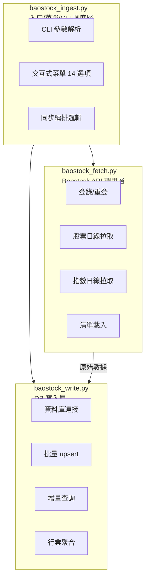
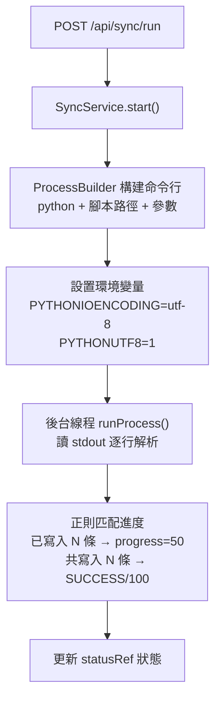

# 數據採集專題（Data Ingestion）

> 對應代碼：`ingestion/`（三模塊拆分）
> 數據源：Baostock（免費 A 股數據，無需 token）。寫入 5 張表，全部冪等（`ON DUPLICATE KEY UPDATE`），重跑安全。

---

## 1. 架構：三模塊拆分（P5 重構）

原單文件 `baostock_ingest.py`（767 行）已拆分為三個職責清晰的模塊：



| 模塊 | 文件 | 職責 | 依賴 |
|------|------|------|------|
| **入口/調度** | `baostock_ingest.py` | CLI 參數、交互式菜單、同步編排 | fetch + write |
| **API 調用層** | `baostock_fetch.py` | Baostock 會話管理、股票/指數拉取、清單載入、數據解析 | baostock 庫 |
| **DB 寫入層** | `baostock_write.py` | 資料庫連接、增量查詢、批量 upsert、指數元數據、行業聚合 | pymysql |

`baostock_ingest.py` 通過 `from baostock_fetch import *` 和 `from baostock_write import *` 重新導出全部公開符號（`:54-81`），保持下游兼容。

---

## 2. CLI 介面

### 2.1 完整參數清單（`baostock_ingest.py:611-632`）

| 參數 | 默認 | 說明 |
|------|------|------|
| `--mode` | `incremental` | `incremental`（查庫增量）/ `range`（指定範圍全量） |
| `--adjustflag` | `3` | 單一復權類型（1後復權/2前復權/3不復權），被 `--adjustflags` 覆蓋 |
| `--adjustflags` | `""` | 多復權逗號分隔，如 `1,2,3`；空字符串=不同步股票 |
| `--start` | `""` | range 模式起始日期；incremental 可省略 |
| `--end` | 今天 | 結束日期 YYYY-MM-DD |
| `--codes` | `""` | 逗號分隔股票代碼，空=用 stock_list.json 全部 3354 隻 |
| `--batch-size` | `1000`（`SYNC_BATCH_SIZE`） | 批量寫入大小 |
| `--index` | `false` | 同步指數到 index_daily + index_metadata |
| `--industry` | `false` | 同步行業分類到 stock_industry 並重算 industry_daily |
| `--force-industry` | `false` | 忽略 7 天新鮮度檢查強制拉行業 |
| `--full-refresh-adjustflag2` | `false` | 全量重刷前復權歷史數據（修復增量陳舊化，見 §6） |
| **`--progress-json`** | `false` | 啟用 JSON 進度協議（機器可解析，見 §3） |

### 2.2 常用命令

```bash
# 日常增量（等效菜單 11，最常用）
python ingestion/baostock_ingest.py --mode incremental --adjustflags 1,2,3 --index --industry

# 補指定日期範圍
python ingestion/baostock_ingest.py --mode range --start 2026-08-01 --end 2026-08-22 --adjustflags 1,2,3 --index

# 只更新特定股票
python ingestion/baostock_ingest.py --mode incremental --codes sh.600000,sz.000001 --adjustflag 3

# 全量重刷前復權（每季度運維）
python ingestion/baostock_ingest.py --full-refresh-adjustflag2 --adjustflags 2

# JSON 進度協議（後端 SyncService 調用）
python ingestion/baostock_ingest.py --mode incremental --adjustflags 1,2,3 --index --progress-json
```

### 2.3 交互式菜單（14 個選項）

無參數運行 `python ingestion/baostock_ingest.py` 進入交互式菜單：

| 選項 | 功能 | 等效參數 |
|------|------|----------|
| 1-3 | 歷史全量：後復權/前復權/不復權 | `--mode range --adjustflag 1\|2\|3` |
| 4 | 歷史全量：三種復權 | `--mode range --adjustflags 1,2,3` |
| 5-7 | 增量：後復權/前復權/不復權 | `--mode incremental --adjustflag 1\|2\|3` |
| 8 | 增量：三種復權 | `--mode incremental --adjustflags 1,2,3` |
| 9 | 指數歷史全量 | `--mode range --adjustflags "" --index` |
| 10 | 指數增量 | `--mode incremental --adjustflags "" --index` |
| 11 | **增量全部（日常最常用）** | `--mode incremental --adjustflags 1,2,3 --index --industry` |
| 12 | 指定日期範圍全部 | `--mode range --start ... --end ... --adjustflags 1,2,3 --index --industry` |
| 13 | 僅同步行業分類 | `--adjustflags "" --industry` |
| 14 | 發現並驗證指數清單 | 調用 `discover_indices.py` |

---

## 3. progress-json 協議

`--progress-json` 啟用後，stdout 輸出機器可解析的 JSON 行（每行一個 JSON 對象），中文進度信息改走 stderr（`baostock_ingest.py:83-96`）。

### 3.1 JSON 行格式

| type | 字段 | 說明 | 觸發時機 |
|------|------|------|----------|
| `progress` | `total`, `completed`, `failed`, `current_code`, `phase`, `adjustflag` | 進度更新 | 每批次寫入 / 每 100 隻股票 |
| `error` | `code`, `message` | 單隻股票拉取失敗 | 異常時 |
| `done` | `total_written`, `total_failed` | 階段完成 | 每復權類型/指數完成時 |

### 3.2 示例輸出

```json
{"type":"progress","total":3354,"completed":101,"failed":0,"current_code":"sh.600010","phase":"stock_daily","adjustflag":3}
{"type":"error","code":"sh.600000","message":"連接超時"}
{"type":"done","total_written":1542,"total_failed":0}
```

### 3.3 phase 值

| phase | 說明 |
|-------|------|
| `stock_daily` | 股票日線同步中 |
| `index_daily` | 指數日線同步中 |

> **與後端耦合**：後端 `SyncService` 仍用正則匹配中文文案（`已寫入 N 條`/`共寫入 N 條`，`SyncService.java:31-32`）。`--progress-json` 是更精確的補充協議，但 SyncService 目前未切換到 JSON 解析（保持兼容）。

---

## 4. 寫入策略：ON DUPLICATE KEY UPDATE upsert

所有表均使用 upsert（`baostock_write.py`），重複運行安全：

| 表 | 唯一鍵 | upsert 函數 | 代碼行 |
|----|--------|-------------|--------|
| `stock_daily` | `(code, date, adjustflag)` | `_upsert_stock_batch` | `:100-112` |
| `index_daily` | `(code, date, frequency)` | `_upsert_index_batch` | `:115-126` |
| `stock_industry` | `(code)` | `_upsert_industry_batch` | `:129-141` |
| `index_metadata` | `(code)` | `_sync_index_metadata` | `:156-192` |
| `industry_daily` | `(date, industry)` | `_sync_industry_daily` | `:195-294` |

- `index_daily`：frequency 固定 `'d'`、source 固定 `'baostock'`
- `stock_industry`：**7 天新鮮度**——DB 最新 `update_date` 距今 ≤7 天則跳過（`--force-industry` 強制）

---

## 5. 增量 vs 全量

### 5.1 增量算法（`baostock_ingest.py:547-558`）

```
每隻股票 × 每種復權:
  last = SELECT MAX(date) FROM stock_daily WHERE code=? AND adjustflag=?
  有記錄 → 從 last+1 拉（若 > end 則跳過，計 skipped）
  無記錄 → 從全局 start（默認 2021-01-01）拉
指數同理（index_daily 按 code+frequency 查 MAX(date)）
```

| 模式 | 參數 | 行為 | 適用場景 |
|------|------|------|----------|
| `incremental` | `--mode incremental` | 每隻股票先查資料庫最新日期，只拉缺失部分 | 日常更新（速度快） |
| `range` | `--mode range --start YYYY-MM-DD --end YYYY-MM-DD` | 拉取指定日期範圍的全部數據 | 補數據、首次導入 |
| **全量重刷前復權** | `--full-refresh-adjustflag2 --adjustflags 2` | 全量重刷 adjustflag=2 歷史（見 §6） | 每季度運維 |

### 5.2 復權類型

| adjustflag | 含義 | 說明 |
|------------|------|------|
| 1 | 後復權 | 以最早數據為基準，向前調整 |
| 2 | 前復權 | 以最新數據為基準，向後調整 |
| 3 | 不復權 | 原始價格 |

---

## 6. 前復權陳舊化風險（重要運維事項）

> ⚠️ **方法論限制 P4-1 — 前復權增量陳舊化**：除權除息後 Baostock 重算 adjustflag=2 全部歷史價格，增量模式只拉 `max_date+1` 之後——前復權歷史數據會逐漸陳舊失真。

### 6.1 問題原理

前復權以最新價格為基準向後調整，**每次除權除息都會改變所有歷史值**。增量模式只拉 `MAX(date)+1` 之後的新數據，庫裡的前復權歷史會逐漸與源不一致，誤差隨除權除息事件累積。

### 6.2 對策

```bash
# 每季度或除權除息高峰後，全量重刷前復權
python ingestion/baostock_ingest.py --full-refresh-adjustflag2 --adjustflags 2

# 或手動指定範圍
python ingestion/baostock_ingest.py --mode range --start 2021-01-01 --adjustflag 2
```

- 後復權（1）以最早值為基準向前調整，歷史同樣可能變動，同理定期重刷
- **不復權（3）歷史不變，增量安全**——這也是 `industry_daily` 聚合固定用 adjustflag=3 的原因

---

## 7. 行業聚合（industry_daily）

`_sync_industry_daily()`（`baostock_write.py:195-294`）從 `stock_daily` 聚合到 `industry_daily`：

```sql
INSERT INTO industry_daily
(date, industry, stock_count, avg_pct_chg, total_amount, total_volume, avg_turn,
 rising_count, falling_count, avg_close, max_close, min_close)
SELECT
  d.date, i.industry, COUNT(*), AVG(d.pctChg), SUM(d.amount), SUM(d.volume),
  AVG(d.turn),
  SUM(CASE WHEN d.pctChg > 0 THEN 1 ELSE 0 END),
  SUM(CASE WHEN d.pctChg < 0 THEN 1 ELSE 0 END),
  AVG(d.close), MAX(d.close), MIN(d.close)
FROM stock_daily d
JOIN stock_industry i ON d.code = i.code
WHERE d.adjustflag = 3 AND d.date >= %s AND d.date <= %s
GROUP BY d.date, i.industry
ON DUPLICATE KEY UPDATE ...
```

- **固定用 adjustflag=3**（不復權），因不復權歷史不變
- 只重算 `[start, end]` 區間內尚未聚合的日期（`NOT EXISTS` 子查詢）
- 唯一鍵 `(date, industry)`
- 只在帶 `--industry` 的運行末尾重算——單獨補 stock_daily 後行業數據不會自動更新

---

## 8. 後端編排（SyncService）

後端 `module.sync.SyncService`（`SyncService.java`）通過 `ProcessBuilder` 調用 ingestion 腳本：

### 8.1 編排流程



### 8.2 關鍵實現（`SyncService.java`）

| 步驟 | 代碼行 | 說明 |
|------|--------|------|
| 構建命令 | `:65-88` | python + 腳本 + `--mode` + `--adjustflags` + 日期 + `--index`/`--industry` |
| 環境變量 | `:92-93` | `PYTHONIOENCODING=utf-8` + `PYTHONUTF8=1`（確保中文不亂碼） |
| 進度解析 | `:31-32, 115-124` | 正則 `已寫入\s*(\d+)\s*條` / `共寫入\s*(\d+)\s*條` |
| 狀態更新 | `:118-134` | RUNNING(50) / SUCCESS(100) / FAILED |

### 8.3 後端 API

| 方法 | 路徑 | 說明 |
|------|------|------|
| `POST` | `/api/sync/run` | 啟動同步（mode/adjustflags/syncIndex/syncIndustry） |
| `GET` | `/api/sync/status` | 查詢同步狀態 |
| `POST` | `/api/sync/cancel` | 取消同步（銷毀子進程） |

> ⚠️ **修改進度文案會破壞前端顯示**：`已寫入 N 條` / `共寫入 N 條` 是 SyncService 的解析協議（`:31-32`），修改需同步正則。

---

## 9. 會話超時自動重登（`baostock_fetch.py:126-135`）

Baostock 長時間查詢會報「用戶未登錄」。`_fetch_stock()`/`_fetch_index()` 捕獲此錯誤後調 `_ensure_login()`：

1. `bs.query_all_stock()` 探活
2. 失敗 → `bs.logout()` → `_login_baostock()`（最多 3 次重試，間隔 3s）
3. 重登失敗拋 `RuntimeError`

無需人工干預。

---

## 10. 輸入文件

| 文件 | 內容 | 缺失行為 |
|------|------|----------|
| `stock_list.json` | 3354 隻 A 股清單（靜態） | 必需，`FileNotFoundError` |
| `index_list.json` | 10 大類 ~80 指數（含 code/name/category） | 回退內置 8 大指數 |

`index_list.json` 支持兩種格式（`baostock_fetch.py:81-102`）：
- 純數組：`["sh.000001", "sz.399001", ...]`
- 新格式：`{"categories": [{"category": "綜合指數", "indices": [{"code": "sh.000001", ...}]}]}`

用菜單 14 / `discover_indices.py` 可自動發現並驗證可用指數。

---

## 11. 配置

### 11.1 依賴

```bash
pip install -r ingestion/requirements.txt   # baostock, pymysql, python-dotenv
```

### 11.2 環境變量（讀根目錄 `.env`）

| 變量 | 默認 | 說明 |
|------|------|------|
| `DB_HOST` | localhost | 資料庫主機 |
| `DB_PORT` | 3306 | 資料庫端口 |
| `DB_NAME` | a_stock_baostock | 資料庫名 |
| `DB_USER` | root | 資料庫用戶 |
| `DB_PASSWORD` | — | **必填** |
| `DB_CHARSET` | utf8mb4 | 字符集 |
| `SYNC_BATCH_SIZE` | 1000 | 批量寫入大小（`--batch-size` 默認值） |
| `SYNC_DEFAULT_START_DATE` | 2021-01-01 | 增量無記錄時的全局起始日期 |

環境變量載入見 `baostock_write.py:26-35`（`_load_env`），使用 `os.environ.setdefault` 不覆蓋已有值。

---

## 12. 已知限制

| # | 事項 |
|---|------|
| 1 | **無拉取限頻**：3354 股 × 3 復權連續請求，有觸發 Baostock 限流風險；被限流表現為連續超時/空數據，等待後重跑即可（冪等） |
| 2 | 全量三復權首次拉取耗時長（小時級），建議分復權類型分批跑 |
| 3 | `industry_daily` 只在帶 `--industry` 的運行末尾重算——單獨補 stock_daily 後行業數據不會自動更新 |
| 4 | `stock_industry` 只存最新分類快照，無歷史時點（survivorship bias 來源） |
| 5 | 前復權增量陳舊化（見 §6），每季度需手動全量刷新 |

---

## 13. 行情預計算（precompute_market_snapshot.py）

> **新增**：數據更新完成後自動觸發行情預計算，生成分析快照持久化到 `market_analysis_snapshot` 表，前端直接加載快照，毫秒級響應。

### 13.1 觸發機制

`baostock_ingest.py` 在 CLI 模式和交互式模式完成數據寫入後，自動調用 `precompute_market_snapshot.py --auto`：

```python
# baostock_ingest.py 完成數據寫入後
if grand_total > 0:
    subprocess.run([sys.executable, "precompute_market_snapshot.py", "--auto"], timeout=300)
```

- **自動觸發**：無需人工干預，數據更新後自動計算
- **失敗不阻塞**：預計算失敗不影響數據同步結果（`--auto` 模式）
- **手動觸發**：`python ingestion/precompute_market_snapshot.py` 或 `--date YYYY-MM-DD`

### 13.2 預計算內容

| 快照類型 | 內容 | 計算來源 |
|----------|------|----------|
| `market_overview` | 指數漲跌 + 漲跌家數 + 成交額匯總 | stock_daily + index_daily |
| `industry_prosperity` | 81 個行業 4 維度評分（動量/資金/活躍度/廣度）+ 等級 | industry_daily |
| `rotation_signals` | 行業短期(5天) vs 長期(20天)動量對比 + 輪動信號 | industry_daily |
| `market_breadth` | 最近 10 天漲跌家數歷史 | stock_daily |

### 13.3 持久化

- **表**：`market_analysis_snapshot`
- **唯一鍵**：`(trade_date, snapshot_type)` — UPSERT 語義，重複運行安全
- **歷史可追蹤**：每個交易日一組快照，支持回看任意交易日的市場狀態
- **格式版本**：`data_version` 字段標記快照格式版本，便於未來遷移

### 13.4 前端消費

前端通過 Java 後端 `/api/snapshot` 端點讀取快照：
- `GET /api/snapshot` — 獲取最新交易日的全部快照
- `GET /api/snapshot?tradeDate=YYYY-MM-DD` — 獲取指定交易日的快照
- `GET /api/snapshot/dates` — 獲取可用日期列表（歷史回看）

### 13.5 驗證

```bash
# 手動執行預計算
python ingestion/precompute_market_snapshot.py

# 指定交易日
python ingestion/precompute_market_snapshot.py --date 2026-08-24

# 驗證快照已寫入
mysql -u root -p a_stock_baostock -e "SELECT trade_date, snapshot_type, computed_at FROM market_analysis_snapshot ORDER BY trade_date DESC LIMIT 10;"
```
