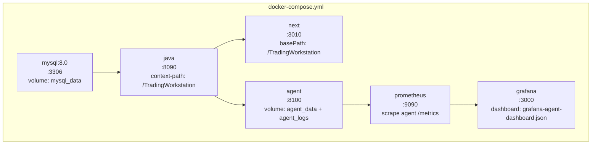
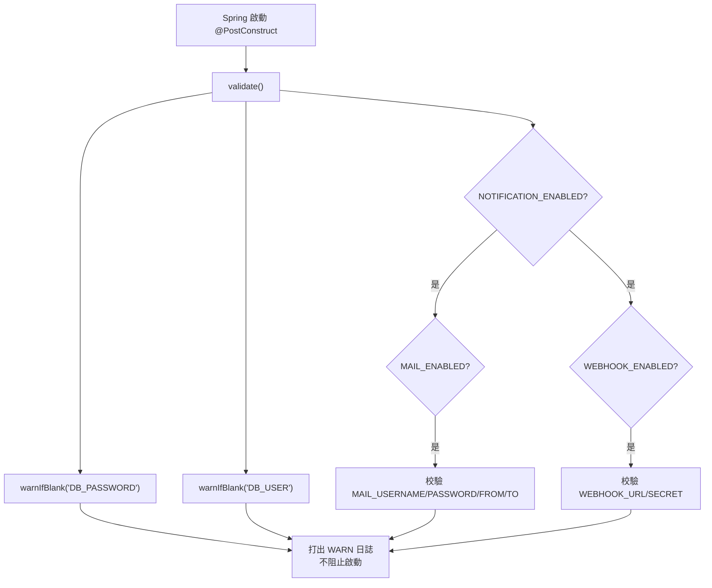

# 部署專題（Deployment）

> 覆蓋：環境要求、Docker Compose 部署、手動部署、環境變量、配置校驗、監控、健康檢查、常見問題。
> 啟動細節與 AGENTS.md 保持一致，衝突時以本文檔為準（更新於 2026-08-22）。

---

## 1. 環境要求

| 依賴 | 版本 | 用途 | 安裝建議 |
|------|------|------|----------|
| **JDK** | 21（Temurin / Microsoft OpenJDK） | 後端 Java | 推薦 Eclipse Temurin 21 |
| **Node.js** | 18+（推薦 20 LTS） | 前端 Next.js | nvm 管理多版本 |
| **Python** | 3.10+ | ingestion + agent | venv 隔離環境 |
| **MySQL** | 8.0+ | 數據庫 | 需提前建庫 `a_stock_baostock` |
| **Docker** | 可選 | 容器化部署 | Docker Desktop / WSL2 |

### 1.1 各服務依賴安裝

```bash
# 後端 Maven 依賴（首次或 pom.xml 變更後）
cd java && mvn -DskipTests dependency:resolve

# 前端 npm 依賴（首次或 package.json 變更後）
cd next && npm install --legacy-peer-deps      # SWR peer dep 限制，必須帶 flag

# 數據同步 Python 依賴
pip install -r ingestion/requirements.txt

# Agent 服務 Python 依賴
cd agent && pip install -r requirements.txt
```

---

## 2. Docker Compose 部署

一鍵啟動全部服務（含可選監控）：

```bash
docker compose up -d          # mysql + java + next + agent + prometheus + grafana
```

### 2.1 服務拓撲



### 2.2 容器配置要點

| 服務 | 鏡像/構建 | 端口 | 關鍵配置 |
|------|-----------|------|----------|
| mysql | `mysql:8.0` | 3306 | `MYSQL_ROOT_PASSWORD`/`MYSQL_DATABASE` 從 `.env`；healthcheck `mysqladmin ping` |
| java | `build: ./java` | 8090 | `DB_HOST=mysql`、`SERVER_CONTEXT_PATH=/TradingWorkstation`；`depends_on: mysql.service_healthy` |
| next | `build: ./next` | 3010 | `BACKEND_HOST=http://java:8090`（**不帶前綴**，rewrite destination 補） |
| agent | `build: ./agent` | 8100 | `BACKEND_API_URL=http://java:8090/TradingWorkstation`（**帶前綴**）；volume `agent_data`（RAG/checkpoint 記憶，**勿刪**） |
| prometheus | `prom/prometheus:latest` | 9090 | 掛載 `docs/prometheus.yml`；scrape agent `/metrics` |
| grafana | `grafana/grafana:latest` | 3000 | 掛載 `docs/grafana-agent-dashboard.json`；`GF_SECURITY_ADMIN_PASSWORD` |

### 2.3 volume

| volume | 用途 | 注意 |
|--------|------|------|
| `mysql_data` | 數據庫數據 | 勿隨意刪除 |
| `agent_data` | Agent RAG/checkpoint/錯誤庫記憶 | **勿隨意刪除**（Agent 全部記憶） |
| `agent_logs` | Agent 日誌 | — |
| `prometheus_data` | Prometheus 時序數據 | — |
| `grafana_data` | Grafana 儀表盤 | — |

### 2.4 容器化限制

- `PUT /api/system/database` 已改為僅校驗輸入（不自動寫 .env），需手動修改 .env 後重啟
- `preference.json` 落在容器內 `/app`（可通過 `PREFERENCE_PATH` 配置到持久化卷）
- 環境變量從宿主 `.env` 透傳（`DB_PASSWORD`、`DEVIN_API_KEY` 等）

---

## 3. 手動部署

### 3.1 啟動順序

**必須按以下順序啟動**（依賴鏈）：

```
MySQL → Java 後端 (8090) → Next.js 前端 (3010)
                              ↑
Java 後端 (8090) ← Agent 服務 (8100)  ← Agent 依賴後端 REST API
```

### 3.2 Windows 一鍵腳本（推薦）

每個服務目錄下有 `start.ps1`，自動處理環境變量、依賴檢查、端口衝突：

```powershell
cd "A:\project\Trading Workstation\java";  .\start.ps1   # 自動加載 .env + JDK21 + 端口檢測
cd "A:\project\Trading Workstation\next";  .\start.ps1
cd "A:\project\Trading Workstation\agent"; .\start.ps1
```

### 3.3 手動啟動（Windows PowerShell）

```powershell
# 0. JDK 21
$env:JAVA_HOME = "C:\Users\13026\.jdks\ms-21.0.9"
$env:Path = "$env:JAVA_HOME\bin;$env:Path"
java -version   # 應顯示 21.x

# 1. 後端（mvn spring-boot:run 不自動加載 .env，需先注入）
Get-Content "A:\project\Trading Workstation\.env" | ForEach-Object {
    if ($_ -match '^\s*([A-Z_]+)\s*=\s*(.+)$') {
        Set-Item -Path "env:$($matches[1])" -Value $matches[2].Trim('"').Trim("'")
    }
}
cd "A:\project\Trading Workstation\java"; mvn spring-boot:run

# 2. 前端（新終端）
cd "A:\project\Trading Workstation\next"; npm run dev

# 3. Agent（新終端，可選；用 python 而非 python3——後者可能指向 MS Store 版）
cd "A:\project\Trading Workstation\agent"
python -m uvicorn app.main:app --host 0.0.0.0 --port 8100
```

### 3.4 macOS / Linux

```bash
export JAVA_HOME=$(/usr/libexec/java_home -v 21 2>/dev/null || echo "/usr/lib/jvm/java-21-openjdk")
cd java && mvn spring-boot:run          # 或 mvn -DskipTests package && java -Xmx4g -jar target/*.jar
cd next && npm run dev
cd agent && python3 -m uvicorn app.main:app --host 0.0.0.0 --port 8100
```

---

## 4. 環境變量

### 4.1 根 `.env`（java + ingestion 共用）

```bash
cp .env.example .env
```

| 組 | 變量 | 默認 | 說明 |
|----|------|------|------|
| **數據庫** | `DB_HOST` / `DB_PORT` / `DB_NAME` / `DB_USER` / `DB_PASSWORD` / `DB_CHARSET` | localhost/3306/a_stock_baostock/root/—/utf8mb4 | **DB_PASSWORD 必填** |
| **服務** | `SERVER_PORT` / `SERVER_CONTEXT_PATH` | 8090 / **/TradingWorkstation** | context-path 默認帶前綴 |
| **查詢默認** | `DEFAULT_ADJUSTFLAG` / `DEFAULT_LIMIT` / `LOOKBACK_DAYS` | 3 / 200 / 180 | |
| **CORS** | `CORS_ALLOWED_ORIGINS` | http://localhost:3010 | 逗號分隔 |
| **緩存** | `CACHE_METRICS_TTL_SECONDS` / `CACHE_SUMMARY_TTL_SECONDS` | 30 / 60 | |
| **偏好** | `PREFERENCE_PATH` | preference.json | 用戶偏好存儲路徑 |
| **同步** | `SYNC_PYTHON_EXECUTABLE` / `SYNC_INGESTION_SCRIPT` / `SYNC_BATCH_SIZE` / `SYNC_DEFAULT_START_DATE` | python / ingestion/baostock_ingest.py / 1000 / 2021-01-01 | |
| **通知** | `NOTIFICATION_ENABLED` + `MAIL_*`(6) + `WEBHOOK_*`(3) | 全 false/空 | SMTP 郵件 + Webhook |
| **調度器** | `ALERT_SCHEDULER_ENABLED` / `ALERT_SCHEDULER_THRESHOLD` / `ALERT_SCHEDULER_CRON` | false / 15.0 / `0 30 15 * * MON-FRI` | 景氣度預警定時調度（P4-8） |

### 4.2 `agent/.env`（AI 優化服務）

```bash
cp agent/.env.example agent/.env
```

至少填一個 LLM 密鑰。`BACKEND_API_URL` 必須**帶** `/TradingWorkstation` 前綴。完整清單見 AGENT_SERVICE.md §10。

| 組 | 關鍵變量 | 默認 |
|----|----------|------|
| LLM 密鑰 | `DEVIN_API_KEY` / `QODER_PERSONAL_ACCESS_TOKEN` / `DEEPSEEK_API_KEY` / `GLM_API_KEY` / `QWEN_API_KEY` | "" |
| 後端 | `BACKEND_API_URL` | `http://localhost:8090/TradingWorkstation`（**帶前綴**） |
| 循環 | `OPTIMIZATION_INTERVAL` / `MAX_ITERATIONS` / `MAX_STAGNANT_ITERATIONS` / `MULTI_WINDOW_BACKTEST` | 5 / 0 / 0 / false |
| 限流 | `RATE_LIMIT_BACKTEST` / `RATE_LIMIT_SCREENER` / `RATE_LIMIT_READ` | 0.033 / 0.2 / 5.0 |
| RAG | `EMBEDDING_MODEL` / `RAG_TOP_K` / `RAG_MIN_SIMILARITY` | bge-small-zh / 3 / 0.3 |
| 其他 | `AGENT_PORT` / `LOG_LEVEL` / `ENABLE_METRICS` / `ENVIRONMENT` | 8100 / INFO / true / development |

### 4.3 `next/.env.local`（可選）

| 變量 | 默認 | 說明 |
|------|------|------|
| `NEXT_PUBLIC_API_BASE` | /TradingWorkstation | 前端 API 基路徑 |
| `BACKEND_HOST` | http://localhost:8090 | rewrites 目標（**不帶前綴**） |

### 4.4 context-path 契約鏈（三處必須同步）

⚠️ **`/TradingWorkstation` 前綴必須在三處同步**：

| 位置 | 配置 | 帶前綴? |
|------|------|---------|
| 後端 `application.yml` | `server.servlet.context-path` | ✅ 帶 |
| 前端 `next.config.js` | `basePath` + rewrites destination | ✅ 帶 |
| Agent `BACKEND_API_URL` | 環境變量 | ✅ 帶 |

docker-compose 中 next 的 `BACKEND_HOST` **不帶**前綴（rewrite destination 補），agent 的 `BACKEND_API_URL` **帶**前綴。

---

## 5. 配置校驗（ConfigValidationInitializer）

後端啟動時自動校驗敏感/必填配置（`config/ConfigValidationInitializer.java:17-57`）：



| 校驗項 | 條件 | 行為 |
|--------|------|------|
| `DB_PASSWORD` | 始終 | 空時 WARN（本地開發可接受） |
| `DB_USER` | 始終 | 空時 WARN（用默認 root） |
| `MAIL_*`(4) | `NOTIFICATION_ENABLED=true` 且 `MAIL_ENABLED=true` | 空時 WARN |
| `WEBHOOK_URL`/`SECRET` | `NOTIFICATION_ENABLED=true` 且 `WEBHOOK_ENABLED=true` | 空時 WARN |

> **設計原則**：不阻止啟動（單機工作台容許空密碼連本地 MySQL），但打出明確 WARN 日誌，避免錯配靜默運行到首次連接才炸。

Agent 端的生產環境校驗見 `agent/app/core/config.py:109-133`（`validate_for_production()`）。

---

## 6. 監控（Prometheus + Grafana）

### 6.1 Prometheus

- 配置文件：`docs/prometheus.yml`（scrape agent `/api/agent/metrics`）
- 端口：9090
- docker-compose 自動啟動，掛載配置文件

### 6.2 Grafana

- 現成儀表盤：`docs/grafana-agent-dashboard.json`
- 端口：3000
- 默認密碼：`GRAFANA_PASSWORD`（默認 admin）
- docker-compose 自動掛載儀表盤到 provisioning 目錄

### 6.3 Agent 指標

`GET /api/agent/metrics` 暴露 13 個 Prometheus 指標（詳見 AGENT_SERVICE.md §8），包括：
- `agent_optimization_iterations_total` / `agent_optimization_score`
- `agent_llm_calls_total` / `agent_llm_fallback_total`
- `agent_json_failure_total`（JSON 失敗保護）
- `agent_backend_calls_total` / `agent_backend_errors_total`

---

## 7. 健康檢查

### 7.1 後端

```bash
# Spring Actuator 健康檢查（注意 context-path 前綴）
curl http://localhost:8090/TradingWorkstation/actuator/health
# 期望：{"status":"UP"}

# 系統健康檢查（含數據庫/緩存狀態）
curl http://localhost:8090/TradingWorkstation/api/system/health
```

`SystemController.health()`（`SystemController.java:38-40`）返回 `SystemHealthDto`，含數據庫連接狀態、緩存統計等。

### 7.2 前端

```bash
curl -I http://localhost:3010/TradingWorkstation
# 期望：HTTP/1.1 200
```

### 7.3 Agent

```bash
curl http://localhost:8100/api/agent/health
# 期望：{"status":"ok","backend_available":true,"model":{...},"rag":{...}}
```

返回 5 個維度：status / backend_available / model / models / rag / rate_limits / config。

### 7.4 Swagger 文檔

| 服務 | URL |
|------|-----|
| 後端 | `http://localhost:8090/TradingWorkstation/swagger-ui.html` |
| Agent | `http://localhost:8100/docs` |

---

## 8. 常見問題

### 8.1 端口衝突

```powershell
# Windows — 查占用
netstat -ano | findstr ":8090"          # 末列 PID → Get-Process -Id <PID>
# 按端口殺
$p = (Get-NetTCPConnection -LocalPort 8090 -ErrorAction SilentlyContinue).OwningProcess
if ($p) { Stop-Process -Id $p -Force }
```

```bash
# macOS/Linux
kill $(lsof -t -i:8090); pkill -f "next dev"; pkill -f "uvicorn app.main:app"
```

| 報錯 | 原因 | 解法 |
|------|------|------|
| `Port 8090 was already in use` | 後端端口占用 | 殺進程或改 `SERVER_PORT` |
| `EADDRINUSE 0.0.0.0:3010` | 前端端口占用 | 殺進程或 `next dev -p <port>` |
| `Address already in use: 8100` | Agent 端口占用 | 殺進程或改 `AGENT_PORT` |

### 8.2 MySQL 連接問題

| 報錯 | 原因 | 解法 |
|------|------|------|
| `Communications link failure` | MySQL 未啟動/連接信息錯 | 查 MySQL 服務 + `.env` `DB_HOST/DB_PORT/DB_USER/DB_PASSWORD` |
| `Access denied for user 'root'` | 密碼錯 | 修 `.env` `DB_PASSWORD` |
| `Unknown database 'a_stock_baostock'` | 庫未創建 | `CREATE DATABASE a_stock_baostock CHARACTER SET utf8mb4;` |

### 8.3 Docker WSL2 問題

| 問題 | 解法 |
|------|------|
| `WSL 2 installation is incomplete` | 安裝 WSL2 內核更新包，`wsl --update` |
| `Cannot connect to the Docker daemon` | 啟動 Docker Desktop，確認 WSL2 後端已啟用 |
| 容器內連不上 MySQL | 確認 `DB_HOST=mysql`（compose 服務名），非 localhost |
| `Unable to rename '...jar' to '...jar.original'` | 舊 jar 被運行中進程鎖定，先殺 java 進程再 package |

### 8.4 context-path 相關（最高頻）

| 症狀 | 原因 | 解法 |
|------|------|------|
| curl 8090 直接 404 | 忘了 `/TradingWorkstation` 前綴 | 帶前綴，或 .env 設 `SERVER_CONTEXT_PATH=` 空 |
| 前端全部請求 404 | `BACKEND_HOST` 誤帶了前綴 | `BACKEND_HOST` 只填 `http://host:8090` |
| agent 連不上後端 | `BACKEND_API_URL` 漏了前綴 | 填 `http://host:8090/TradingWorkstation` |

### 8.5 Java 環境問題

| 報錯 | 原因 | 解法 |
|------|------|------|
| `No Java runtime found` / 版本非 21 | `JAVA_HOME` 錯 | `java\scripts\fix-java21-system.ps1`（管理員）或手動設置 |
| `NoClassDefFoundError: SpringApplication` | Maven 本地倉庫路徑含非 ASCII（中文） | 倉庫路徑改純 ASCII + settings.xml 存 UTF-8 |
| `Unrecognised tag: 'profile'` | settings.xml `<profile>` 寫在 `<profiles>` 外 | 移入或刪除 |

### 8.6 緩存導致的「數據不更新」

後端 Caffeine 緩存 TTL 30 秒；同步完成後最多等 30s 或重啟後端。前端 SWR 也有自身刷新間隔。

### 8.7 Agent 啟動慢

首次啟動拉取 `bge-small-zh` embedding 模型（~95MB），等待或預置模型緩存。

---

## 9. 服務端口總覽

| 服務 | 默認端口 | 配置項 | 說明 |
|------|----------|--------|------|
| Java 後端 | 8090 | `SERVER_PORT` | REST API + Swagger（context-path `/TradingWorkstation`） |
| Next.js 前端 | 3010 | `package.json` 腳本 | App Router，basePath `/TradingWorkstation` |
| Agent 服務 | 8100 | `AGENT_PORT` | AI 優化循環 + LLM 路由 |
| MySQL | 3306 | `DB_PORT` | 數據庫 |
| Prometheus | 9090 | docker-compose | 可選監控 |
| Grafana | 3000 | docker-compose | 可選儀表盤 |

---

## 10. 安全部署注意（必讀）

- **系統無認證**：後端 51+ agent 22 端點全開放，含觸發同步、寫 DB 配置、啟停 AI 循環。僅限單機或可信內網；暴露公網前必須加反代認證（nginx BasicAuth / OAuth proxy）
- **CORS**：後端 origins 白名單來自 .env；agent 硬編碼 localhost——跨機部署需調整
- **通知 Webhook** 當前無 HMAC 簽名；**郵件密碼明文存 .env**——妥善保護 .env 權限
- **Prometheus/Grafana** 若啟用同樣無認證，注意網絡邊界
