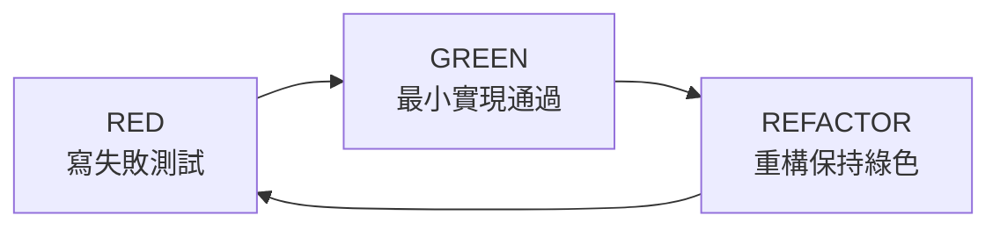

# 開發工作流專題（Development）

> 面向要修改本項目代碼的開發者：環境搭建、構建測試命令、TDD 工作流、代碼風格、Git 規範、調試技巧、擴展指南。

---

## 1. 開發環境搭建

### 1.1 JDK 21 + Maven（後端）

```powershell
# Windows — 設置 JDK 21
$env:JAVA_HOME = "C:\Users\13026\.jdks\ms-21.0.9"
$env:Path = "$env:JAVA_HOME\bin;$env:Path"
java -version   # 應顯示 21.x

# 系統級永久設置（管理員）
Set-ExecutionPolicy Bypass -Scope Process -Force
.\java\scripts\fix-java21-system.ps1
```

```bash
# macOS/Linux
export JAVA_HOME=$(/usr/libexec/java_home -v 21 2>/dev/null || echo "/usr/lib/jvm/java-21-openjdk")
```

```bash
# 安裝 Maven 依賴
cd java && mvn -DskipTests dependency:resolve
```

項目 `pom.xml` 配置 `<java.version>21</java.version>` + `<maven.compiler.release>21</maven.compiler.release>`。

### 1.2 Node 18+ + npm（前端）

```bash
cd next && npm install --legacy-peer-deps      # SWR peer dep 限制，必須帶 flag
```

### 1.3 Python 3.10+ + venv（agent + ingestion）

```bash
# Agent 服務
cd agent
python -m venv .venv
.venv\Scripts\activate          # Windows
# source .venv/bin/activate     # macOS/Linux
pip install -r requirements.txt

# 數據同步
pip install -r ingestion/requirements.txt
```

> ⚠️ Windows 上用 `python` 而非 `python3`——後者可能指向 Microsoft Store 版本。

---

## 2. 構建命令

| 端 | 命令 | 說明 |
|----|------|------|
| java | `cd java && mvn -DskipTests compile` | 需 JDK 21；最快驗證 |
| java | `mvn -DskipTests package` | 產出可執行 jar |
| java | `mvn spring-boot:run` | 需先注入 .env（見 DEPLOYMENT.md §3.3） |
| next | `cd next && npm run build` | 依賴安裝需 `--legacy-peer-deps` |
| next | `npm run dev` / `npm run lint` | 開發服務器 / lint |
| agent | `cd agent && python -m uvicorn app.main:app --port 8100` | 開發服務器 |
| agent | `ruff check app/` | Python lint（ruff.toml） |
| ingestion | 無構建 | 冪等可直接小範圍試跑（`--codes sh.600000`） |

---

## 3. 測試

### 3.1 測試命令

| 端 | 命令 | 測試數 | 覆蓋率門檻 |
|----|------|--------|-----------|
| **Java** | `cd java && mvn test` | **80**（3 skipped） | — |
| **前端** | `cd next && npm run test` | **24** | — |
| **Agent** | `cd agent && python -m pytest tests/` | **197** | 40%（pytest.ini） |

### 3.2 Java 測試（80 個）

按測試類分布（`src/test/java/com/quantization/test/`）：

| 測試類 | 測試數 | 覆蓋場景 |
|--------|--------|----------|
| `BacktestServiceTest` | 7 | 回測邏輯：曲線/止損/空數據/落庫/滑點/夏普 |
| `IndicatorMathTest`（含子類） | 28 | MA/MACD/KDJ/RSI/BOLL/EMA/振幅/量比/收益率 |
| `IndicatorEngineTest` | 7 | 指標引擎註冊表/快照構建 |
| `ScreenerFiltersTest` | 13 | 選股過濾器 |
| `ScreenerCoreTest` | 6 | 選股核心邏輯 |
| `PreferenceServiceTest` | 7 | 用戶偏好服務（MySQL 入庫 + 文件降級） |
| `StockServiceAlgorithmTest` | 4 | 景氣度/輪動算法 |
| **`AiCallLogCleanupSchedulerTest`** | **5** | AI 調用日誌清理調度器（Phase 4 新增） |
| **`PreferenceRepositoryTest`** | **3**（skipped） | Testcontainers MySQL 集成測試（需 Docker） |

**構成**：72 原有 + 5 aicalllog + 3 Testcontainers = 80（3 個 Testcontainers 在無 Docker 環境下 skip）。

### 3.3 前端測試（24 個 vitest）

`src/lib/api/__tests__/api.test.ts`，覆蓋 lib/api 層（API 客戶端函數/類型映射）。

### 3.4 Agent 測試（197 個 pytest）

15 個測試文件，覆蓋率門檻 40%（`pytest.ini`）。含 **24 個多窗口評分測試**（Phase 5 新增，`test_optimizer_multi_window.py`）：

| 測試類 | 測試數 | 覆蓋場景 |
|--------|--------|----------|
| `TestWeightedAverageScore` | 7 | 加權計算/邊界/常量一致性 |
| `TestBuildWindowConfig` | 7 | 窗口構建/不可變性/異常處理 |
| `TestRunMultiWindowBacktest` | 4 | 三窗口調用/加權/主窗口選擇 |
| `TestMultiWindowFlagInLoop` | 3 | 啟用/禁用切換 |
| `TestStagnantTermination` | 3 | 無限制/停止/進展重置 |

---

## 4. TDD 工作流

### 4.1 RED → GREEN → REFACTOR



| 階段 | 做法 | 驗證 |
|------|------|------|
| **RED** | 先寫測試，描述期望行為 | `mvn test` / `pytest` 應失敗 |
| **GREEN** | 最小實現讓測試通過 | `mvn test` / `pytest` 應全綠 |
| **REFACTOR** | 重構代碼，保持測試綠色 | 每次重構後跑測試 |

### 4.2 Java TDD 示例

```java
// 1. RED — 先寫測試（BacktestServiceTest.java）
@Test
@DisplayName("滑点配置生效：买入成交价上浮")
void slippageAppliedToFillPrice() {
    // ... 構造測試數據 ...
    BacktestConfigDto config = new BacktestConfigDto(..., 0.02, 50);
    BacktestResultDto result = backtestService.runBacktest(...);
    assertThat(result.logLines()).anyMatch(line -> line.contains("滑点：50 bp"));
}

// 2. GREEN — 實現滑點邏輯（BacktestService.java:249）
double fillPrice = price * (1 + slippageRate);  // 買入上浮

// 3. REFACTOR — 提取常量、優化性能，測試保持綠色
```

### 4.3 Agent TDD 示例

```python
# 1. RED — test_optimizer_multi_window.py
def test_weights_05_03_02():
    assert _weighted_average_score([80, 70, 60], [0.5, 0.3, 0.2]) == 74.0

# 2. GREEN — optimizer.py
def _weighted_average_score(scores, weights):
    weighted = sum(s * w for s, w in zip(scores, weights))
    return round(weighted / sum(weights), 2)

# 3. REFACTOR — 邊界處理、類型標註
```

---

## 5. 代碼風格

### 5.1 Java（後端）

- **模塊結構**：`module.<name>/` 下平鋪 Controller/Service/Repository/Entity + `dto/` 子包。新模塊照此結構
- **DTO 一律 Java record**，出參字段即 JSON 字段（無 @JsonProperty 改名）；可空字段用包裝類型（`Integer`/`Double`），Service 層負責默認值（參考 `BacktestService.java:97` 的 adjustflag 處理）
- **統一響應**：Controller 返回 `ApiResponse.ok(data)`；業務錯誤拋 `BusinessException(ErrorCode.X, msg)`，由 `GlobalExceptionHandler` 統一轉換
- **只讀事務**：查詢 Service 標 `@Transactional(readOnly = true)`
- **緩存**：新增 `@Cacheable` 時緩存名用 `CacheConfig` 常量並在 CacheManager 註冊；緩存名按域拆分（`STOCK_DAILY_CACHE`/`INDUSTRY_DAILY_CACHE`/`FORECAST_CACHE`/`ROTATION_CACHE`）
- **Entity 不是 schema 權威**：表結構變更必須寫顯式 SQL，`ddl-auto=none`
- **領域對象與 Entity 解耦**：下游計算用 `StockDaily` record，不直接傳 Entity

### 5.2 TypeScript（前端）

- API 類型集中在 `src/lib/api/types.ts`，**與後端 DTO 字段逐一對應**（手工維護，見 §8 變更清單）
- API 函數集中 `src/lib/api/index.ts`（後端）/ `agent.ts`（agent）；頁面用 SWR 消費，不散落 fetch
- 組件目錄按頁面域分組（dashboard/industry/screener/backtest/agent/chart/layout/ui）；通用 UI 進 `ui/`
- 日期一律 `yyyy-MM-dd` 字符串傳輸，展示層用 date-fns 格式化

### 5.3 Python（agent / ingestion）

- agent：配置一律進 `core/config.py`（pydantic Settings），勿散落 os.getenv；新指標進 `core/metrics.py`；LLM 調用一律走 `llm_client.analyze()`（自帶路由/降級/計量），勿直連供應商 SDK
- agent 測試：pytest + 新功能配套測試（覆蓋率門檻 40% 會強制執行）
- **類型標註**：所有函數簽名加類型標註（`dict[str, Any]`、`list[str]`、`str | None` 等）
- ingestion：保持冪等（新表必須帶唯一鍵 + ON DUPLICATE KEY UPDATE）；**勿修改進度輸出文案** `已寫入 N 條` / `共寫入 N 條`（是 SyncService 的解析協議）

---

## 6. Git 工作流

### 6.1 分支策略

- `main` — 主分支，保持可運行
- `feature/*` — 功能分支
- `fix/*` — 修復分支
- 分支/提交規範見 `CONTRIBUTING.md`

### 6.2 Commit 規範

```
<type>(<scope>): <subject>

<body>
```

| type | 說明 |
|------|------|
| `feat` | 新功能 |
| `fix` | 修復 |
| `docs` | 文檔 |
| `refactor` | 重構 |
| `test` | 測試 |
| `chore` | 雜項 |

### 6.3 Pre-commit 鉤子

`.pre-commit-config.yaml` 配置 pre-commit 鉤子；`.github/gitleaks.toml` 掃密鑰。

### 6.4 勿提交

- `.env`（含密碼）
- `java/preference.json`（運行時產物）
- `agent/data/`（運行時記憶：Milvus + checkpoint + 錯誤庫）
- `agent/.env`

CI 見 `.github/workflows/`。

---

## 7. 調試

### 7.1 調試工具

| 場景 | 方法 |
|------|------|
| 看後端實際 SQL | `application.yml` `show-sql: true`（臨時）或 log `org.hibernate.SQL=DEBUG` |
| 排查某端點 | **Swagger UI** 直接調（帶 context-path `/TradingWorkstation`）；統一信封的 `code/message` 先看 |
| 緩存干擾排查 | TTL 統一 30s；重啟後端即清空（Caffeine 純內存） |
| agent 循環卡住 | `GET /api/agent/monitor/events` 看節點時間軸；`/monitor/errors` 看 JSON 提取/評委拒絕記錄 |
| agent LLM 成本 | `GET /api/agent/metrics` 中 `agent_llm_calls_total{provider=}`；或 ai_call_log 表按 provider 聚合 |
| 同步不動 | 後端日誌看子進程 stdout 轉發；直接手跑 ingestion 腳本複現 |
| 前端拿到 404 | 九成是 context-path 三處不同步（DEPLOYMENT.md §4.4） |
| 回測結果可疑 | 先讀 BACKTEST_ENGINE.md §6 方法論限制，確認不是理想化假設所致 |

### 7.2 Swagger UI

| 服務 | URL |
|------|-----|
| 後端 | `http://localhost:8090/TradingWorkstation/swagger-ui.html` |
| Agent | `http://localhost:8100/docs` |

### 7.3 前端 DevTools

- React DevTools — 組件樹/props/state
- Network — API 請求/響應（注意 context-path 前綴）
- SWR DevTools — 緩存狀態/重新驗證

---

## 8. 變更同步清單（改一處必須聯動的地方）

| 你改了 | 必須同步 |
|--------|----------|
| 後端 DTO 字段 | `next/src/lib/api/types.ts` 對應 interface；若 agent 消費（backend_client.py 21 個端點）同步 agent 解析；docs/api.md |
| 新增後端端點 | types.ts + index.ts API 函數；docs/api.md；若供 agent 用 → backend_client.py + rate_limiter 分類 |
| 表結構 | 顯式 migration SQL（docs/）+ Entity @Column + ingestion CREATE TABLE（行情表）+ database.md + SystemService.validateSchema 必需列（若動 stock_daily） |
| ingestion 進度文案 | ⚠️ 禁改；必須改時同步 `SyncService.java:31-32` 正則 |
| context-path | 三處：application.yml / next.config.js（basePath+rewrites）/ agent BACKEND_API_URL |
| 環境變量 | .env.example（或 agent/.env.example）+ AppProperties/config.py 綁定 + DEPLOYMENT.md §4 |
| 緩存名/TTL | CacheConfig 常量與 CacheManager 註冊 + MODULE_GUIDE.md 緩存表 |
| agent 階段/供應商 | providers.py STAGE_DEFAULT_PROVIDERS + few_shot.py 示例 + AGENT_SERVICE.md |

**OpenAPI 類型生成管線**：已接入 `openapi-typescript` 從後端 `/v3/api-docs` 生成前端類型，逐步消滅 types.ts 手工同步（詳見下方 §12「OpenAPI 類型生成」）。

---

## 9. 新增指標計算器

指標引擎採用**註冊表模式**（`IndicatorEngine.java:29-47`），持有 `Map<String, IndicatorCalculator>`，所有 `IndicatorCalculator` bean 由 Spring 自動注入並按 `name()` 註冊。**新增指標只需實現接口 + `@Component`，無需改 `IndicatorEngine`**。

### 9.1 步驟

```java
// 1. 實現 IndicatorCalculator 接口（參考 calculator/MaCalculator.java）
package com.quantization.module.indicator.calculator;

@Component
public class MyIndicatorCalculator implements IndicatorCalculator {

    @Override
    public String name() {
        return "MY_INDICATOR";  // 註冊表 key
    }

    @Override
    public void calculate(IndicatorSnapshotBuilder builder, List<StockDaily> history, int index) {
        List<Double> closes = builder.closes();
        // 計算邏輯...
        builder.myIndicator(value);  // 寫入構建器
    }
}
```

```java
// 2. 在 IndicatorSnapshotBuilder 添加字段 + setter
private double myIndicator;
public void myIndicator(double v) { this.myIndicator = v; }
// 在 build() 中加入快照 record
```

```java
// 3. 在 IndicatorSnapshot record 添加字段
public record IndicatorSnapshot(..., double myIndicator) {}
```

### 9.2 關鍵文件

| 文件 | 職責 |
|------|------|
| `IndicatorCalculator.java:21-33` | 接口定義（`name()` + `calculate()`） |
| `IndicatorEngine.java:36-47` | Spring 注入構造函數，自動收集所有計算器 |
| `IndicatorSnapshotBuilder.java` | 可變構建器，各計算器寫入字段 |
| `IndicatorSnapshot` | 不可變 record，最終快照 |
| `calculator/*.java` | 7 個現有計算器（MA/RSI/VolumeRatio/Return/KDJ/MACD/BOLL） |

### 9.3 測試

新增計算器後，在 `IndicatorMathTest` 或新建測試類添加對照標準序列的測試（純函數最易測，是選股/回測共同地基）。

---

## 10. 新增篩選條件

`ScreenerCriteriaDto`（`screener/dto/ScreenerCriteriaDto.java:15-64`）含 49 個扁平字段，同時提供按域分組的嵌套子記錄視圖（`priceFilter()`、`momentumFilter()` 等，P5 重構）。

### 10.1 步驟

```java
// 1. 在 ScreenerCriteriaDto record 添加字段（保持扁平）
public record ScreenerCriteriaDto(
    ...,
    Double minMyFilter,   // 新增字段
    Double maxMyFilter,
    ...
) {}

// 2. 在嵌套子記錄視圖添加（如屬於某域）
public record PriceFilter(..., Double minMyFilter, Double maxMyFilter) {}
public PriceFilter priceFilter() {
    return new PriceFilter(..., minMyFilter, maxMyFilter);
}
```

```typescript
// 3. 同步前端類型（next/src/lib/api/types.ts）
interface ScreenerCriteriaDto {
  ...
  minMyFilter?: number;
  maxMyFilter?: number;
}
```

```java
// 4. 在 ScreenerFilters 實現過濾邏輯
if (criteria.minMyFilter() != null && snapshot.myIndicator() < criteria.minMyFilter()) {
    return false;
}
```

### 10.2 變更同步清單

| 改了 | 同步 |
|------|------|
| `ScreenerCriteriaDto` 字段 | `types.ts` interface；agent `backend_client.py` 解析；docs/api.md |
| 篩選邏輯 | `ScreenerFilters` + `ScreenerFiltersTest` |
| 嵌套視圖 | 對應子記錄 + 訪問器 |

---

## 11. 已知技術債（動手前先讀）

按優先級（詳細分析與修法見 architecture.md §7）：

1. 🔴 景氣度雙公式 bug（`StockService.java:2452`）——碰行業分析代碼前必看
2. 🔴 SystemService .env 反寫無淨化；NotificationService Webhook 無簽名
3. 🟡 StockService 2,583 行過載（規劃拆 stock/industry/forecast）
4. 🟡 CacheConfig 單一 TTL（`CACHE_SUMMARY_TTL_SECONDS` 是死配置）
5. 🟡 IndicatorController 忽略請求 config（一行修復）
6. 🟡 前端 types.ts 手工鏡像已有漂移（`SummaryMetricsDto` 缺 `earliestTradeDate`）

---

## 12. OpenAPI 類型生成

前端 TypeScript 類型已接入 `openapi-typescript` 自動生成管線，從後端 Spring Boot 的 springdoc-openapi spec（`/TradingWorkstation/v3/api-docs`）生成，消滅 `types.ts` 手工同步的契約 drift。

### 12.1 管線概覽

```
後端 springdoc-openapi  →  /TradingWorkstation/v3/api-docs (OpenAPI 3.0 JSON)
                              │
              ┌───────────────┼───────────────┐
              ▼               ▼               ▼
        gen:api          gen:api:local    gen:api:smart
       (URL 直連)       (本地文件)      (自動選擇+刷新)
              │               │               │
              └───────┬───────┴───────┬───────┘
                      ▼               ▼
        src/lib/api/generated.ts   src/lib/api/openapi.json
        (自動生成類型)             (本地 spec 快照/fallback)
```

### 12.2 三個生成腳本

| 腳本 | 命令 | 來源 | 後端要求 |
|------|------|------|----------|
| `gen:api` | `npm run gen:api` | 後端 URL | 需啟動 |
| `gen:api:local` | `npm run gen:api:local` | 本地 `openapi.json` | 不需要 |
| `gen:api:smart` | `npm run gen:api:smart` | 自動（URL → 文件 fallback） | 可選 |

- `gen:api` / `gen:api:local` 直接調用 `openapi-typescript` CLI
- `gen:api:smart` 走 `scripts/generate-api-types.ts`：先嘗試 URL 拉取（5s 超時），成功則刷新本地 `openapi.json`；失敗則 fallback 到本地文件。支持 `--url` / `--file` 顯式模式

### 12.3 文件職責

| 文件 | 職責 | 是否提交 Git |
|------|------|-------------|
| `src/lib/api/types.ts` | 手寫類型（權威，63 個），與後端 DTO 逐一對應 | ✅ |
| `src/lib/api/generated.ts` | 自動生成類型（`paths`/`components`/`operations` 命名空間） | ✅（可 regen） |
| `src/lib/api/openapi.json` | 後端 spec 本地快照（離線 fallback） | ✅ |
| `scripts/generate-api-types.ts` | 智能生成腳本（URL + 文件 fallback） | ✅ |

### 12.4 工作流

**後端改了 DTO 後**：

```bash
# 1. 啟動後端（或確保已啟動）
# 2. 重新生成前端類型
cd next
npm run gen:api          # 或 npm run gen:api:smart

# 3. 對比 generated.ts 與 types.ts，逐步遷移手寫類型
#    （diff 兩者的 interface 定義，發現漂移點）

# 4. 確認 build/test 通過
npm run typecheck && npm run test && npm run build
```

**離線開發（後端未啟動）**：

```bash
cd next
npm run gen:api:local    # 從上次保存的 openapi.json 生成
```

### 12.5 設計原則

- **不破壞**：`types.ts` 手寫類型保留不動，`generated.ts` 是補充；在完全遷移前 `types.ts` 仍為權威
- **冪等**：重複運行 `gen:api` 產出一致（spec 不變時）
- **離線友好**：`openapi.json` 快照確保後端未啟動時仍可生成
- **漸進遷移**：可逐個 interface 從 `types.ts` 切換到 `generated.ts` 的 `components["schemas"]`，無需一次性全替
