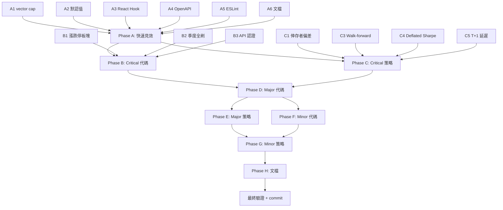

# 完整修復方案（51 項缺陷）

> 範圍：全部 51 項（4 Critical + 11 Major + 11 Minor + 6 文檔 + 5 策略 Critical + 8 策略 Major + 6 策略 Minor）
> 實施順序：Phase A → B → C → D → E → F → G → H
> 驗證：每個 Phase 完成後運行相關測試
> Git：全部完成後一次 commit

---

## Phase A：快速見效（6 項，≤1 天）

### A1. 修復 vector_store cap 只刪負分（C3）

**文件**：`agent/app/services/vector_store.py`

**現狀**（line 240）：
```python
filter="composite_score < 0",  # 只清理負分
```

**改動**：改為按 composite_score 升序刪除最低分（不分正負）
```python
# 先嘗試刪除負分，不足時刪除最低分正分
results = _milvus.query(
    collection_name=COLLECTION_NAME,
    filter="",  # 不限制分數
    output_fields=["id", "composite_score"],
    sort="composite_score",  # 升序：最低分優先
    limit=to_delete,
)
```

**驗證**：臨時測試插入 1001 條正分經驗，驗證 cap 生效

---

### A2. 補齊 BacktestConfigDto 默認值（m5 + m6 + S-M2 + S-M3 + S-m2）

**文件**：`java/.../backtest/dto/BacktestConfigDto.java`

**現狀**：
- `commissionBps`（double，無默認值，Java record 默認 0.0）
- `slippageBps`（Integer，默認 0）
- `rebalanceInterval`（int，無默認值，默認 0）
- `holdingPeriod`（int，無默認值，默認 0）
- `maxPositions`（int，無默認值，默認 0）

**改動**：
```java
public static final double DEFAULT_COMMISSION_BPS = 3.0;
public static final int DEFAULT_SLIPPAGE_BPS = 5;  // 從 0 改為 5
public static final int DEFAULT_REBALANCE_INTERVAL = 5;
public static final int DEFAULT_HOLDING_PERIOD = 10;
public static final int DEFAULT_MAX_POSITIONS = 5;

public BacktestConfigDto {
    if (riskFreeRate == null) riskFreeRate = DEFAULT_RISK_FREE_RATE;
    if (slippageBps == null) slippageBps = DEFAULT_SLIPPAGE_BPS;
    // commissionBps 是 double，不能用 null 判斷，改為 effective 方法
    // rebalanceInterval/holdingPeriod/maxPositions 是 int，用 effective 方法
}

public double effectiveCommissionBps() {
    return commissionBps > 0 ? commissionBps : DEFAULT_COMMISSION_BPS;
}
public int effectiveRebalanceInterval() {
    return rebalanceInterval > 0 ? rebalanceInterval : DEFAULT_REBALANCE_INTERVAL;
}
public int effectiveHoldingPeriod() {
    return holdingPeriod > 0 ? holdingPeriod : DEFAULT_HOLDING_PERIOD;
}
public int effectiveMaxPositions() {
    return maxPositions > 0 ? maxPositions : DEFAULT_MAX_POSITIONS;
}
```

**文件**：`java/.../backtest/BacktestService.java`

**改動**（line 84-88）：
```java
int rebalanceInterval = Math.max(1, config.effectiveRebalanceInterval());
int holdingPeriod = Math.max(1, config.effectiveHoldingPeriod());
int maxPositions = Math.max(1, config.effectiveMaxPositions());
double initialCapital = config.initialCapital();
double commissionRate = config.effectiveCommissionBps() / 10000.0;
```

**驗證**：`BacktestServiceTest` 新增測試驗證默認值生效

---

### A3. 修復 React Hook 依賴警告（m4）

**文件 1**：`next/src/components/agent/AgentNodeTimeline.tsx`

**現狀**（line 132-133）：
```tsx
const iterations = timeline?.iterations ?? [];
const nodeDefs = timeline?.node_definitions ?? [];
```

**改動**：用 useMemo 包裝
```tsx
const iterations = useMemo(() => timeline?.iterations ?? [], [timeline?.iterations]);
const nodeDefs = useMemo(() => timeline?.node_definitions ?? [], [timeline?.node_definitions]);
```

**文件 2**：`next/src/components/agent/AgentModelCard.tsx`

**現狀**（line 89）：useEffect 缺少 `currentConfig`、`onStartConfigChange`、`validateDates` 依賴

**改動**：補齊依賴數組（需讀取完整 useEffect 後確定）

**驗證**：`npm run build` 零 React Hook 警告

---

### A4. 重新生成 OpenAPI 類型（M6）

**文件**：`next/src/lib/api/generated.ts`（自動生成）

**改動**：
1. 啟動 Java 後端
2. 執行 `npm run gen:api`（從 `http://localhost:8090/TradingWorkstation/v3/api-docs` 生成）
3. 驗證端點數 = 64

**驗證**：`npm run typecheck` 通過

---

### A5. 新增 ESLint 9 flat config（階段 1 基線）

**文件**：`next/eslint.config.mjs`（新建）

**改動**：
```javascript
import next from 'eslint-config-next';

export default [
  ...next,
  {
    rules: {
      'react-hooks/exhaustive-deps': 'warn',
    },
  },
];
```

**驗證**：`npm run lint` 可執行

---

### A6. 更新文檔計數與模塊描述（D1-D6 + m8）

**文件**：
- `docs/AGENT_SERVICE.md`：端點 22/26→34、測試 197/200+→324
- `docs/api.md`：後端端點 52→64、news 端點 3→10
- `docs/architecture.md`：端點 52→64、22→34、模塊 12→13
- `docs/database.md`：補充 `news_sentiment_score` 表
- `docs/DEVELOPMENT.md`：Java 測試 80→93、Agent 197→324、模塊 12→13
- `AGENTS.md`：provider 7→8（加 ox-alpha）、ForecastService 描述修正（非 God class）

**驗證**：人工核對計數

---

## Phase B：Critical 代碼修復（3 項）

### B1. 漲跌停按板塊動態計算（C1 + S-C2）

**涉及文件**：
1. `java/.../stock/StockDailyEntity.java` — 新增 `board` 字段
2. `java/src/main/resources/schema.sql` — 新增 `stock_listing` 表 DDL
3. `ingestion/baostock_write.py` — 寫入時根據代碼前綴判斷 board
4. `ingestion/baostock_fetch.py` — 返回數據中新增 board
5. `java/.../backtest/BacktestService.java` — 動態計算漲跌停閾值
6. `java/.../backtest/dto/BacktestConfigDto.java` — 新增 board 配置（可選）

**改動詳情**：

**StockDailyEntity.java**：新增字段
```java
@Column(length = 10)
private String board;  // main / star / chinext / st
```

**schema.sql**：新增 stock_listing 表
```sql
CREATE TABLE IF NOT EXISTS stock_listing (
    code VARCHAR(20) NOT NULL PRIMARY KEY,
    code_name VARCHAR(50),
    board VARCHAR(10) NOT NULL COMMENT 'main/star/chinext/st',
    listing_date DATE,
    delisting_date DATE,
    updated_at TIMESTAMP DEFAULT CURRENT_TIMESTAMP ON UPDATE CURRENT_TIMESTAMP
);
```

**baostock_write.py**：新增 board 推斷函數
```python
def _infer_board(code: str, is_st: int) -> str:
    """根據股票代碼前綴推斷板塊。"""
    if is_st == 1:
        return "st"
    if code.startswith("sh.688") or code.startswith("sz.300"):
        return "chinext"  # 科創板/創業板
    return "main"
```

**BacktestService.java**：動態閾值
```java
// 移除硬編碼
// private static final double LIMIT_THRESHOLD = 9.9;

private double limitThreshold(String board) {
    return switch (board) {
        case "star", "chinext" -> 19.9;
        case "st" -> 4.9;
        default -> 9.9;
    };
}
```

**影響行**：line 186-189（止損跌停延後）、line 236-238（買入漲跌停跳過）

**驗證**：
- `BacktestServiceTest` 新增 3 個測試：科創板 20%、ST 5%、主板 10%
- 需要回填 board 字段到歷史數據（SQL UPDATE）

---

### B2. adjustflag=2 季度自動全刷（C2 + S-M1）

**涉及文件**：
1. `java/.../sync/SyncService.java` — 新增季度全刷方法
2. `java/.../sync/QuarterlyRefreshScheduler.java`（新建）— 定時調度
3. `java/src/main/resources/application.yml` — 新增配置
4. `ingestion/baostock_ingest.py` — 新增 `--auto-quarterly` 模式

**改動詳情**：

**QuarterlyRefreshScheduler.java**（新建）：
```java
@Component
@ConditionalOnProperty(name = "app.sync.quarterly-full-refresh-enabled", havingValue = "true")
public class QuarterlyRefreshScheduler {
    @Scheduled(cron = "${app.sync.quarterly-refresh-cron:0 0 2 1 */3 ?}")
    public void executeQuarterlyRefresh() {
        // 調用 SyncService 執行 --full-refresh-adjustflag2
    }
}
```

**application.yml**：
```yaml
sync:
  quarterly-full-refresh-enabled: ${SYNC_QUARTERLY_REFRESH:true}
  quarterly-refresh-cron: ${SYNC_QUARTERLY_CRON:0 0 2 1 */3 ?}
```

**baostock_ingest.py**：新增 `--auto-quarterly` 模式
```python
# 讀取 data/last_adjustflag2_refresh.txt 時間戳
# 若超過 90 天則執行全刷
# 完成後更新時間戳
```

**驗證**：手動觸發 `--auto-quarterly` 驗證執行

---

### B3. API 認證中間件（C4）

**涉及文件**：
1. `java/pom.xml` — 新增 spring-boot-starter-security 依賴
2. `java/.../config/SecurityConfig.java`（新建）— Spring Security 配置
3. `agent/app/core/auth.py`（新建）— FastAPI API key 認證
4. `agent/app/main.py` — 註冊中間件
5. `agent/app/core/config.py` — 新增 `api_key` 配置
6. `next/src/lib/api/client.ts` — 注入 `X-API-Key` header
7. `next/src/lib/api/agent.ts` — 注入 `X-API-Key` header
8. `application.yml` — 新增 `app.security.api-key` 配置
9. `.env.example` — 新增 `API_KEY` 環境變量

**改動詳情**：

**SecurityConfig.java**（新建）：
```java
@Configuration
@EnableWebSecurity
@ConditionalOnProperty(name = "app.security.enabled", havingValue = "true", matchIfMissing = false)
public class SecurityConfig {
    @Bean
    public SecurityFilterChain filterChain(HttpSecurity http) throws Exception {
        http.csrf().disable()
            .authorizeHttpRequests(auth -> auth
                .requestMatchers("/api/**").authenticated()
                .anyRequest().permitAll())
            .addFilterBefore(new ApiKeyFilter(apiKey), UsernamePasswordAuthenticationFilter.class);
        return http.build();
    }
}
```

**auth.py**（新建）：
```python
async def api_key_middleware(request: Request, call_next):
    if settings.environment == "development" and not settings.api_key:
        return await call_next(request)
    provided = request.headers.get("X-API-Key")
    if provided != settings.api_key:
        return JSONResponse(status_code=401, content={"error": "Unauthorized"})
    return await call_next(request)
```

**驗證**：
- 無 API key 請求返回 401
- 有 API key 請求正常
- 開發環境無 key 也正常（`app.security.enabled=false`）

---

## Phase C：Critical 策略修復（5 項，與 Phase B 部分重疊）

### C1. 倖存者偏差修復（S-C1 + M4）

**涉及文件**：
1. `java/src/main/resources/schema.sql` — 新增 `stock_listing` 表（已在 B1 中）
2. `ingestion/baostock_fetch.py` — 新增退市股發現
3. `ingestion/baostock_write.py` — 新增 `stock_listing` 寫入
4. `java/.../stock/StockListingRepository.java`（新建）— 查詢 stock_listing
5. `java/.../screener/ScreenerCore.java` — `availableCodes` 改為按 asOfDate 過濾
6. `java/.../screener/ScreenerService.java` — 傳遞 asOfDate 到 ScreenerCore

**改動詳情**：

**ScreenerCore.java**（line 87 附近）：
```java
// 現狀：availableCodes 來自靜態 stock_list.json
// 改動：新增 availableCodesOnDate(asOfDate) 方法，查詢 stock_listing 表
public Set<String> availableCodesOnDate(LocalDate asOfDate) {
    return stockListingRepository.findActiveOnDate(asOfDate);
}
```

**驗證**：
- 構造歷史日期回測，驗證不含未上市/已退市股票
- 對比修復前後回測結果差異

---

### C2. 漲跌停板塊動態（S-C2）= B1

已在 Phase B1 中完成。

---

### C3. Walk-forward 框架（S-C3 + M2 + L3）

**涉及文件**：
1. `java/.../backtest/dto/WalkForwardConfigDto.java`（新建）
2. `java/.../backtest/BacktestService.java` — 新增 `runWalkForward()` 方法
3. `java/.../backtest/BacktestController.java` — 新增 walk-forward 端點
4. `agent/app/agents/optimizer.py` — 優化循環改為 train 段迭代
5. `agent/app/agents/scoring.py` — 新增樣本外得分

**改動詳情**：

**WalkForwardConfigDto.java**（新建）：
```java
public record WalkForwardConfigDto(
    LocalDate trainStart,
    LocalDate trainEnd,
    LocalDate testStart,
    LocalDate testEnd,
    int nFolds,  // 滾動窗口數，0=單次 train/test
    ScreenerCriteriaDto criteria,
    BacktestConfigDto config
) {}
```

**BacktestService.java**：新增方法
```java
public WalkForwardResultDto runWalkForward(WalkForwardConfigDto request) {
    // 在 train 段運行正常回測
    BacktestResultDto trainResult = runBacktest(...);
    // 在 test 段用相同參數運行回測
    BacktestResultDto testResult = runBacktest(...);
    // 計算樣本外表現
    return new WalkForwardResultDto(trainResult, testResult, ...);
}
```

**驗證**：構造 walk-forward 回測，驗證 train/test 段分離

---

### C4. 多重檢驗修正 — Deflated Sharpe + PBO（S-C4 + L4）

**涉及文件**：
1. `java/.../backtest/BacktestService.java` — 新增 `calculateDeflatedSharpe()` 方法
2. `java/.../backtest/dto/BacktestResultDto.java` — `BacktestStatistics` 新增字段
3. `agent/app/agents/optimizer.py` — 維護全局試驗計數 + Sharpe 分佈
4. `agent/app/agents/scoring.py` — 報告 Deflated Sharpe

**改動詳情**：

**BacktestStatistics** 新增字段：
```java
public record BacktestStatistics(
    double totalReturn, double annualReturn, double benchmarkReturn,
    double excessReturn, double maxDrawdown, double sharpe,
    int rebalanceCount, int totalTrades,
    // 新增
    double sortino, double calmar, double informationRatio,
    double beta, double alpha, double winRate, double profitLossRatio,
    double deflatedSharpe, int nTrials, double pbo
) {}
```

**Deflated Sharpe 計算**：
```java
// DSR = (SR_observed - E[max(SR)] under null) / std(SR)
// E[max(SR)] ≈ sqrt(2*log(N)) * std(SR) （極值理論近似）
// N = 試驗次數
```

**驗證**：構造已知 Sharpe 分佈的試驗，驗證 Deflated Sharpe 計算正確

---

### C5. T+1 執行延遲（S-C5 + M1 + M3）

**涉及文件**：
1. `java/.../backtest/BacktestService.java` — 買入/賣出延遲到次日
2. `java/.../backtest/dto/BacktestConfigDto.java` — 新增 `executionDelay` 配置

**改動詳情**：

**BacktestConfigDto.java**：
```java
Integer executionDelay  // 執行延遲天數，默認 1（T+1），0=T+0
// effectiveExecutionDelay() 返回 1 if null
```

**BacktestService.java**：
```java
// 調倉日選股（當日）
List<ScreenedStockDto> candidates = screenerCore.screenAt(grouped, date, ...);
// 執行延遲到 nextTradeDate(date)
LocalDate execDate = tradeDates.get(Math.min(dateIdx + executionDelay, tradeDates.size() - 1));
// 用 execDate 的開盤價執行
Double openPrice = openPriceLookup.get(code).get(execDate);
double fillPrice = openPrice * (1 + slippageRate);
```

**影響行**：line 231（選股）、line 249（買入）、line 201（賣出）、line 220（賣出）

**驗證**：
- `BacktestServiceTest` 新增 T+1 測試
- 對比 T+0 vs T+1 回測結果差異

---

## Phase D：Major 代碼修復（11 項，部分與 Phase B/C 重疊）

### D1. error_store 原子寫入 + 進程間鎖（M7）

**文件**：`agent/app/services/error_store.py`

**改動**（line 74-81）：
```python
import tempfile, os

def _persist():
    try:
        _DATA_DIR.mkdir(parents=True, exist_ok=True)
        # 原子寫入：先寫臨時文件，再 rename
        with tempfile.NamedTemporaryFile(
            mode='w', dir=_DATA_DIR, suffix='.tmp',
            delete=False, encoding='utf-8'
        ) as f:
            json.dump({"errors": _cache}, f, ensure_ascii=False, indent=2)
            tmp_path = f.name
        os.replace(tmp_path, _STORE_FILE)  # 原子操作
    except Exception as e:
        logger.warning(f"持久化錯誤經驗失敗（忽略）: {e}")
        # 清理臨時文件
        if 'tmp_path' in locals() and os.path.exists(tmp_path):
            os.unlink(tmp_path)
```

**驗證**：並發寫入測試 + 寫入中斷後文件完整性

---

### D2. retry budget + circuit breaker（M9）

**涉及文件**：
1. `agent/app/core/llm_client.py` — 新增 CircuitBreaker 類
2. `agent/app/core/config.py` — 新增 `max_total_llm_attempts`
3. `agent/app/agents/stages/base.py` — max_attempts 從 config 讀取

**改動詳情**：

**config.py**：
```python
max_total_llm_attempts: int = 3  # 跨所有 provider 總嘗試數
circuit_breaker_threshold: int = 3  # 連續失敗閾值
circuit_breaker_recovery_seconds: int = 300  # 熔斷恢復時間
```

**llm_client.py**：新增 CircuitBreaker
```python
class CircuitBreaker:
    def __init__(self):
        self._failures: dict[str, int] = {}  # provider -> 連續失敗數
        self._open_until: dict[str, float] = {}  # provider -> 熔斷恢復時間

    def is_open(self, provider: str) -> bool:
        if provider in self._open_until:
            if time.time() < self._open_until[provider]:
                return True
            else:
                del self._open_until[provider]
                self._failures[provider] = 0
        return False

    def record_failure(self, provider: str):
        self._failures[provider] = self._failures.get(provider, 0) + 1
        if self._failures[provider] >= settings.circuit_breaker_threshold:
            self._open_until[provider] = time.time() + settings.circuit_breaker_recovery_seconds

    def record_success(self, provider: str):
        self._failures[provider] = 0
```

**改動**：`analyze()` 方法中，跳過熔斷的 provider，限制總嘗試數

**驗證**：模擬所有 provider 故障，驗證總調用 ≤ budget

---

### D3. token usage 指標（M8）

**涉及文件**：
1. `agent/app/core/metrics.py` — 新增指標
2. `agent/app/core/llm_client.py` — 解析 usage 並記錄

**改動詳情**：

**metrics.py**：
```python
def record_llm_tokens(provider: str, prompt_tokens: int, completion_tokens: int):
    inc_counter("agent_llm_tokens_total", {"provider": provider, "type": "prompt"}, prompt_tokens)
    inc_counter("agent_llm_tokens_total", {"provider": provider, "type": "completion"}, completion_tokens)

def record_llm_error(provider: str):
    inc_counter("agent_llm_errors_total", {"provider": provider})
```

**llm_client.py**：在 `LLMResponse` 中解析 usage
```python
# 解析 response.usage.prompt_tokens / completion_tokens
if hasattr(response, 'usage') and response.usage:
    record_llm_tokens(provider_id, response.usage.prompt_tokens, response.usage.completion_tokens)
```

**驗證**：`/metrics` 端點驗證新指標存在

---

### D4. 補抓狀態持久化 + 失敗暫停（M10）

**文件**：`agent/app/services/news_sync_scheduler.py`

**改動**：
```python
# 新增狀態文件
_STATE_FILE = Path(__file__).parent.parent.parent / "data" / "news_sync_state.json"

def _save_state():
    """持久化補抓狀態。"""
    state = {
        "catchup_done": _catchup_done,
        "last_sync_time": datetime.now().isoformat(),
        "completed_channels": _completed_channels,
    }
    with tempfile.NamedTemporaryFile(mode='w', dir=_STATE_FILE.parent, suffix='.tmp', delete=False) as f:
        json.dump(state, f)
        os.replace(f.name, _STATE_FILE)

def _load_state():
    """啟動時恢復狀態。"""
    if _STATE_FILE.exists():
        state = json.loads(_STATE_FILE.read_text())
        return state
    return None

# 補抓失敗時暫停定時同步
if not catchup_success:
    scheduler.pause_job("news_sync")  # 暫停定時
    logger.warning("補抓失敗，已暫停定時同步")
```

**驗證**：模擬補抓失敗驗證暫停 + 殺進程重啟驗證狀態恢復

---

### D5. 補抓並行化 + 自適應頁間隔（M11）

**文件**：`agent/app/services/wallstreetcn_client.py`

**改動**（line 646-741 附近）：
```python
# 多通道並行補抓（限制並發 3）
import asyncio

async def _catchup_all_channels(channels: list[str], days: int):
    semaphore = asyncio.Semaphore(3)
    async def catchup_one(channel):
        async with semaphore:
            return await _catchup_channel(channel, days)
    results = await asyncio.gather(*[catchup_one(ch) for ch in channels], return_exceptions=True)
    return results

# 自適應頁間隔
async def _adaptive_page_interval(last_response_time: float) -> float:
    return max(3.0, min(12.0, last_response_time * 1.5))
```

**config.py** 新增：
```python
news_sync_catchup_concurrency: int = 3
news_sync_catchup_page_interval_min: float = 3.0
news_sync_catchup_page_interval_max: float = 12.0
```

**驗證**：測量補抓完成時間

---

### D6. BacktestService 分批載入（M5）

**文件**：`java/.../backtest/BacktestService.java`

**現狀**（line 128-148）：兩分支都全量載入

**改動**：實現真正的分批載入
```java
if (totalDays > 180) {
    // 大範圍回測：按調倉日分批載入
    grouped = new ScreenerCore.Grouped(new HashMap<>(), new ArrayList<>());
    for (LocalDate rebalanceDate : rebalanceDateList) {
        LocalDate batchStart = rebalanceDate.minusDays(ScreenerService.SCREENING_LOOKBACK_DAYS);
        LocalDate batchEnd = rebalanceDate.plusDays(rebalanceInterval * 2);
        List<StockDaily> batch = stockService.domainRecordsInRange(batchStart, batchEnd, adjustflag, null);
        // 合併到 grouped（去重）
        mergeGrouped(grouped, screenerCore.groupHistories(batch));
    }
    priceLookup = buildPriceLookup(grouped);
    pctChangeLookup = buildPctChangeLookup(grouped);
} else {
    // 小範圍回測：一次載入（保持現狀）
    ...
}
```

**驗證**：5 年回測內存監控 + 分批 vs 全量結果對比

---

### D7. generated.ts 漂移修復（M6）= A4

已在 Phase A4 中完成。

---

### D8. adjustflag=2 季度全刷（M2）= B2

已在 Phase B2 中完成。

---

### D9. 倖存者偏差（M4）= C1

已在 Phase C1 中完成。

---

### D10. T+1 延遲（M1）= C5

已在 Phase C5 中完成。

---

### D11. Walk-forward（M2）= C3

已在 Phase C3 中完成。

---

## Phase E：Major 策略修復（8 項，部分重疊）

### E1. 滑點默認值（S-M2）= A2

已在 Phase A2 中完成。

---

### E2. commissionBps 默認值（S-M3）= A2

已在 Phase A2 中完成。

---

### E3. adjustflag=2 陳舊化（S-M1）= B2

已在 Phase B2 中完成。

---

### E4. 流動性約束（S-M4）

**文件**：`java/.../backtest/BacktestService.java`、`BacktestConfigDto.java`

**改動**：
```java
// BacktestConfigDto 新增
Double maxVolumePct  // 單筆買入不超過當日成交量的百分比，默認 10%

// BacktestService 買入邏輯（line 249 附近）
double maxVolume = stockDaily.getVolume() * config.effectiveMaxVolumePct() / 100.0;
double maxShares = maxVolume;
if (shares > maxShares) {
    shares = maxShares;
    if (shares <= 0) continue;  // 成交量不足，跳過
}
```

**驗證**：構造低成交量股票測試

---

### E5. 止損止盈默認值（S-M5）

**文件**：`java/.../backtest/dto/BacktestConfigDto.java`

**改動**：
```java
public static final double DEFAULT_STOP_LOSS_PCT = 10.0;
public static final double DEFAULT_TAKE_PROFIT_PCT = 0.0;  // 不默認止盈

public Double effectiveStopLossPct() {
    return stopLossPct != null ? stopLossPct : DEFAULT_STOP_LOSS_PCT;
}
```

**BacktestService.java**（line 91）：
```java
Double stopLoss = config.effectiveStopLossPct();
Double takeProfit = config.takeProfitPct();  // 仍可為 null
```

**驗證**：回測驗證止損生效

---

### E6. 風控指標補全（S-M6）

**文件**：`java/.../backtest/dto/BacktestResultDto.java`、`BacktestService.java`

**改動**：BacktestStatistics 新增字段（已在 C4 中定義）

**計算邏輯**：
```java
// Sortino: (mean - dailyRiskFree) / downsideStd * sqrt(252)
double downsideStd = Math.sqrt(
    dailyReturns.stream().filter(r -> r < 0)
        .mapToDouble(r -> Math.pow(r - mean, 2)).sum() / dailyReturns.size()
);
double sortino = downsideStd == 0 ? 0 : (mean - dailyRiskFree) / downsideStd * Math.sqrt(252);

// Calmar: annualReturn / maxDrawdown
double calmar = maxDrawdown == 0 ? 0 : annualReturn / maxDrawdown;

// Information Ratio: excessReturn / trackingError * sqrt(252)
double trackingError = Math.sqrt(
    excessReturns.stream().mapToDouble(r -> Math.pow(r - excessMean, 2)).sum() / excessReturns.size()
);
double informationRatio = trackingError == 0 ? 0 : (excessMean / trackingError) * Math.sqrt(252);

// Beta: cov(strategy, benchmark) / var(benchmark)
// Alpha: annualReturn - beta * benchmarkAnnualReturn - riskFreeRate

// 勝率: 盈利交易日數 / 總交易日數
// 盈虧比: 平均盈利 / 平均虧損
```

**驗證**：回測結果驗證新指標非零且合理

---

### E7. 基準可配置（S-M7）

**文件**：`java/.../backtest/BacktestService.java`、`BacktestConfigDto.java`

**改動**：
```java
// BacktestConfigDto 新增
String benchmarkCode  // 基準指數代碼，默認 sh.000001

// BacktestService
private static final String DEFAULT_BENCHMARK = "sh.000001";
String benchmarkCode = config.benchmarkCode() != null ? config.benchmarkCode() : DEFAULT_BENCHMARK;
List<IndexDailyEntity> indexData = stockService.findIndexDailyBetween(benchmarkCode, start, end);
```

**驗證**：用不同基準回測驗證

---

### E8. 紙面交易（S-M8）

**涉及文件**：
1. `java/.../papertrading/PaperTradingService.java`（新建）
2. `java/.../papertrading/PaperTradingController.java`（新建）
3. `java/.../papertrading/PaperTradingEntity.java`（新建）
4. `java/src/main/resources/schema.sql` — 新增 paper_trading 表
5. `next/src/app/paper-trading/page.tsx`（新建）
6. `next/src/lib/api/types.ts` — 新增紙面交易類型

**改動詳情**：

**schema.sql**：
```sql
CREATE TABLE IF NOT EXISTS paper_trading (
    id BIGINT AUTO_INCREMENT PRIMARY KEY,
    strategy_id BIGINT,
    trade_date DATE NOT NULL,
    code VARCHAR(20) NOT NULL,
    action VARCHAR(10) NOT NULL COMMENT 'buy/sell',
    shares DOUBLE NOT NULL,
    price DECIMAL(20,4) NOT NULL,
    portfolio_value DECIMAL(20,2),
    created_at TIMESTAMP DEFAULT CURRENT_TIMESTAMP
);
```

**PaperTradingService.java**：
```java
@Service
public class PaperTradingService {
    @Scheduled(cron = "0 0 15 * * MON-FRI")  // 每日收盤後
    public void executeDailyPaperTrading() {
        // 用最新數據運行策略
        // 記錄虛擬交易
        // 計算組合價值
    }
}
```

**驗證**：手動觸發紙面交易，驗證交易記錄

---

## Phase F：Minor 代碼修復（11 項）

### F1. IndicatorEngine 校驗失敗日誌（m1）

**文件**：`java/.../indicator/IndicatorEngine.java`

**改動**（line 70-78）：
```java
if (history.size() < 30) {
    log.debug("指標計算跳過：歷史數據不足 {} < 30, code={}", history.size(), code);
    return null;
}
if (closePrice == null || closePrice <= 0) {
    log.debug("指標計算跳過：收盤價無效 {}, code={}", closePrice, code);
    return null;
}
// ... 其他校驗同理
```

---

### F2. ScreenerCore parallelStream 異常處理（m2）

**文件**：`java/.../screener/ScreenerCore.java`

**改動**（line 58 附近）：
```java
// 現狀
histories.entrySet().parallelStream().map(...).filter(...).collect(...)

// 改動
histories.entrySet().parallelStream()
    .map(entry -> {
        try {
            return screenOne(entry, dates, tradeDate, ...);
        } catch (Exception e) {
            log.warn("選股計算失敗 code={}: {}", entry.getKey(), e.getMessage());
            return null;
        }
    })
    .filter(Objects::nonNull)
    .collect(...)
```

---

### F3. DashboardService 優雅降級（m3）

**文件**：`java/.../dashboard/DashboardService.java`

**改動**（line 61-75）：
```java
CompletableFuture<List<StockDailyDto>> recordsFuture = CompletableFuture.supplyAsync(() -> {
    try {
        return stockService.recentRecords(limit);
    } catch (Exception e) {
        log.warn("載入近期記錄失敗，降級為空列表: {}", e.getMessage());
        return Collections.emptyList();
    }
}, asyncExecutor);
// ... 其他 future 同理
```

---

### F4. React Hook 警告（m4）= A3

已在 Phase A3 中完成。

---

### F5. commissionBps 默認值（m5）= A2

已在 Phase A2 中完成。

---

### F6. 滑點默認值（m6）= A2

已在 Phase A2 中完成。

---

### F7. 基準可配置（m7）= E7

已在 Phase E7 中完成。

---

### F8. ForecastService 描述修正（m8）= A6

已在 Phase A6 中完成。

---

### F9. vector_store 初始化重試（m9）

**文件**：`agent/app/services/vector_store.py`

**改動**（line 43 附近）：
```python
# 現狀：3 次失敗後永久放棄
# 改動：改為指數退避重試（最大間隔 5 分鐘）
_MAX_INIT_RETRIES = 3
_INIT_RETRY_BASE_SECONDS = 60  # 基礎間隔
_INIT_RETRY_MAX_SECONDS = 300  # 最大間隔

def _init():
    global _init_attempted, _init_fail_count
    if _init_attempted and _init_fail_count >= _MAX_INIT_RETRIES:
        # 檢查是否到了重試時間
        if time.time() - _last_init_attempt_time < _INIT_RETRY_MAX_SECONDS:
            return
        _init_fail_count = 0  # 重置計數，允許重試
    # ... 原有初始化邏輯
```

---

### F10. aicalllog 保留天數可配置 + 脫敏（m10）

**文件**：`java/.../aicalllog/AiCallLogService.java`、`application.yml`

**改動**：
```java
// 現狀：retention-days 已可配置（application.yml line 85）
// 改動：新增 inputJson 脫敏
public String sanitizeInputJson(String inputJson) {
    // 移除用戶偏好中的個人標識
    // 移除 API key 相關字段
    return inputJson.replaceAll("\"apiKey\"\\s*:\\s*\"[^\"]*\"", "\"apiKey\":\"***\"");
}
```

---

### F11. Agent lifespan 優雅關閉超時（m11）

**文件**：`agent/app/main.py`

**改動**（line 186-193）：
```python
# 關閉清理
try:
    await asyncio.wait_for(model_checker.stop(), timeout=10.0)
except asyncio.TimeoutError:
    logger.warning("model_checker 停止超時，強制繼續")

try:
    await asyncio.wait_for(news_sync_scheduler.stop(), timeout=10.0)
except asyncio.TimeoutError:
    logger.warning("news_sync_scheduler 停止超時，強制繼續")

await backend_client.aclose()
```

---

## Phase G：Minor 策略修復（6 項）

### G1. 因子正交化分析（S-m1）

**文件**：`java/.../indicator/IndicatorEngine.java`（新增方法）

**改動**：新增因子相關性計算
```java
public Map<String, Map<String, Double>> calculateFactorCorrelation(
    Map<String, IndicatorSnapshot> snapshots) {
    // 計算各因子間的 Pearson 相關係數
    // 返回相關性矩陣
}
```

**驗證**：計算結果驗證高相關因子對

---

### G2. 調倉頻率/持有期/持倉數默認值（S-m2）= A2

已在 Phase A2 中完成。

---

### G3. 壓力情景測試（S-m3）

**涉及文件**：
1. `java/.../backtest/BacktestService.java` — 新增 `runStressTest()` 方法
2. `java/.../backtest/BacktestController.java` — 新增端點

**改動**：
```java
public BacktestResultDto runStressTest(BacktestRequestDto request, String scenario) {
    // 根據 scenario 調整日期範圍
    // 2015_stock_crash: 2015-06-01 ~ 2015-09-30
    // 2018_trade_war: 2018-06-01 ~ 2018-12-31
    // 2020_pandemic: 2020-01-01 ~ 2020-03-31
    // liquidity_crisis: 模擬成交量下降 80%
    // limit_extreme: 模擬連續 5 天跌停
    BacktestConfigDto stressConfig = applyStressScenario(request.config(), scenario);
    return runBacktest(new BacktestRequestDto(request.criteria(), stressConfig));
}
```

---

### G4. 多策略組合（S-m4）

**涉及文件**：
1. `java/.../backtest/PortfolioService.java`（新建）
2. `java/.../backtest/dto/PortfolioResultDto.java`（新建）

**改動**：
```java
@Service
public class PortfolioService {
    public PortfolioResultDto runPortfolio(List<BacktestRequestDto> strategies, String allocationMethod) {
        // 運行每個策略的回測
        // 按分配方法（equal_weight / risk_parity / markowitz）組合
        // 計算組合層面的統計指標
        // 計算策略間相關性矩陣
    }
}
```

---

### G5. 移動止損 / ATR 止損（S-m5）

**文件**：`java/.../backtest/dto/BacktestConfigDto.java`、`BacktestService.java`

**改動**：
```java
// BacktestConfigDto 新增
Double trailingStopPct  // 移動止損百分比
Double atrStopMultiplier  // ATR 止損乘數

// BacktestService 止損邏輯（line 185 附近）
if (trailingStopPct != null) {
    double highestPrice = p.highestPrice;  // 需在 Position 中追蹤
    if (price <= highestPrice * (1 - trailingStopPct / 100.0)) {
        toExit.add(e.getKey());
    }
}
if (atrStopMultiplier != null) {
    double atr = calculateATR(code, date, 14);
    if (price <= p.entryPrice - atr * atrStopMultiplier) {
        toExit.add(e.getKey());
    }
}
```

---

### G6. 行業聚合復權驗證（S-m6）

**文件**：`ingestion/baostock_write.py`

**改動**：
```python
# 現狀（line 244）：industry_daily 聚合用 adjustflag = 3
# 驗證：IndustryService 是否只用 pctChange（不受復權影響）
# 若用價格指標，需改為 adjustflag = 2 或同時計算兩種

# 暫保持 adjustflag = 3，但新增日誌
logger.info("industry_daily 聚合使用不復權數據 (adjustflag=3)，價格指標可能受除權除息影響")
```

**驗證**：檢查 IndustryService 是否只用 pctChange

---

## Phase H：文檔漂移修復（6 項）= A6

已在 Phase A6 中完成。

---

## 實施順序與依賴關係



---

## 驗證計劃

### 每 Phase 完成後

| Phase | 驗證命令 |
|-------|----------|
| A | `cd agent && python -m pytest tests/ -q` + `cd next && npm run build` + `npm run typecheck` |
| B | `cd java && mvn -B test` + 手動 API 測試 |
| C | `cd java && mvn -B test` + walk-forward 回測驗證 |
| D | `cd agent && python -m pytest tests/ -q` + `cd java && mvn -B test` |
| E | `cd java && mvn -B test` + 回測驗證新指標 |
| F | `cd agent && python -m pytest tests/ -q` + `cd java && mvn -B test` |
| G | `cd java && mvn -B test` |
| H | 人工核對文檔 |

### 最終驗證（全部完成後）

```bash
# Java
cd java && mvn -B test

# Agent
cd agent && python -m pytest tests/ --cov=app --cov-report=term

# Frontend
cd next && npm run typecheck && npm run test && npm run build
```

### Git 提交

```bash
git add -A
git commit -m "fix: complete 51-item defect fix (4C/11M/11m/6D + 5SC/8SM/6Sm)

- C1: Dynamic limit threshold by board (star/chinext/st/main)
- C2: Auto quarterly adjustflag=2 full refresh
- C3: Fix vector_store cap to delete lowest score (not just negative)
- C4: Add API key authentication middleware (Java + Agent)
- S-C1: Fix survivorship bias with stock_listing table
- S-C3: Add walk-forward backtest framework
- S-C4: Add Deflated Sharpe + PBO + risk metrics
- S-C5: Add T+1 execution delay
- M1-M11: Major code fixes (retry budget, token metrics, etc.)
- S-M1-S-M8: Major strategy fixes (liquidity, stop-loss, paper trading)
- m1-m11: Minor code fixes (logging, degradation, etc.)
- S-m1-S-m6: Minor strategy fixes (factor analysis, stress test)
- D1-D6: Documentation drift fixes

Generated with [Devin](https://devin.ai)

Co-Authored-By: Devin <158243242+devin-ai-integration[bot]@users.noreply.github.com>"
```

---

## 風險與回滾

| 修復項 | 主要風險 | 回滾方法 |
|--------|----------|----------|
| B1 漲跌停板塊 | DB schema 變更需停機 | 恢復硬編碼 9.9 |
| B2 季度全刷 | 全刷耗時長 | `quarterly-full-refresh-enabled: false` |
| B3 API 認證 | 前端忘記注入 key | `app.security.enabled: false` |
| C1 倖存者偏差 | 退市股數據不完整 | 恢復靜態 stock_list.json |
| C3 Walk-forward | 樣本內表現下降 | `walkForwardEnabled: false` |
| C5 T+1 延遲 | 歷史回測結果變化 | `executionDelay: 0` |
| D2 retry budget | 正常波動被跳過 | `max_total_llm_attempts: 14` |
| E4 流動性約束 | 可能減少交易機會 | `maxVolumePct: null` |
| E5 止損默認 | 可能過早止損 | `stopLossPct: null` |

---

## 工作量估算

| Phase | 項目數 | 新建文件 | 修改文件 | 預估工作量 |
|-------|--------|----------|----------|-----------|
| A | 6 | 1 (eslint.config.mjs) | ~10 | 1 天 |
| B | 3 | 3 (SecurityConfig, QuarterlyRefreshScheduler, auth.py) | ~15 | 3 天 |
| C | 5 | 2 (WalkForwardConfigDto, StockListingRepository) | ~10 | 5 天 |
| D | 11（6 獨立） | 1 (CircuitBreaker in llm_client) | ~8 | 3 天 |
| E | 8（5 獨立） | 4 (PaperTrading*, PortfolioService) | ~8 | 4 天 |
| F | 11（6 獨立） | 0 | ~8 | 1 天 |
| G | 6（4 獨立） | 2 (PortfolioService, PortfolioResultDto) | ~5 | 2 天 |
| H | 6 | 0 | 6 | 0.5 天 |
| **合計** | **51** | **~13 新建** | **~70 修改** | **~19.5 天** |

---

## 確認清單

實施前需確認：

- [ ] Phase A 可立即開始（無依賴）
- [ ] Phase B1 需確認 DB 可停機遷移
- [ ] Phase B3 需確認前端可配合注入 API key
- [ ] Phase C1 需確認 Baostock 退市股覆蓋率
- [ ] Phase C3 需確認 walk-forward 設計（nFolds / 滾動 vs 固定）
- [ ] Phase E8 紙面交易需確認前端頁面設計
- [ ] 全部完成後一次 commit
