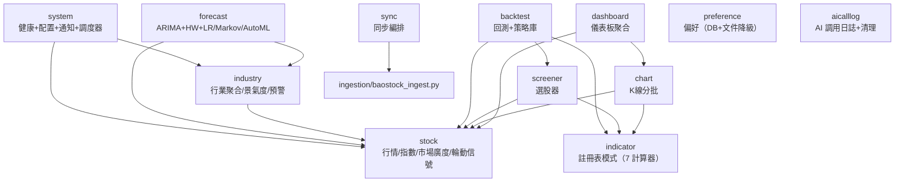

# 模塊指南（Module Guide）

> 逐模塊說明職責、REST 端點、分層結構、數據表、緩存與依賴關係。後端共 **13 個模塊**（Phase 5 已將 `stock` 三分拆為 `stock` + `industry` + `forecast`；新增 `news` 財經新聞模塊）。
> 路徑均省略前綴 `java/src/main/java/com/quantization/`。
> 最後校準日期：2026-08-23（覆蓋 Phase 4 + Phase 5 + news 模塊全部變更）。

---

## 0. 模塊速查表

| 模塊 | 端點前綴 | 端點數 | 持久化 | 緩存 | 依賴 |
|------|----------|:---:|--------|------|------|
| stock | /api/stock | 26 | 5 行情表只讀 | 4 處 @Cacheable | — |
| industry | /api/stock（行業端點） | — | 無 | 6 處 @Cacheable | stock(Repository) |
| forecast | /api/stock（預測端點） | — | 無 | 8 處 @Cacheable | stock(Repository), industry |
| indicator | /api/indicator | 1 | 無 | 無 | — |
| dashboard | /api/dashboard | 2 | 無 | dashboardSummary | stock, chart |
| chart | /api/chart | 2 | 無 | 無 | stock, indicator |
| screener | /api/screener | 1 | 無 | 無 | stock, indicator |
| backtest | /api/backtest | 7 | backtest_strategy | 無 | stock, screener, indicator |
| sync | /api/sync | 3 | 無（fork Python） | 無 | ingestion 腳本 |
| system | /api/system | 4 | 無（僅校驗，不寫 .env） | 無 | stock(ping), industry(alerts) |
| preference | /api/preference | 2 | user_preference（+文件降級） | 無 | — |
| aicalllog | /api/aicalllog | 6 | ai_call_log | 無 | —（消費者是 agent） |
| news | /api/news | 3 | financial_news | 無 | —（抓取由 agent 负责） |

---

## 1. 模塊依賴關係圖



依賴方向要點（實測，非設計稿）：

- **無循環依賴**；所有業務依賴匯向 `module.stock`（核心域）
- `indicator` 是無狀態共享內核，被 screener / backtest / chart 三方復用
- 已知越層：`BacktestService` / `ScreenerService` 直接注入 stock 模塊的 `IndexDailyRepository` / `StockIndustryRepository`，繞過了 StockService 門面

---

## 2. 模塊：stock（行情核心）

### 職責
基礎行情查詢、指數行情、市場廣度、輪動信號、指數元數據。Phase 5 已將行業分析（industry）和預測（forecast）拆出，stock 專注行情讀取。

### 規模
`StockController` 520 行、`StockService` 505 行、`StockDailyRepositoryImpl` 426 行；24 DTO、7 Entity、5 Repository。

### 對外 REST 端點（26 個，由 StockController 統一路由，分發到 StockService / IndustryService / ForecastService）

| 方法 | 路徑 | 關鍵參數（默認值） | 出參 |
|------|------|--------------------|------|
| GET | /summary | — | SummaryMetricsDto |
| GET | /search | code, adjustflag=3, startDate, endDate, limit=50, offset=0 | SearchResultDto |
| GET | /movers | limit=8 | List\<HotSymbolDto\> |
| GET | /suggest | q, limit=10 | List\<StockSuggestionDto\> |
| GET | /industries | code, industry | List\<StockIndustryDto\> |
| GET | /industries/list | — | List\<String\> |
| GET | /industry-daily | tradeDate | List\<IndustryDailyDto\> |
| GET | /industry-daily/range | industry, start, end | List\<IndustryDailyDto\> |
| GET | /industry-daily/all-range | start, end | List\<IndustryDailyDto\> |
| GET | /industry-prosperity | tradeDate | List\<IndustryProsperityDto\> |
| GET | /industry-prosperity/range | start, end, topN=15 | List\<IndustryProsperityDto\> |
| GET | /industry-prosperity/alerts | threshold=10.0, notify=false | ProsperityAlertDto |
| GET | /industry-prosperity/seasonality | months=12 (1-60) | ProsperitySeasonalityDto |
| GET | /industry-prosperity/markov | months=12 (1-36) | ProsperityMarkovDto |
| GET | /industry-prosperity/forecast | months=6 (1-24), forecastDays=5 (1-20) | ProsperityForecastDto |
| GET | /industry-prosperity/forecast/backtest | months=6, forecastDays=5, backtestDays=60 | ProsperityForecastBacktestDto |
| GET | /rotation-prediction | lookbackDays=20 | RotationPredictionDto |
| GET | /rotation-prediction/backtest | lookbackDays=20, forwardDays=5, backtestDays=90 | RotationBacktestDto |
| GET | /rotation-prediction/automl | backtestDays=90, tuneStartDate?, tuneEndDate?, evalStartDate?, evalEndDate? | RotationAutoMlDto |
| GET | /rotation-markov | lookbackDays=30 (5-180) | RotationMarkovDto |
| GET | /rotation | days=10 | RotationSignalDto |
| GET | /index-history | code, days=10 | List\<IndexDailyDto\> |
| POST | /index-history/batch | IndexHistoryBatchRequestDto | Map\<String, List\<IndexDailyDto\>\> |
| GET | /sector-performance | days=10 | List\<SectorPerformanceDto\> |
| GET | /market-breadth | days=10 | MarketBreadthDto |
| GET | /index-list | categoryCode | List\<IndexMetadataDto\> |

### 分層結構
- `StockController` → `StockService`（`@Transactional(readOnly=true)`）→ 5 個 Repository
- 領域對象 `StockDaily`（record）與 `StockDailyEntity` 解耦，經 `StockDailyMapper` 轉換——下游模塊（回測/選股/圖表）只碰領域對象
- `StockDailyRepositoryCustom/Impl`：Criteria API（分頁/K線/波動榜/交易日）+ Native SQL（`suggest`；`sectorPerformance` 用窗口函數 `ROW_NUMBER() OVER (PARTITION BY ...)`；`SHOW TABLE STATUS` 取近似行數避免 COUNT 全表）
- 其餘 Repository：方法名派生 + 少量 JPQL

### 類清單

| 類型 | 類 |
|------|-----|
| Controller | StockController |
| Service | StockService |
| Repository | StockDailyRepository / StockDailyRepositoryCustom(Impl) / IndexDailyRepository / IndexMetadataRepository / IndustryDailyRepository / StockIndustryRepository |
| Entity | StockDailyEntity / IndexDailyEntity / IndexMetadataEntity / IndustryDailyEntity / StockIndustryEntity |
| 領域對象 | StockDaily（record）/ AdjustFlag / StockDailyQuery / StockSummaryProjection |
| Mapper | StockDailyMapper |
| 工具 | StockMathUtils |
| DTO（24） | HotSymbolDto / IndexDailyDto / IndexHistoryBatchRequestDto / IndexMetadataDto / IndustryDailyDto / IndustryProsperityDto / MarketBreadthDto / ProsperityAlertDto / ProsperityForecastBacktestDto / ProsperityForecastDto / ProsperityMarkovDto / ProsperitySeasonalityDto / RotationAutoMlDto / RotationBacktestDto / RotationMarkovDto / RotationPredictionDto / RotationSignalDto / SearchResultDto / SectorPerformanceDto / StockDailyDto / StockDailyQueryDto / StockIndustryDto / StockSuggestionDto / SummaryMetricsDto |

### 數據表
`stock_daily`、`index_daily`、`index_metadata`、`industry_daily`、`stock_industry` 全部**只讀**（寫入方是 ingestion）。schema 詳見 `docs/database.md`。

### 緩存（4 處 @Cacheable）

| 緩存名 | TTL | 使用方法 |
|--------|-----|----------|
| dashboardSummary | 60s | summaryMetrics() |
| sectorPerformance | 30s | sectorPerformance(days) |
| marketBreadth | 30s | marketBreadth(days) |
| rotationSignal | 30s | rotationSignals(days) |

---

## 3. 模塊：industry（行業景氣度）

### 職責
行業日聚合查詢、行業景氣度計算（動量0.35+資金0.25+活躍0.20+廣度0.20）、景氣度歷史趨勢、景氣度異常預警（突變/等級躍遷）。

### 類清單

| 類型 | 類 |
|------|-----|
| Service | IndustryService（513 行） |
| Repository | 復用 stock 模塊的 IndustryDailyRepository |
| DTO | 復用 stock 模塊的 IndustryDailyDto / IndustryProsperityDto / ProsperityAlertDto |

### 緩存（6 處 @Cacheable，全部 INDUSTRY_DAILY_CACHE，TTL 60s）

| 方法 | key 前綴 |
|------|----------|
| industryDailyByDate | `#tradeDate` 或 `'latest'` |
| industryDailyRange | `#industry-#start-#end` |
| allIndustryDailyRange | `'all-#start-#end'` |
| industryProsperity | `'prosperity-#tradeDate'` |
| industryProsperityRange | `'prosperity-range-#start-#end-#topN'` |
| prosperityAlerts | `'prosperity-alert-#threshold'` |

### 景氣度公式（`IndustryService.java:92-177`）

```
prosperityIndex = momentumScore × 0.35 + capitalScore × 0.25 + activityScore × 0.20 + breadthScore × 0.20
（各維度當日橫截面 min-max 歸一到 0-100）
```

等級：≥80 繁榮 / ≥65 景氣 / ≥50 平穩 / ≥35 低迷 / 其餘衰退。

### 預警類型（`ProsperityAlertDto.java`）

| 類型 | 條件 |
|------|------|
| surge | 今日景氣度 - 昨日 ≥ threshold |
| plunge | 昨日 - 今日 ≥ threshold |
| grade_up | 等級從低到高（如 低迷 → 景氣） |
| grade_down | 等級從高到低（如 繁榮 → 平穩） |

---

## 4. 模塊：forecast（預測引擎）

### 職責
行業景氣度多模型預測（ARIMA + Holt-Winters + 線性回歸）、預測回測驗證、季節性分析、Markov 狀態轉移模型、行業輪動預測、輪動預測回測、AutoML 調參、輪動 Markov。

### 規模
`ForecastService` 1,763 行（系統最大單類）。

### 類清單

| 類型 | 類 |
|------|-----|
| Service | ForecastService |
| Repository | 復用 stock 模塊的 IndustryDailyRepository / IndexDailyRepository |
| DTO | 復用 stock 模塊的 ProsperityForecastDto / ProsperityForecastBacktestDto / ProsperityMarkovDto / ProsperitySeasonalityDto / RotationPredictionDto / RotationBacktestDto / RotationAutoMlDto / RotationMarkovDto |

### 緩存（8 處 @Cacheable）

| 方法 | 緩存名 | TTL |
|------|--------|-----|
| prosperitySeasonality | FORECAST_CACHE | 120s |
| prosperityMarkov | FORECAST_CACHE | 120s |
| prosperityForecast | FORECAST_CACHE | 120s（緩存鍵含 adaptive-weights/rolling-window-days 後綴，切換配置不命中彼此緩存） |
| prosperityForecastBacktest | FORECAST_CACHE | 120s |
| predictRotation | ROTATION_CACHE | 120s |
| backtestRotationPrediction | ROTATION_CACHE | 120s |
| autoTuneRotationPrediction | ROTATION_CACHE | 120s |
| rotationMarkov | ROTATION_CACHE | 120s |

### 方法論說明（Phase 4 補充）

> ⚠️ **P4-13 — "ARIMA" 命名**：實為 ARI(2,1) 無 MA 項、無定階（無 AIC/BIC）、無平穩性檢驗（`ForecastService.java:1448`）。命名大於實質——「ARIMA」暗示了完整的 Box-Jenkins 方法論，但實際實現是固定階數的差分自回歸，缺乏模型選擇與診斷檢驗環節。

> ⚠️ **P4-14 — "AutoML" 命名**：實為 15 組合窮舉網格搜索（lookback×forward = 5×3），無貝葉斯/隨機搜索。現已改為**嚴格日期隔離 out-of-sample 評估**——調參只用區間 A 的數據做網格搜索選出最佳參數，評估只用區間 B 的數據（B 在 A 之後，完全不重疊）跑回測報告結果（`ForecastService.autoTuneRotationPrediction`）。不傳日期參數時默認前 70% 區間調參、後 30% 區間評估。可通過 `tuneStartDate/tuneEndDate/evalStartDate/evalEndDate` 參數自定義兩個區間。但搜索空間有限，泛化能力仍受限。

> ⚠️ **P4-3 — 集成權重**：默認固定 0.35/0.35/0.30（ARIMA/HW/LR，`ForecastService.java:38`）。回測端點計算最優逆 MAE 權重供參考（`ForecastService.java` `computeOptimalWeights`）。Phase 4 後續新增**滾動窗口自適應權重**（`app.forecast.adaptive-weights`，默認 `false` 保持兼容）：啟用後 `computeAdaptiveWeights` 用過去 N 天（`app.forecast.rolling-window-days`，默認 60）滾動窗口對每個時間點做 one-step-ahead 預測，以逆 MAE 歸一化得到動態權重。**look-ahead bias 防護**：每個時間點的預測只用截至該點的歷史數據（`Arrays.copyOf(data, t)`），不接觸目標值及未來數據。預測結果 DTO 新增 `weightSource`（"fixed"/"adaptive"）及各行業實際權重字段。

> ⚠️ **P4-9 — Holt-Winters 季節週期**：硬編碼 `HW_SEASON_LENGTH=5`（交易週，`ForecastService.java:35`）。A 股以 5 個交易日為週期有一定合理性（週內效應），但月度/季度季節性（如 20/60 交易日）被完全忽略。

> ⚠️ **P4-4 — Markov 一階假設**：景氣度等級轉移假設只依賴前一狀態，無法捕捉多步記憶的週期模式。

---

## 5. 模塊：indicator（指標引擎，註冊表模式）

### 職責
純計算模塊，無 Entity/Repository/緩存。被 screener/backtest/chart 三方復用。

### ✅ Phase 5 新增：註冊表模式

`IndicatorEngine` 持有 `Map<String, IndicatorCalculator>` 註冊表（`IndicatorEngine.java:29`），所有 `IndicatorCalculator` bean 由 Spring 自動注入並按 `name()` 註冊（`IndicatorEngine.java:36-47`）。新增指標只需實現接口 + `@Component`，**無需修改 `IndicatorEngine`**。

### 端點
POST `/api/indicator/compute`：入參 `{records: StockDaily[], config: IndicatorConfigDto}`，出參 `IndicatorSeriesDto`（MA 序列 Map、BOLL 三軌、MACD 三線、KDJ 三值、RSI）。

### 類清單

| 類型 | 類 | 說明 |
|------|-----|------|
| Controller | IndicatorController | `mergeConfig` 合併 DTO 與默認值 |
| Engine | IndicatorEngine | 註冊表 + buildSnapshot/buildSeries |
| 接口 | IndicatorCalculator | `name()` + `calculate(builder, history, index)` |
| 計算器 | MaCalculator | name()='MA' |
| | RsiCalculator | name()='RSI' |
| | VolumeRatioCalculator | name()='VOLUME_RATIO' |
| | ReturnCalculator | name()='RETURN' |
| | KdjCalculator | name()='KDJ' |
| | MacdCalculator | name()='MACD' |
| | BollCalculator | name()='BOLL' |
| 工具 | IndicatorMath | MA/EMA/BOLL/MACD/KDJ/RSI/量比/振幅/N日收益/交叉信號/綜合評分 |
| 構建器 | IndicatorSnapshotBuilder | 可變構建器，各計算器填充字段 |
| 快照 | IndicatorSnapshot | 不可變 record |
| 配置 | IndicatorConfig | defaults()（僅 MA）/ .screener()（全指標）兩檔預設 |
| DTO | IndicatorConfigDto / IndicatorSeriesDto | |

### 計算流程

```
IndicatorEngine.buildSnapshot(code, history, config)
  → 基礎字段填入 IndicatorSnapshotBuilder
  → 遍歷 registry.values()，各計算器 calculate(builder, history, index)
  → IndicatorMath.scoreCandidate() 計算複合評分（依賴多個計算器結果）
  → builder.build() → 不可變 IndicatorSnapshot
```

### 已知問題
✅ `IndicatorController` 已修復：請求 DTO 中非 null 字段會覆蓋默認值（`mergeConfig`），前端自定義指標參數生效。

---

## 6. 模塊：dashboard（儀表盤聚合）

### 端點
- GET `/api/dashboard`（code, adjustflag, startDate, endDate, limit）→ `DashboardSnapshotDto`：一次聚合 ping 狀態 + summary + 行情表 + movers(8) + K 線（複用 ChartService），經 `asyncExecutor`（8 線程）部分並行
- GET `/api/dashboard/summary` → `SummaryMetricsDto`（**直接轉調** `stockService.summaryMetrics()`，非重複實現；與 `/api/stock/summary` 等價，前端只用本端點，另一個建議廢棄）

### 類清單

| 類型 | 類 |
|------|-----|
| Controller | DashboardController |
| Service | DashboardService |
| DTO | DashboardSnapshotDto |

### 已知問題
🟢 `CacheConfigHolder` 內部類（DashboardService）是繞循環依賴的補丁。

---

## 7. 模塊：chart（K 線分批）

### 端點
- GET `/api/chart/candlestick`（code, adjustflag=3, startDate, endDate, + IndicatorConfigDto）— 初始批次 + 內嵌指標序列 + `hasMore`
- GET `/api/chart/candlestick/older`（+ beforeDate 遊標 + IndicatorConfigDto）— 向更早翻頁

批次大小由 `app.chart.batch-size` 配置（默認 500，`AppProperties.java:81`）。前端 `CandlestickChart` 滾動到左端觸發 older 拉取。

### 類清單

| 類型 | 類 |
|------|-----|
| Controller | ChartController |
| Service | ChartService |
| DTO | CandlestickDto |

---

## 8. 模塊：screener（選股器）

### 端點
POST `/api/screener/run`：入參 `ScreenerCriteriaDto`，出參 `ScreenerResultDto{criteria, screenDate, scannedSymbols, matchedSymbols, candidates, summaryLines}`。

### ✅ Phase 5 新增：DTO 嵌套視圖

`ScreenerCriteriaDto` 保留全部 49 個扁平字段以維持序列化格式與 API 契約不變，同時提供按域分組的嵌套子記錄視圖訪問器（`ScreenerCriteriaDto.java:66-156`）：

| 訪問器 | 子記錄 | 字段 |
|--------|--------|------|
| `priceFilter()` | PriceFilter | minClose, maxClose |
| `pctChangeFilter()` | PctChangeFilter | minPctChange, maxPctChange |
| `turnoverFilter()` | TurnoverFilter | minTurn, maxTurn, minAmplitude, maxAmplitude |
| `volumeFilter()` | VolumeFilter | minVolume, minAmount, minVolumeRatio, maxVolumeRatio |
| `momentumFilter()` | MomentumFilter | return20/60/120 min/max |
| `technicalFilter()` | TechnicalFilter | RSI/KDJ/MACD/BOLL min/max |
| `maFilter()` | MaFilter | priceAboveMa5/20/60, ma5AboveMa20, ma20AboveMa60 |
| `crossFilter()` | CrossFilter | macdCrossSignal/withinDays, kdjCrossSignal/withinDays |
| `bollFilter()` | BollFilter | bollPosition |

嵌套視圖為只讀派生視圖，不參與 Jackson 序列化。供 `ScreenerFilters` / `ScreenerCore` 等消費端以語義化方式訪問分組條件。

### 條件 DSL（49 字段，全部可空，隱式 AND）
- 區間類：close / pctChange / turn / amplitude / volumeRatio / return20/60/120 / rsi14 / K/D/J / macdHist / bollWidth / bollPercentB（各有 min/max）
- 布爾類：priceAboveMa5/20/60、ma5AboveMa20、ma20AboveMa60、excludeSt（默認 true）
- 枚舉類：macdCrossSignal / kdjCrossSignal（golden/death/any + withinDays 窗口）、bollPosition、sortBy（默認 score）
- 其他：minVolume、minAmount、industries[]、maxResults=100、asOfDate=今天、adjustflag=3

⚠️ **語義限制**：條件間只有 AND，無法表達 OR/嵌套。

### 類清單

| 類型 | 類 |
|------|-----|
| Controller | ScreenerController |
| Service | ScreenerService |
| Core | ScreenerCore（`screenAt()` 同時被回測引擎在歷史時點復用） |
| Filters | ScreenerFilters |
| DTO | ScreenerCriteriaDto / ScreenedStockDto / ScreenerResultDto |

### 實現
全內存過濾：拉 asOfDate 前 320 天全市場行情 → `ScreenerCore` parallelStream 構建 `IndicatorSnapshot` → `ScreenerFilters.matches()` 短路過濾 → 排序 → 截斷。

---

## 9. 模塊：backtest（回測 + 策略庫）

詳細原理見 `docs/BACKTEST_ENGINE.md`。

### 端點

| 方法 | 路徑 | 說明 |
|------|------|------|
| POST | /run | 運行回測（結果自動落庫 source=auto） |
| POST | /run-and-save | 與 /run 等價（runBacktest 已內置自動落庫） |
| POST | /strategies | 保存策略（source=manual） |
| GET | /strategies?source= | 策略列表（source: manual/auto） |
| GET | /strategies/{id} | 策略詳情 |
| GET | /recent?limit=20 | 最近回測記錄（按創建時間倒序） |
| DELETE | /strategies/{id} | 刪除 |

### ✅ Phase 5 補強

| 補強項 | 實現 | 位置 |
|--------|------|------|
| **滑點 slippageBps** | 買入價 = close × (1 + slippageRate)，賣出價 = close × (1 - slippageRate) | `BacktestConfigDto.java:31,49` / `BacktestService.java:89` |
| **漲跌停約束** | 調倉選股跳過當日漲停（pctChg≥9.9）/跌停（pctChg≤-9.9）；止損賣出遇跌停延後到下一交易日 | `BacktestService.java:60` |
| **夏普減無風險利率** | `sharpe = (mean - rf/252) / std × √252`，rf 默認 0.02 | `BacktestConfigDto.java:34` / `BacktestService.java:379-380` |
| **結果自動落庫** | `runBacktest` 結果自動落庫 source=auto（best-effort，失敗不影響結果返回） | `BacktestService.java:412-432` |

### 類清單

| 類型 | 類 |
|------|-----|
| Controller | BacktestController |
| Service | BacktestService / BacktestStrategyService |
| Repository | BacktestStrategyRepository |
| Entity | BacktestStrategyEntity |
| DTO | BacktestConfigDto / BacktestRequestDto / BacktestResultDto / SaveStrategyDto / SavedStrategyDetailDto / SavedStrategySummaryDto |

### 持久化
`backtest_strategy` 表：criteria/config/result 以 **JSON 字符串三列**存儲（ObjectMapper 序列化）。`source=auto` 為回測自動保存，`source=manual` 為前端用戶手動保存。

### 關鍵行為
- `adjustflag` null → 默認 3（`BacktestService.java:97`，歷史 NPE 修復點）
- 基準指數硬編碼 `sh.000001`（`BacktestService.java:57`）
- 手續費雙邊收取
- 漲跌停閾值 `LIMIT_THRESHOLD = 9.9`（`BacktestService.java:60`）

---

## 10. 模塊：sync（同步編排）

### 端點
POST `/run`（SyncRequestDto: mode/adjustflags/start/end/codes/syncIndex/syncIndustry）、GET `/status`、POST `/cancel`。

### 類清單

| 類型 | 類 |
|------|-----|
| Controller | SyncController |
| Service | SyncService |
| DTO | SyncRequestDto / SyncStatusDto |

### 實現
- `ProcessBuilder` 拼命令調 `ingestion/baostock_ingest.py`，強制 `PYTHONIOENCODING=utf-8`
- 進度：正則解析 stdout `已寫入 N 條`（→50%）/ `共寫入 N 條`（→100%）——⚠️ 腳本文案是隱式協議，改文案會斷進度
- 並發：`synchronized start()` + AtomicReference 狀態，同時僅一個任務；`cancel()` → `Process.destroy()`；`@PreDestroy` 兜底

### SyncStatusDto
`{state: IDLE|RUNNING|SUCCESS|FAILED|CANCELLED, progress: 0-100, message, written, startedAt, finishedAt, error}`

---

## 11. 模塊：system（健康 + 配置 + 通知 + 調度器）

### 端點

| 方法 | 路徑 | 說明 |
|------|------|------|
| GET | /health | ping + information_schema 校驗 stock_daily 表/14 列/唯一索引 |
| GET | /database | 當前 DB 配置（不含密碼） |
| PUT | /database | 寫回 .env（重啟生效）⚠️ 容器部署下無效；⚠️ 無輸入淨化（待修） |
| GET | /notification/test | 測試郵件/Webhook 配置 |

### 類清單

| 類型 | 類 |
|------|-----|
| Controller | SystemController |
| Service | SystemService |
| 通知 | NotificationService |
| 調度器 | ProsperityAlertScheduler |
| DTO | DatabaseConfigDto / DatabaseConfigUpdateDto / SystemHealthDto |

### NotificationService
- SMTP：`@PostConstruct` 構建 JavaMailSenderImpl（port 465→SSL，否則 STARTTLS，`NotificationService.java:78-98`）
- Webhook：RestTemplate POST JSON + **HMAC-SHA256 簽名頭**（`X-Webhook-Signature`，`NotificationService.java:251-292`），最多 3 次指數退避重試
- 全部 `@Async("notificationExecutor")`（**獨立 4 線程池**，Phase 5 分離）；**無重試**（郵件），失敗僅 warn
- **觸發語義**：僅在用戶請求 `/api/stock/industry-prosperity/alerts?notify=true` 時順帶發送，或由 `ProsperityAlertScheduler` 定時觸發

### ✅ Phase 5 新增：通知線程池分離

`AsyncConfig.java` 將通知推送與 Dashboard 聚合的線程池分離：

| Bean 名 | 線程數 | 用途 | 線程名前綴 |
|---------|--------|------|-----------|
| `asyncExecutor` | 8 | Dashboard 並行加載 | `dashboard-async` |
| `notificationExecutor` | 4 | 通知推送（郵件/Webhook） | `notification-async` |

### ProsperityAlertScheduler（P4-8）
- 預設關閉，`ALERT_SCHEDULER_ENABLED=true` 啟用
- Cron 默認 `0 30 15 * * MON-FRI`（每交易日 15:30 CST）
- 定時調 `industryService.prosperityAlerts(threshold)`，有異常則推送通知

---

## 12. 模塊：preference（用戶偏好，✅ Phase 5 入庫）

### 端點
GET/PUT `/api/preference`。`UserPreferenceDto`：defaultAdjustflag / defaultLimit / defaultLookbackDays / watchlist / screenerPresets（Map，含選股預設）/ indicatorConfig / defaultSortBy。

### ✅ Phase 5 新增：MySQL 入庫 + 文件降級

| 要素 | 實現 |
|------|------|
| 主存儲 | MySQL `user_preference` 表（`PreferenceEntity`，`PreferenceEntity.java`） |
| 降級存儲 | JSON 文件（路徑由 `app.preference.path` 配置，環境變量 `PREFERENCE_PATH`，默認 `preference.json`） |
| 降級觸發 | DB 操作拋出異常時自動降級（`PreferenceService.java:56-78`） |
| 文件寫入 | 臨時文件 + `Files.move(ATOMIC_MOVE)` 原子操作，`synchronized` 防並發（`PreferenceService.java:132-147`） |
| 用戶標識 | `userId` 默認 `"default"`（`PreferenceService.java:31`），未來可擴展多用戶 |
| 建表 | `schema.sql` 冪等建表，啟動時自動執行 |

### 類清單

| 類型 | 類 |
|------|-----|
| Controller | PreferenceController |
| Service | PreferenceService |
| Repository | PreferenceRepository |
| Entity | PreferenceEntity |
| DTO | UserPreferenceDto |

---

## 13. 模塊：aicalllog（AI 調用日誌 + 清理調度器）

### 端點

| 方法 | 路徑 | 參數 | 說明 |
|------|------|------|------|
| POST | /log | AiCallLogRequest | agent 回寫調用日誌 |
| GET | / | page=0, size=20 | 分頁查詢全部 |
| GET | /stage/{stageName} | page, size | 按階段分頁 |
| GET | /iteration/{iteration} | — | 某迭代完整調用鏈 |
| GET | /recent | limit=10 | 最近日誌 |
| GET | /score-trend | — | 評分趨勢數據 |

### 類清單

| 類型 | 類 |
|------|-----|
| Controller | AiCallLogController |
| Service | AiCallLogService |
| Repository | AiCallLogRepository |
| Entity | AiCallLogEntity |
| 調度器 | AiCallLogCleanupScheduler |
| DTO | AiCallLogDto / AiCallLogRequest |

### Entity（ai_call_log，唯一有顯式遷移 SQL 的表：`docs/migration_ai_call_log.sql`）
iteration / stage_name / stage_display_name / provider / model_name / input_json / output_text / output_json（LONGTEXT×3）/ judge_score / judge_passed / judge_feedback / attempts / duration_ms / error / created_at。

索引：idx_iteration / idx_stage / idx_created / idx_score。

### ✅ Phase 5 新增：AiCallLogCleanupScheduler

| 配置項 | 默認 | 說明 |
|--------|------|------|
| `AICALLLOG_CLEANUP_ENABLED` | false | 是否啟用定時清理 |
| `AICALLLOG_RETENTION_DAYS` | 90 | 日誌保留天數 |
| `AICALLLOG_CLEANUP_CRON` | `0 0 2 * * *` | Cron（每天凌晨 2:00） |

- 預設關閉，`@ConditionalOnProperty` 條件裝配（`AiCallLogCleanupScheduler.java:24-28`）
- 啟用後定時 `DELETE FROM ai_call_log WHERE created_at < NOW() - INTERVAL retention_days DAY`

### score-trend 返回
`{stageTrends: [{iteration, stageName, avgScore, maxScore, minScore}], iterationTrends: [{iteration, avgScore, callCount}], stages, maxIteration}` — 供前端 `/agent-dashboard` 繪圖。

寫入方：agent `backend_client.py` 每次 LLM 調用後回寫。

---

## 14. 模塊：news（財經新聞）

### 職責

提供華爾街見聞等來源財經新聞的查詢與管理。**新聞抓取由 Agent 服務負責**（`wallstreetcn_client.py` 抓取 + `news_store.py` 寫入 MySQL + Milvus），後端 `news` 模塊僅負責已入庫新聞的分頁查詢、詳情查詢與過期清理。

### 端點

| 方法 | 路徑 | 參數 | 說明 |
|------|------|------|------|
| GET | /api/news | page=0, size=20, channel?, source? | 分頁查詢最新新聞（按 published_at 倒序） |
| GET | /api/news/{id} | — | 新聞詳情 |
| DELETE | /api/news/cleanup | daysBefore=30 | 清理 N 天前的新聞 |

### 類清單

| 類型 | 類 |
|------|-----|
| Controller | NewsController |
| Service | NewsService |
| Repository | FinancialNewsRepository |
| Entity | FinancialNewsEntity |
| DTO | FinancialNewsDto / NewsBatchUpsertRequest / NewsSyncResultDto |

### Entity（financial_news，schema.sql `CREATE TABLE IF NOT EXISTS`）

| 欄位 | 類型 | 約束 | 說明 |
|------|------|------|------|
| id | BIGINT | PK AUTO_INCREMENT | |
| uri | VARCHAR(200) | NOT NULL, UNIQUE | 文章唯一標識（去重用） |
| title | VARCHAR(500) | NOT NULL | 標題 |
| summary | VARCHAR(2000) | | 摘要 |
| content | TEXT | | 正文 |
| source | VARCHAR(50) | NOT NULL | 來源（如「華爾街見聞」） |
| author | VARCHAR(100) | | 作者 |
| channel | VARCHAR(50) | | 頻道（a-stock/global/us-stock 等） |
| published_at | DATETIME | | 發布時間 |
| url | VARCHAR(500) | | 原文連結 |
| image_url | VARCHAR(500) | | 配圖 |
| created_at | DATETIME | NOT NULL | 入庫時間 |

索引：`uk_financial_news_uri`（唯一）/ `idx_financial_news_channel` / `idx_financial_news_published`。

寫入方：Agent 服務 `news_store.py` 抓取後批量 upsert（`NewsBatchUpsertRequest`）。

### 與 Agent 服務的協作

```
Agent wallstreetcn_client.py（抓取）
       ↓
Agent news_store.py（清洗 + URI 去重）
       ↓
   ┌───┴───┐
   ↓       ↓
MySQL      Milvus 向量庫
financial_news   financial_news_vectors
   ↓
後端 NewsController（查詢/清理）
   ↓
前端 /news 頁面（展示/搜索/語義檢索）
```

---

## 15. 橫切層（common / config）

### common
- `common.api`：`ApiResponse{success, code, message, data}`（NON_NULL）、`ErrorCode`（String 常量：OK/BAD_REQUEST/VALIDATION_ERROR/NOT_FOUND/DB_ERROR/SYNC_ERROR/INTERNAL_ERROR）、`PageResponse`
- `common.exception`：`BusinessException` + `GlobalExceptionHandler`（Business→按 code 映射狀態碼；校驗→400；兜底→500）
- `common.util`：CodeUtils（代碼規範化）/ DateUtils / DecimalUtils / FormatUtils

### config
- `config.CacheConfig`：**10 緩存名，4 域獨立 TTL**（`CacheConfig.java`）：
  - `dashboardSummary`：summaryTtlSeconds（默認 60s）
  - `dashboardMetrics` / `indexMetadata` / `marketBreadth` / `rotationSignal` / `sectorPerformance`：metricsTtlSeconds（默認 30s）
  - `stockDaily`（STOCK_DAILY_CACHE）：stockTtlSeconds（默認 30s）
  - `industryDaily`（INDUSTRY_DAILY_CACHE）：industryTtlSeconds（默認 60s）
  - `forecast`（FORECAST_CACHE）：forecastTtlSeconds（默認 120s）
  - `rotation`（ROTATION_CACHE）：rotationTtlSeconds（默認 120s）
  - 全部 maximumSize=500
- `config.AsyncConfig`：**兩個獨立線程池**（`AsyncConfig.java`）：
  - `asyncExecutor`（8 守護線程，dashboard-async）
  - `notificationExecutor`（4 守護線程，notification-async）
- `config.WebConfig`：CORS `/api/**`，origins 來自 `CORS_ALLOWED_ORIGINS`（默認 localhost:3010），`allowedHeaders` 顯式列舉（Content-Type/Authorization/X-Requested-With/X-Webhook-Signature）
- `config.ConfigValidationInitializer`：啟動時校驗敏感配置（DB_PASSWORD/DB_USER/通知子配置），打 WARN 不阻止啟動
- `config.OpenApiConfig`：Swagger 配置
- `config.properties.AppProperties`：`@ConfigurationProperties(prefix="app")` 綁定 title/queryDefaults/cache/cors/sync/preference/chart

---

## 16. Phase 5 變更日誌

以下為 Phase 5 相對 Phase 4 的全部修改：

### 16.1 模塊三分拆
- `stock` 模塊拆分為 `stock`（行情）+ `industry`（景氣度）+ `forecast`（預測）三個獨立模塊
- `StockController` 統一路由，分發到 `StockService` / `IndustryService` / `ForecastService`
- `StockService` 從 2,583 行瘦身至 505 行

### 16.2 indicator 註冊表模式
- 新增 `IndicatorCalculator` 接口（`IndicatorCalculator.java`）
- `IndicatorEngine` 改為持有 `Map<String, IndicatorCalculator>` 註冊表（`IndicatorEngine.java:29`）
- 新增 7 個計算器：MaCalculator / RsiCalculator / VolumeRatioCalculator / ReturnCalculator / KdjCalculator / MacdCalculator / BollCalculator
- 新增 `IndicatorSnapshotBuilder`（可變構建器）
- 新增指標只需實現接口 + `@Component`，無需修改 `IndicatorEngine`

### 16.3 preference 入庫
- 新增 `PreferenceEntity` + `PreferenceRepository`（`user_preference` 表）
- `PreferenceService` 主存儲改為 MySQL，DB 異常時降級到文件存儲
- 新增 `schema.sql` 冪等建表（啟動時自動執行）

### 16.4 backtest 補強
- 新增 `slippageBps`（滑點，默認 0，`BacktestConfigDto.java:31`）
- 新增漲跌停約束（`LIMIT_THRESHOLD=9.9`，`BacktestService.java:60`）
- 新增 `riskFreeRate`（無風險利率，默認 0.02，夏普減 rf，`BacktestService.java:379-380`）
- `runBacktest` 結果自動落庫 source=auto（`BacktestService.java:412-432`）
- 新增 `GET /api/backtest/recent` 端點（最近回測記錄）
- `BacktestStrategyRepository` 新增 `findRecentRuns()` 方法

### 16.5 screener DTO 嵌套視圖
- `ScreenerCriteriaDto` 新增 9 個嵌套子記錄（PriceFilter / PctChangeFilter / TurnoverFilter / VolumeFilter / MomentumFilter / TechnicalFilter / MaFilter / CrossFilter / BollFilter）
- 新增 9 個嵌套視圖訪問器（`ScreenerCriteriaDto.java:115-156`）
- 保留 49 個扁平字段維持序列化格式不變

### 16.6 緩存 4 域拆名
- `CacheConfig` 從 7 緩存名單一 TTL 重構為 10 緩存名 4 域獨立 TTL
- 新增 `STOCK_DAILY_CACHE` / `INDUSTRY_DAILY_CACHE` / `FORECAST_CACHE` / `ROTATION_CACHE` 四個域緩存名
- `AppProperties.Cache` 新增 stockTtlSeconds / industryTtlSeconds / forecastTtlSeconds / rotationTtlSeconds
- `application.yml` 新增對應配置項

### 16.7 通知線程池分離
- `AsyncConfig` 新增 `notificationExecutor`（4 線程，notification-async）
- `NotificationService.sendProsperityAlertNotification()` 改用 `@Async("notificationExecutor")`
- 與 `asyncExecutor`（8 線程，dashboard-async）分離，避免相互阻塞

### 16.8 Webhook HMAC-SHA256 簽名
- Webhook secret 從放入 payload body 改為 HMAC-SHA256 簽名頭 `X-Webhook-Signature`
- `WebConfig` CORS 允許頭新增 `X-Webhook-Signature`

### 16.9 配置啟動校驗
- 新增 `ConfigValidationInitializer`（`@PostConstruct` 校驗 DB_PASSWORD/DB_USER/通知子配置，打 WARN 不阻止啟動）

### 16.10 AI 調用日誌清理
- 新增 `AiCallLogCleanupScheduler`（預設關閉，`AICALLLOG_CLEANUP_ENABLED=true` 啟用）
- `AiCallLogRepository` 新增 `deleteByCreatedAtBefore()` 方法
- `AiCallLogController` 新增 `GET /`（分頁查詢全部）端點

### 16.11 ingestion 拆分
- `baostock_ingest.py` 拆分為 `baostock_fetch.py`（API 調用層）+ `baostock_write.py`（DB 寫入層）+ `baostock_ingest.py`（入口/CLI/菜單）

### 16.12 其他
- `StockMathUtils` 從 StockService 抽出（復用於 industry/forecast）
- `application.yml` 新增 `app.aicalllog.*` / `app.chart.batch-size` 配置項
- `BacktestConfigDto` 新增 `effectiveRiskFreeRate()` / `effectiveSlippageBps()` 安全訪問器
