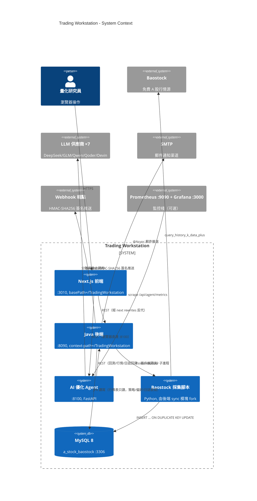
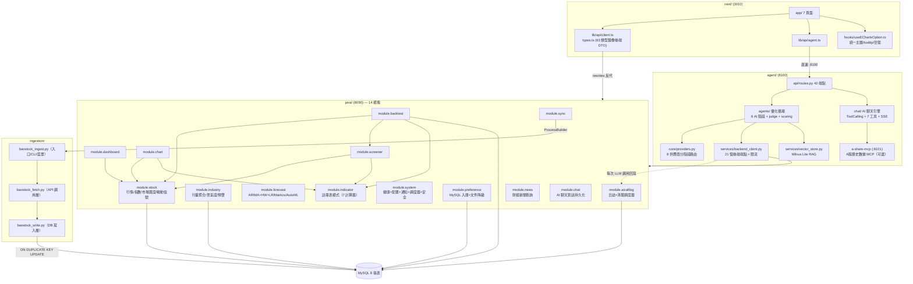
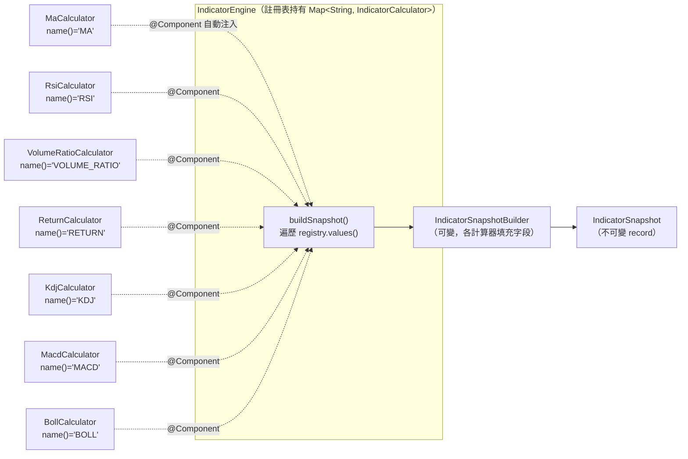
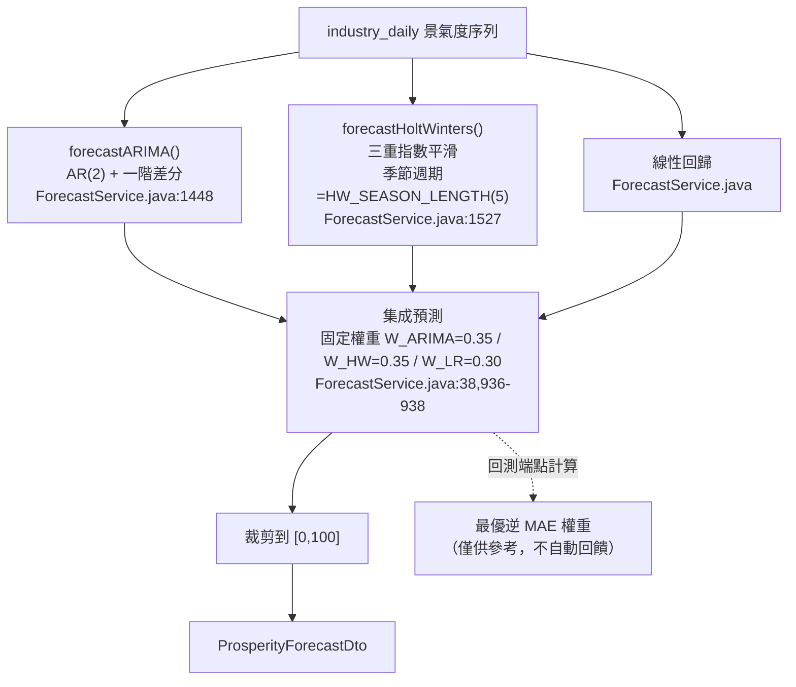
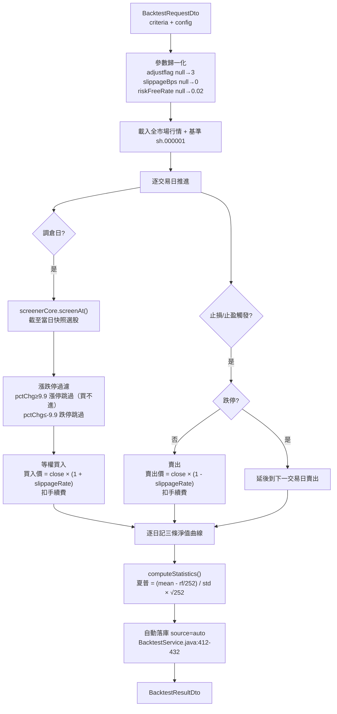
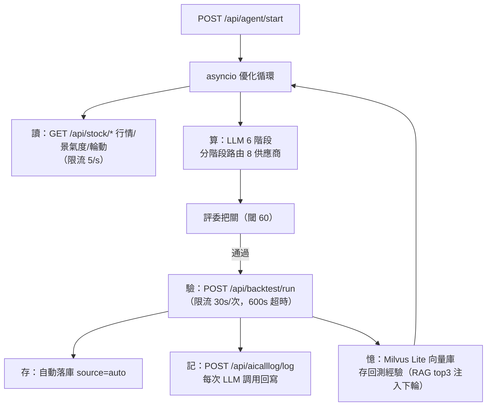
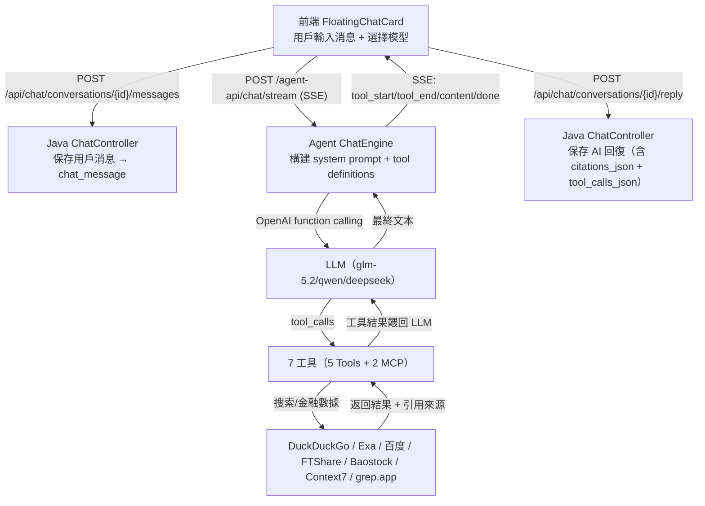

# 架構總覽（Architecture）

> 本文檔面向新加入的開發者，目標是讀完後能獨立理解系統全貌、各服務職責、數據流與部署拓撲，並能獨立完成 onboarding。
> 最後校準日期：2026-08-24（基於代碼實讀，覆蓋 Phase 4 + Phase 5 + chat 模塊全部變更）。

---

## 1. 項目概覽

### 1.1 Trading Workstation 是什麼

Trading Workstation 是一個**單機/小團隊自用的 A 股量化研究工作台**。它把「行情採集 → 指標計算 → 選股 → 回測 → 行業景氣度分析 → 多模型預測 → AI 策略優化」串成一條完整的研究流水線，並提供可視化前端與可觀測的 AI 優化循環。

### 1.2 解決什麼問題

| 痛點 | 本系統的解法 |
|------|-------------|
| A 股研究散落在 Excel/Python 腳本裡，難以復用 | 統一 Java 後端 + Next.js 前端，選股/回測/預測參數化、可保存、可復現 |
| 免費行情數據獲取麻煩 | Baostock 採集腳本冪等寫入 MySQL，增量/全量/指數/行業一鍵同步 |
| 指標計算重複造輪子 | `IndicatorEngine` 註冊表模式，7 個計算器統一復用於選股/回測/圖表 |
| 回測假設不透明 | 回測引擎顯式聲明滑點/漲跌停/手續費/無風險利率，結果自動落庫可追溯 |
| AI 調參黑盒 | Agent 服務 6 階段優化循環 + 評委把關 + 調用日誌全量落庫 + Prometheus 監控 |
| 投研問答缺乏真實數據支撐 | AI 聊天懸浮卡片 + ToolCalling 7 工具（搜索/金融數據 MCP）+ 引用追溯 + SSE 流式 |

### 1.3 系統組成

4 個自研服務 + 1 個數據庫 + 可選監控棧：

| 組件 | 技術棧 | 端口 | 職責 |
|------|--------|------|------|
| Java 後端 | Java 21 + Spring Boot 3.3 + Spring Data JPA + Caffeine | 8090 | REST API（92 端點）+ 16 模塊業務邏輯 + 同步編排 |
| Next.js 前端 | Next.js 15 + React 19 + TypeScript 5.6 + ECharts 5.5 + SWR + Zustand + Tailwind | 3010 | 7 頁面可視化 + AI 聊天懸浮卡片 + API 客戶端 |
| Agent 服務 | Python 3.10+ + FastAPI + LangGraph 風格優化循環 | 8100 | AI 策略優化 + 8 供應商 LLM 路由 + Milvus Lite RAG + AI 聊天引擎（ToolCalling + 7 工具） |
| 採集腳本 | Python 3.10+ + Baostock + PyMySQL | — | 由後端 sync 模塊 fork，寫入 5 張行情表 |
| MySQL | 8.0+ | 3306 | 庫名 `a_stock_baostock`，16 張表 |
| Prometheus + Grafana | docker-compose 可選 | 9090 / 3000 | 監控 Agent 服務指標 |

---

## 2. 技術棧與版本

| 端 | 技術 | 版本 | 來源 |
|----|------|------|------|
| Java 後端 | Spring Boot | 3.3.4 | `java/pom.xml` |
| | Java | 21 | `pom.xml` `<java.version>21</java.version>` |
| | Spring Data JPA | BOM 管理 | |
| | Caffeine | BOM 管理 | `config/CacheConfig.java` |
| | springdoc-openapi | 2.6.0 | Swagger `/swagger-ui.html` |
| | MySQL Connector/J | BOM 管理 | |
| | Lombok | BOM 管理 | |
| Next.js 前端 | Next.js | 15.1.9 | `next/package.json` |
| | React | 19.0.1 | |
| | TypeScript | 5.6 | |
| | ECharts | 5.5.1 | |
| | SWR | 2.2.5 | 數據請求 |
| | Zustand | 5.0.1 | 狀態管理 |
| | TanStack Table | 8.20.5 | 表格 |
| | Tailwind CSS | 3.4.14 | |
| Agent 服務 | FastAPI | requirements.txt | |
| | Milvus Lite | | 向量庫 RAG |
| | sentence-transformers | BAAI/bge-small-zh-v1.5 | 嵌入模型 |
| | APScheduler | | |
| | prometheus-client | | `/api/agent/metrics` |
| 採集腳本 | baostock / pymysql | `ingestion/requirements.txt` | |

---

## 3. C4 模型（四層架構視圖）

### 3.1 Context（系統上下文）



**外部系統說明**：

| 外部系統 | 交互方式 | 備註 |
|----------|----------|------|
| Baostock | 採集腳本 `query_history_k_data_plus`，會話超時自動重登 | 免費、無需 token |
| LLM 供應商（7 個） | Agent 按階段性價比路由：DeepSeek V4-Pro/Flash、GLM-5.2/4-Flash、Qwen3.6、Qoder、Devin | |
| SMTP | `NotificationService` 異步發送景氣度預警郵件 | port 465→SSL，否則 STARTTLS |
| Webhook | `NotificationService` HMAC-SHA256 簽名 + 3 次指數退避重試 | 簽名頭 `X-Webhook-Signature` |
| Prometheus | scrape Agent `/api/agent/metrics`（13 個指標） | docker-compose 可選 |

### 3.2 Container（容器視圖）



### 3.3 Component（後端 16 模塊組件視圖）

後端按業務域拆分為 **17 個模塊**（`com.quantization.module.*`），Phase 5 已將原 `stock` 三分拆為 `stock`（行情）+ `industry`（景氣度）+ `forecast`（預測），後續新增 `news`（財經新聞）+ `chat`（AI 聊天對話持久化）+ `agentstate`（Agent 狀態持久化）+ `dailydigest`（當日市場摘要持久化）+ `snapshot`（行情預計算快照查詢）：

| 模塊 | 端點前綴 | 端點數 | 持久化 | 核心類 |
|------|----------|:---:|--------|--------|
| stock | /api/stock | 26 | 5 行情表只讀 | StockController / StockService / StockDailyRepositoryImpl |
| industry | /api/stock（行業端點） | — | 無 | IndustryService |
| forecast | /api/stock（預測端點） | — | 無 | ForecastService（1,763 行） |
| indicator | /api/indicator | 1 | 無 | IndicatorEngine + 7 Calculator |
| dashboard | /api/dashboard | 2 | 無 | DashboardService |
| chart | /api/chart | 2 | 無 | ChartService |
| screener | /api/screener | 1 | 無 | ScreenerService / ScreenerCore / ScreenerFilters |
| backtest | /api/backtest | 7 | backtest_strategy | BacktestService / BacktestStrategyService |
| sync | /api/sync | 3 | 無（fork Python） | SyncService |
| system | /api/system | 4 | 無 | SystemService / NotificationService / ProsperityAlertScheduler |
| preference | /api/preference | 2 | user_preference | PreferenceService（DB+文件降級） |
| aicalllog | /api/aicalllog | 6 | ai_call_log | AiCallLogService / AiCallLogCleanupScheduler |
| news | /api/news | 4 | financial_news | NewsService / NewsController（查詢+清理，抓取由 Agent 負責） |
| chat | /api/chat | 7 | chat_conversation + chat_message | ChatService / ChatController（對話+消息持久化，AI 回復由 Agent SSE 生成） |
| agentstate | /api/agentstate | 3 | agent_state | AgentStateService / AgentStateController（Agent 三層狀態 DB 持久化，單行 upsert） |
| dailydigest | /api/dailydigest | 5 | daily_market_digest | DailyDigestService / DailyDigestController（當日摘要按交易日 upsert，AI 生成後持久化） |

> 模塊間依賴關係圖見 `docs/MODULE_GUIDE.md` §模塊依賴關係圖。

### 3.4 Code（關鍵類交互）

#### 3.4.1 IndicatorEngine 註冊表模式



- 接口：`IndicatorCalculator.java:21` — `name()` + `calculate(builder, history, index)`
- 引擎構造：`IndicatorEngine.java:36-47` — Spring 注入 `List<IndicatorCalculator>`，按 `name()` 註冊到 `LinkedHashMap`
- 新增指標只需：實現 `IndicatorCalculator` + `@Component`，**無需修改 `IndicatorEngine`**
- 測試友好無參構造：`IndicatorEngine.java:53-63` — 內置 7 個計算器，不依賴 Spring 容器

#### 3.4.2 ForecastService 三模型集成



#### 3.4.3 BacktestService 滑點 + 漲跌停



關鍵常量（`BacktestService.java`）：
- `BENCHMARK_CODE = "sh.000001"`（:57）
- `LIMIT_THRESHOLD = 9.9`（:60）— |pctChg| ≥ 9.9 視為漲跌停
- `slippageRate = config.effectiveSlippageBps() / 10000.0`（:89）
- `riskFreeRate = config.effectiveRiskFreeRate()`（:90）

---

## 4. 服務端口與路由

### 4.1 端口總覽

| 服務 | 默認端口 | 配置項 | 前綴 | 說明 |
|------|----------|--------|------|------|
| Java 後端 | 8090 | `SERVER_PORT` | `context-path: /TradingWorkstation` | REST API + Swagger `/swagger-ui.html` |
| Next.js 前端 | 3010 | `package.json` 腳本 | `basePath: /TradingWorkstation` | App Router，SSR+CSR |
| Agent 服務 | 8100 | `AGENT_PORT` | `/api/agent` | AI 優化循環 + LLM 路由，Swagger `/docs` |
| MySQL | 3306 | `DB_PORT` | — | 庫名 `a_stock_baostock` |
| Prometheus | 9090 | docker-compose | — | 可選，scrape agent `/metrics` |
| Grafana | 3000 | docker-compose | — | 可選，儀表盤見 `docs/grafana-agent-dashboard.json` |

### 4.2 ⚠️ context-path 契約鏈（新人最常踩的坑）

`/TradingWorkstation` 前綴必須在**三處**保持同步：

1. **後端** `application.yml:42` → `context-path: ${SERVER_CONTEXT_PATH:/TradingWorkstation}`（默認**帶**前綴）
2. **前端** `next.config.js` → `basePath: '/TradingWorkstation'` + rewrites `destination: ${BACKEND_HOST}/TradingWorkstation/api/:path*`
   - 因此 docker-compose 中 `BACKEND_HOST: http://java:8090` **不帶**前綴是正確的——前綴由 rewrite destination 補上
3. **Agent** `agent/.env` → `BACKEND_API_URL=http://localhost:8090/TradingWorkstation`（**帶**前綴）

驗證命令也要帶前綴：`curl http://localhost:8090/TradingWorkstation/actuator/health`（除非本地 `.env` 顯式設 `SERVER_CONTEXT_PATH=` 為空）。

### 4.3 路由流向

```
瀏覽器 → next(:3010, basePath=/TradingWorkstation)
       → rewrites → java(:8090, context-path=/TradingWorkstation/api/*)
       → Controller → Service（@Cacheable Caffeine）→ Repository → MySQL

瀏覽器 → agent(:8100/api/agent/*)  ← 瀏覽器直連，不經後端
agent  → java(:8090/TradingWorkstation/api/*)  ← 回測/行情/日誌回寫
```

---

## 5. 數據流

### 5.1 行情數據流（寫路徑 + 預計算）

```mermaid
flowchart TD
    bs["Baostock API<br/>query_history_k_data_plus<br/>（會話超時自動重登 _ensure_login）"]
    bs --> fetch["baostock_fetch.py<br/>API 調用層"]
    fetch --> write["baostock_write.py<br/>DB 寫入層"]
    write -->|INSERT ON DUPLICATE KEY UPDATE 批1000| sd["stock_daily<br/>唯一鍵(code,date,adjustflag)"]
    write -->|INSERT ON DUPLICATE KEY UPDATE 批100| id["index_daily<br/>唯一鍵(code,date,frequency)"]
    write -->|upsert + 7天新鮮度| si["stock_industry<br/>行業分類"]
    write -->|upsert| im["index_metadata<br/>指數元數據"]
    write -->|純 SQL 聚合| ind["industry_daily<br/>JOIN stock_daily(af=3) × stock_industry<br/>GROUP BY date,industry"]
    write -->|數據更新完成後自動觸發| pre["precompute_market_snapshot.py<br/>行情預計算"]
    pre -->|UPSERT by (trade_date, snapshot_type)| snap["market_analysis_snapshot<br/>4 種快照：market_overview /<br/>industry_prosperity / rotation_signals /<br/>market_breadth"]
```

**Java 後端對以上 5 張行情表只讀不寫**。後端寫的表：`backtest_strategy`（策略保存）、`user_preference`（偏好）、`ai_call_log`（agent 回寫）、`market_analysis_snapshot`（由 ingestion 腳本寫入，後端只讀）。

**行情預計算流程**：
1. `baostock_ingest.py` 完成 stock_daily / index_daily / industry_daily 寫入後
2. 自動調用 `precompute_market_snapshot.py --auto`
3. 計算 4 種快照（市場概覽 / 行業景氣度 / 輪動信號 / 市場廣度）
4. UPSERT 寫入 `market_analysis_snapshot` 表（冪等，重複運行安全）
5. 前端通過 `/api/snapshot` 端點直接讀取快照，毫秒級加載

### 5.2 預測數據流（讀路徑）

```
MySQL industry_daily → ForecastService.prosperityForecast()
  → ARIMA(AR2+差分) + Holt-Winters(季節=5) + 線性回歸
  → 固定權重集成(0.35/0.35/0.30) → 裁剪[0,100] → ProsperityForecastDto
  → @Cacheable(FORECAST_CACHE, TTL 120s) → 前端
```

### 5.3 AI 優化流



### 5.4 查詢數據流（讀路徑）

```
瀏覽器 → next(:3010, basePath) → rewrites → java(:8090, context-path)
      → Controller → Service（@Cacheable Caffeine, 按域獨立 TTL）→ Repository → MySQL
```

### 5.5 AI 聊天數據流（懸浮卡片）



---

## 6. 緩存策略

### 6.1 四域拆名 + 獨立 TTL

Phase 5 已將原單一 TTL 緩存按業務域拆名，各域獨立 TTL，避免跨域相互擠占（`CacheConfig.java`）：

| 緩存名 | 常量 | TTL 配置項 | 默認 TTL | 最大條目 | 使用方 |
|--------|------|-----------|----------|----------|--------|
| `dashboardSummary` | `SUMMARY_CACHE` | `CACHE_SUMMARY_TTL_SECONDS` | 60s | 500 | StockService.summaryMetrics() |
| `dashboardMetrics` | `METRICS_CACHE` | `CACHE_METRICS_TTL_SECONDS` | 30s | 500 | DashboardService |
| `indexMetadata` | `INDEX_METADATA_CACHE` | `CACHE_METRICS_TTL_SECONDS` | 30s | 500 | 指數元數據 |
| `marketBreadth` | `MARKET_BREADTH_CACHE` | `CACHE_METRICS_TTL_SECONDS` | 30s | 500 | StockService.marketBreadth() |
| `rotationSignal` | `ROTATION_SIGNAL_CACHE` | `CACHE_METRICS_TTL_SECONDS` | 30s | 500 | StockService.rotationSignals() |
| `sectorPerformance` | `SECTOR_PERFORMANCE_CACHE` | `CACHE_METRICS_TTL_SECONDS` | 30s | 500 | StockService.sectorPerformance() |
| `stockDaily` | **`STOCK_DAILY_CACHE`** | `CACHE_STOCK_TTL_SECONDS` | 30s | 500 | stock 模塊行情查詢 |
| `industryDaily` | **`INDUSTRY_DAILY_CACHE`** | `CACHE_INDUSTRY_TTL_SECONDS` | 60s | 500 | industry 模塊（6 處 @Cacheable） |
| `forecast` | **`FORECAST_CACHE`** | `CACHE_FORECAST_TTL_SECONDS` | 120s | 500 | forecast 模塊（4 處 @Cacheable） |
| `rotation` | **`ROTATION_CACHE`** | `CACHE_ROTATION_TTL_SECONDS` | 120s | 500 | forecast 模塊輪動（4 處 @Cacheable） |

> 配置層次：`.env` → `application.yml:50-56` → `AppProperties.Cache`（`AppProperties.java:39-50`）→ `CacheConfig.cacheManager()`（`CacheConfig.java:62-85`）

### 6.2 緩存使用統計

| 模塊 | @Cacheable 處數 | 緩存名 |
|------|:---:|--------|
| stock | 4 | SUMMARY_CACHE / SECTOR_PERFORMANCE_CACHE / MARKET_BREADTH_CACHE / ROTATION_SIGNAL_CACHE |
| industry | 6 | INDUSTRY_DAILY_CACHE（key 前綴區分：`prosperity-`、`prosperity-range-`、`prosperity-alert-` 等） |
| forecast | 8 | FORECAST_CACHE（4 處）+ ROTATION_CACHE（4 處） |

---

## 7. 線程池

Phase 5 已將通知推送與 Dashboard 聚合的線程池分離（`AsyncConfig.java`），避免相互阻塞：

| Bean 名 | 線程數 | 用途 | 線程名前綴 |
|---------|--------|------|-----------|
| `asyncExecutor` | 8（固定） | Dashboard 並行加載 | `dashboard-async` |
| `notificationExecutor` | 4（固定） | 通知推送（郵件/Webhook） | `notification-async` |

- 兩者均為守護線程（`daemon=true`）
- `@EnableAsync` + `@EnableScheduling` 在 `AsyncConfig.java:22`
- `NotificationService.sendProsperityAlertNotification()` 標註 `@Async("notificationExecutor")`（`NotificationService.java:117`）

---

## 8. 配置層次

### 8.1 四層配置鏈

```
.env（根目錄，java 與 ingestion 共用）
  ↓ 環境變量注入
application.yml（${VAR:default} 語法）
  ↓ @ConfigurationProperties 綁定
AppProperties（@ConfigurationProperties(prefix="app")）
  ↓ 啟動時校驗
ConfigValidationInitializer（@PostConstruct 打 WARN 日誌，不阻止啟動）
```

### 8.2 啟動校驗（ConfigValidationInitializer.java:27-45）

| 校驗項 | 條件 | 警告 |
|--------|------|------|
| `DB_PASSWORD` | 恆為空時 | 數據庫密碼為空，本地開發可接受，生產必須設置 |
| `DB_USER` | 恆為空時 | 用戶名為空，將使用默認 root |
| `MAIL_USERNAME/PASSWORD/FROM/TO` | `NOTIFICATION_ENABLED=true` 且 `MAIL_ENABLED=true` | 郵件通知已啟用但 X 為空 |
| `WEBHOOK_URL/SECRET` | `NOTIFICATION_ENABLED=true` 且 `WEBHOOK_ENABLED=true` | Webhook 已啟用但 X 為空 |

> 設計選擇：**不阻止啟動**（單機工作台容許空密碼連本地 MySQL），但打出明確 WARN 避免錯配靜默運行到首次連接才炸。

### 8.3 AppProperties 子配置

| 子配置 | 綁定前綴 | 字段 | 來源 |
|--------|----------|------|------|
| QueryDefaults | `app.query-defaults` | adjustflag=3 / limit=200 / lookbackDays=180 | `AppProperties.java:30-34` |
| Cache | `app.cache` | 6 個 TTL（見 §6） | `AppProperties.java:39-50` |
| Cors | `app.cors` | allowedOrigins（默認 localhost:3010） | `AppProperties.java:55-57` |
| Sync | `app.sync` | pythonExecutable / ingestionScript / batchSize / defaultStartDate | `AppProperties.java:62-67` |
| Preference | `app.preference` | path（默認 preference.json，文件降級用） | `AppProperties.java:72-74` |
| Chart | `app.chart` | batchSize=500 | `AppProperties.java:79-82` |

---

## 9. 安全

### 9.1 安全邊界（重要）

**系統目前無任何認證層**：後端 92 端點 + agent 42 端點全部開放，包含寫配置、觸發同步、啟停 AI 循環、AI 聊天等操作。docker-compose 端口映射到 `0.0.0.0`，意味着**局域網內任意主機可訪問**。僅適合單機/可信網絡部署；暴露公網前必須加認證（反代 BasicAuth 起步）。

### 9.2 Webhook HMAC-SHA256 簽名

Phase 5 已修復：Webhook secret 從放入 payload body 改為 **HMAC-SHA256 簽名頭**（`NotificationService.java:251-292`）：

- 簽名算法：`HmacSHA256(secret, jsonBody)` → 十六進制字符串（`NotificationService.java:282-292`）
- 簽名頭：`X-Webhook-Signature: <hex>`
- 重試：最多 3 次，指數退避（1s / 2s / 3s）（`NotificationService.java:251-279`）
- CORS 允許頭顯式列舉 `X-Webhook-Signature`（`WebConfig.java:35`）

### 9.3 CORS 配置

- 路徑：`/api/**`（`WebConfig.java:32`）
- 允許來源：`CORS_ALLOWED_ORIGINS`（默認 `http://localhost:3010`，逗號分隔）
- 允許方法：GET / POST / PUT / DELETE / OPTIONS
- 允許頭：Content-Type / Authorization / X-Requested-With / X-Webhook-Signature
- `allowCredentials(true)` / `maxAge(3600)`

### 9.4 已知安全債務

- 🔴 `.env` 運行時反寫（`PUT /api/system/database`）無輸入淨化
- 🔴 無認證層（見 §9.1）
- 🟡 容器內 `.env` 反寫無效（容器內 .env 不是宿主機文件）

---

## 10. 已知限制（方法論聲明）

以下為系統的方法論層面限制，使用者必讀：

| # | 限制 | 影響 | 位置 |
|---|------|------|------|
| 1 | **前復權增量陳舊化**：除權除息後 Baostock 重算 adjustflag=2 全部歷史，增量只拉 max_date+1 | 前復權歷史逐漸失真，需每季度全量重刷 `--full-refresh-adjustflag2` | `ingestion/baostock_ingest.py` |
| 2 | **ST survivorship bias**：回測選股用截至當日快照 ✅，但 ST 標記和行業分類用當前最新值（非時點） | `excludeSt=true` 過濾的是「現在的 ST 股」而非「當時的 ST 股」 | `BacktestService` / `stock_industry` 表 |
| 3 | **回測執行假設**：等權配置、無最小手數、基準固定 sh.000001、行業與 ST 用最新快照 | 絕對收益數字不可直接外推實盤 | `BACKTEST_ENGINE.md §6` |
| 4 | **Markov 一階假設**：景氣度等級轉移假設只依賴前一狀態 | 無法捕捉多步記憶的週期模式 | `ForecastService.prosperityMarkov()` |
| 5 | **ARIMA 簡化**：實為 ARI(2,1) 無 MA 項、無定階（無 AIC/BIC）、無平穩性檢驗 | 命名大於實質，非完整 Box-Jenkins 流程 | `ForecastService.java:1448` |
| 6 | **AutoML 網格搜索**：實為 15 組合窮舉（lookback×forward = 5×3），無貝葉斯/隨機搜索 | 搜索空間有限，泛化能力受限；已切分 tune/eval 防 in-sample 過擬合 | `ForecastService.java:471-540` |
| 7 | **集成權重固定**：0.35/0.35/0.30（ARIMA/HW/LR），回測計算最優逆 MAE 權重但不自動回饋 | 永遠使用次優權重（設計上避免過擬合到特定回測區間） | `ForecastService.java:38,936` |
| 8 | **HW 季節長度限制**：硬編碼 `HW_SEASON_LENGTH=5`（交易週） | 月度/季度季節性（20/60 交易日）被忽略 | `ForecastService.java:35` |
| 9 | **橫截面歸一化語義**：景氣度是「當日相對排名」非絕對景氣 | 全市場齊跌時仍有行業得 80+ 分「繁榮」；跨日比較嚴格意義不成立 | `IndustryService.java:148-157` |

---

## 11. 延伸閱讀

| 文檔 | 內容 |
|------|------|
| `docs/MODULE_GUIDE.md` | 16 模塊職責、API、數據表、緩存、依賴關係一覽 |
| `docs/api.md` | 完整 REST API 參考（92 後端 + 42 agent 端點） |
| `docs/database.md` | 16 張表 schema + ER 圖 + 寫入策略 |
| `docs/BACKTEST_ENGINE.md` | 回測引擎原理與假設聲明 |
| `docs/AGENT_SERVICE.md` | Agent LLM 路由 + 優化循環 + AI 聊天引擎（ToolCalling + 7 工具） |
| `docs/DATA_INGESTION.md` | 數據採集完整指南 |
| `docs/DEPLOYMENT.md` | 部署、環境變量、故障排查 |
| `docs/DEVELOPMENT.md` | 開發規範、構建/測試命令 |
