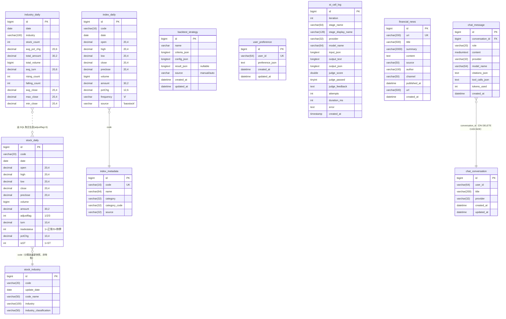

# 數據庫 Schema（Database）

> MySQL 8.0+，庫名 `a_stock_baostock`，字符集 utf8mb4，時區 Asia/Shanghai。
> 本文檔面向新人，覆蓋全部 10 張表的欄位、約束、索引、關係與寫入策略。
> 最後校準日期：2026-08-24（基於代碼實讀，覆蓋 Phase 4 + Phase 5 + chat 模塊全部變更）。

---

## 1. 連接配置

通過根目錄 `.env`（java 與 ingestion 共用）：

```env
DB_HOST=localhost
DB_PORT=3306
DB_NAME=a_stock_baostock
DB_USER=root
DB_PASSWORD=...
DB_CHARSET=utf8mb4
```

Hikari 連接池（`application.yml:9-16`）：

| 參數 | 值 |
|------|-----|
| pool-name | QuantHikari |
| maximum-pool-size | 20 |
| minimum-idle | 5 |
| connection-timeout | 10s |
| idle-timeout | 300s |
| max-lifetime | 1800s |
| connection-test-query | SELECT 1 |

---

## 2. 重要約定

**`ddl-auto: none`**（`application.yml:20`）——JPA 不管理表結構。表的真源（source of truth）有三處：

| 表類 | 真源 | 說明 |
|------|------|------|
| 行情類 5 表（stock_daily / index_daily / index_metadata / stock_industry / industry_daily） | `ingestion/baostock_write.py` 的 `CREATE TABLE IF NOT EXISTS` | industry_daily 有顯式建表，其餘為歷史遺留預建 |
| `user_preference` | `java/src/main/resources/schema.sql`（冪等建表，啟動時自動執行） | Phase 5 新增 |
| `financial_news` | `java/src/main/resources/schema.sql`（冪等建表，啟動時自動執行） | news 模塊新增，由 Agent `news_store.py` 寫入 |
| `chat_conversation` + `chat_message` | `java/src/main/resources/schema.sql`（冪等建表，啟動時自動執行） | chat 模塊新增，AI 聊天對話持久化 |
| `ai_call_log` | `docs/migration_ai_call_log.sql`（唯一顯式遷移腳本，需手動執行） | |
| `backtest_strategy` | 需手動建表（見 §3.6） | |

> ⚠️ JPA Entity 大多未聲明 `@Table(uniqueConstraints/indexes)`（僅 `IndexMetadataEntity.code` 和 `PreferenceEntity.userId` 標了 unique）——Entity 註解**不是** schema 權威，勿以 Entity 反推索引。

---

## 3. ER 圖



**關係說明**：

| 關係 | 連接鍵 | 性質 |
|------|--------|------|
| stock_daily ↔ stock_industry | `code` | stock_industry 只存**最新快照**（無歷史時點），回測中的行業過濾存在輕微前視偏差 |
| index_daily ↔ index_metadata | `code` | index_metadata.code 唯一 |
| industry_daily ← stock_daily + stock_industry | `JOIN ON code WHERE adjustflag=3 GROUP BY date,industry` | 純 SQL 聚合，衍生表 |
| chat_message ↔ chat_conversation | `conversation_id` | 外鍵 ON DELETE CASCADE，刪除對話自動刪消息 |

---

## 4. 表詳解

### 4.1 stock_daily（A 股日線，核心表）

| 要素 | 內容 |
|------|------|
| 唯一鍵 | `(code, date, adjustflag)` — 系統健康檢查會校驗此索引存在（`SystemService.validateSchema`） |
| 寫入方 | ingestion，批 1000，`INSERT ... ON DUPLICATE KEY UPDATE`（更新 OHLC/量額/turn/tradestatus/pctChg/isST） |
| 讀取方 | java `StockDailyRepositoryImpl`（Criteria API + Native SQL） |
| 數據量級 | 3354 股 × 3 復權 × 交易日數（2021 起 ≈ 每年 ~250 日） |

**欄位說明**：

| 欄位 | 類型 | 約束 | 說明 |
|------|------|------|------|
| id | BIGINT | PK AUTO_INCREMENT | |
| code | VARCHAR(20) | NOT NULL，唯一鍵組成 | 股票代碼（如 sh.600000） |
| date | DATE | NOT NULL，唯一鍵組成 | 交易日 |
| open / high / low / close | DECIMAL(20,4) | | 開高低收 |
| preclose | DECIMAL(20,4) | | 前收盤 |
| volume | BIGINT | | 成交量（股） |
| amount | DECIMAL(30,2) | | 成交額（元） |
| adjustflag | INT | NOT NULL，唯一鍵組成 | 1=後復權 / 2=前復權 / 3=不復權 |
| turn | DECIMAL(10,4) | | 換手率% |
| tradestatus | INT | | 1=正常 / 0=停牌 |
| pctChg | DECIMAL(10,4) | | 漲跌幅% |
| isST | INT | | 1=ST 股 |

⚠️ **前復權陳舊化**：除權除息後 Baostock 會重算 adjustflag=2 的**全部歷史**價格，而增量同步只拉最新日期之後——前復權歷史數據會逐漸失真，需定期用 range 模式全量重刷（見 `DATA_INGESTION.md §5`）。

### 4.2 index_daily（指數日線）

| 欄位 | 類型 | 約束 | 說明 |
|------|------|------|------|
| id | BIGINT | PK AUTO_INCREMENT | |
| code | VARCHAR(16) | NOT NULL，唯一鍵組成 | 指數代碼（如 sh.000001） |
| date | DATE | NOT NULL，唯一鍵組成 | 交易日 |
| open / high / low / close / preclose | DECIMAL(20,4) | | OHLC + 前收 |
| volume | BIGINT | | 成交量 |
| amount | DECIMAL(30,2) | | 成交額 |
| pctChg | DECIMAL(12,6) | | 漲跌幅% |
| frequency | VARCHAR | NOT NULL，唯一鍵組成 | 目前恆為 `'d'`（日線） |
| source | VARCHAR | | 恆為 `'baostock'` |

- 唯一鍵：`(code, date, frequency)`
- 寫入方：ingestion（批 100）

### 4.3 index_metadata（指數元數據）

| 欄位 | 類型 | 約束 | 說明 |
|------|------|------|------|
| id | BIGINT | PK AUTO_INCREMENT | |
| code | VARCHAR(16) | **UNIQUE** | 指數代碼 |
| name | VARCHAR(64) | | 指數名稱 |
| category | VARCHAR(32) | | 分類中文名 |
| category_code | VARCHAR(32) | | 分類英文代碼（composite/scale/industry_l1/...） |
| source | VARCHAR(32) | | 恆 `'baostock'` |

- 寫入方：ingestion `_sync_index_metadata()`，從 `ingestion/index_list.json` 的 10 大類別 ~80 個指數寫入
- 供 `/api/stock/index-list` 與市場廣度分類計算

### 4.4 stock_industry（行業分類）

| 欄位 | 類型 | 約束 | 說明 |
|------|------|------|------|
| id | BIGINT | PK AUTO_INCREMENT | |
| code | VARCHAR(20) | NOT NULL | 股票代碼 |
| update_date | DATE | | 更新日期 |
| code_name | VARCHAR(50) | | 股票名稱 |
| industry | VARCHAR(100) | | 行業名稱（申萬分類） |
| industry_classification | VARCHAR(50) | | 行業分類 |
| | | INDEX idx_code | code 索引（`baostock_write.py:264`） |

- 寫入方：ingestion `_sync_industry()`（`bs.query_stock_industry()`，申萬分類）
- `ON DUPLICATE KEY UPDATE` + **7 天新鮮度檢查**（DB 最新 update_date 距今 ≤7 天則跳過，`--force-industry` 強制）
- ⚠️ 只存**最新快照**，無歷史時點——回測中的行業過濾存在輕微前視偏差

### 4.5 industry_daily（行業日聚合，衍生表）

建表 SQL：`baostock_write.py:202-222`

| 欄位 | 類型 | 約束 | 說明 |
|------|------|------|------|
| id | BIGINT | PK AUTO_INCREMENT | |
| date | DATE | NOT NULL，唯一鍵組成 | 交易日 |
| industry | VARCHAR(100) | NOT NULL，唯一鍵組成 | 行業名稱 |
| stock_count | INT | DEFAULT 0 | 該行業當日股票數 |
| avg_pct_chg | DECIMAL(20,6) | | 平均漲跌幅 |
| total_amount | DECIMAL(30,2) | | 總成交金額 |
| total_volume | BIGINT | | 總成交量 |
| avg_turn | DECIMAL(20,6) | | 平均換手率 |
| rising_count | INT | DEFAULT 0 | 上漲家數 |
| falling_count | INT | DEFAULT 0 | 下跌家數 |
| avg_close | DECIMAL(20,4) | | 平均收盤價 |
| max_close | DECIMAL(20,4) | | 最高收盤價 |
| min_close | DECIMAL(20,4) | | 最低收盤價 |

- 唯一鍵：`uk_date_industry (date, industry)`
- 索引：`idx_date (date)`、`idx_industry (industry)`
- 生成方式（**純 SQL，Java 不參與**，`baostock_write.py:225-258`）：

```sql
INSERT INTO industry_daily (date, industry, stock_count, avg_pct_chg, total_amount, ...)
SELECT d.date, i.industry, COUNT(*), AVG(d.pctChg), SUM(d.amount), SUM(d.volume),
       AVG(d.turn),
       SUM(CASE WHEN d.pctChg > 0 THEN 1 ELSE 0 END),
       SUM(CASE WHEN d.pctChg < 0 THEN 1 ELSE 0 END),
       AVG(d.close), MAX(d.close), MIN(d.close)
FROM stock_daily d JOIN stock_industry i ON d.code = i.code
WHERE d.adjustflag = 3 AND d.date BETWEEN %s AND %s
  AND i.industry IS NOT NULL AND i.industry != ''
GROUP BY d.date, i.industry
ON DUPLICATE KEY UPDATE ...
```

⚠️ 口徑固定 **adjustflag=3（不復權）**。⚠️ 只在同步腳本運行時重算——若單獨補寫 stock_daily 而未跑同步，行業數據滯後。全部行業分析功能（景氣度/輪動/Markov/預測）都建立在此表之上。

### 4.6 backtest_strategy（策略庫）

| 欄位 | 類型 | 約束 | 說明 |
|------|------|------|------|
| id | BIGINT | PK AUTO_INCREMENT | |
| name | VARCHAR(128) | NOT NULL | 策略名 |
| criteria_json | TEXT | NOT NULL | ScreenerCriteriaDto 的 JSON |
| config_json | TEXT | NOT NULL | BacktestConfigDto 的 JSON |
| result_json | LONGTEXT | NULL | BacktestResultDto 的 JSON（run-and-save 才有） |
| source | VARCHAR(20) | NOT NULL DEFAULT 'manual' | `manual`（用戶）/ `auto`（回測自動落庫 / agent） |
| created_at | DATETIME | NOT NULL | |
| updated_at | DATETIME | NOT NULL | |

- 寫入方：java `BacktestStrategyService`（手動保存）+ `BacktestService.saveAndReturn()`（回測自動落庫，`BacktestService.java:412-432`）
- JSON 三列的取捨：靈活但不可 SQL 查詢條件內容；查詢維度只有 name/source/時間
- `source` 列由 `migration_ai_call_log.sql:28` 的 `ALTER TABLE ADD COLUMN IF NOT EXISTS` 添加

### 4.7 user_preference（用戶偏好，Phase 5 新增）

建表 SQL：`java/src/main/resources/schema.sql`（冪等，啟動時自動執行）

| 欄位 | 類型 | 約束 | 說明 |
|------|------|------|------|
| id | BIGINT | PK AUTO_INCREMENT | |
| user_id | VARCHAR(64) | NOT NULL **UNIQUE** | 用戶標識（默認 `"default"`） |
| preference_json | TEXT | | UserPreferenceDto 全量 JSON |
| created_at | DATETIME | NOT NULL | |
| updated_at | DATETIME | NOT NULL | |

- 寫入方：java `PreferenceService`（`PreferenceService.java:95-116`）
- 唯一鍵：`uk_user_preference_user_id (user_id)`
- **DB 異常時降級到文件存儲**（路徑由 `app.preference.path` 配置，默認 `preference.json`，`PreferenceService.java:120-147`）
- 替代原 preference.json 文件存儲，解決多實例部署下文件存儲失效問題

### 4.8 ai_call_log（AI 調用日誌）

DDL：`docs/migration_ai_call_log.sql`（需手動執行）

| 欄位 | 類型 | 約束 | 說明 |
|------|------|------|------|
| id | BIGINT | PK AUTO_INCREMENT | |
| iteration | INT | NOT NULL DEFAULT 0 | 優化迭代輪次（從 1 開始） |
| stage_name | VARCHAR(64) | NOT NULL | 階段標識（market_news/industry_analysis/.../judge） |
| stage_display_name | VARCHAR(128) | NULL | 階段中文名 |
| provider | VARCHAR(32) | NULL | LLM 供應商 |
| model_name | VARCHAR(64) | NULL | 模型名稱 |
| input_json | LONGTEXT | NULL | 標準化 JSON 輸入 |
| output_text | LONGTEXT | NULL | AI 原始輸出文本 |
| output_json | LONGTEXT | NULL | 標準化 JSON 輸出 |
| judge_score | DOUBLE | NULL | 評委評分（0-100） |
| judge_passed | TINYINT(1) | NULL | 評委是否通過 |
| judge_feedback | TEXT | NULL | 評委反饋 |
| attempts | INT | NULL DEFAULT 1 | 嘗試次數（含重試） |
| duration_ms | INT | NULL DEFAULT 0 | 執行耗時（毫秒） |
| error | TEXT | NULL | 異常信息 |
| created_at | TIMESTAMP | NOT NULL DEFAULT CURRENT_TIMESTAMP | |

**索引**：

| 索引名 | 欄位 | 用途 |
|--------|------|------|
| idx_iteration | iteration | 按迭代查詢調用鏈 |
| idx_stage | stage_name | 按階段分頁查詢 |
| idx_created | created_at | 按時間查詢 / 清理調度器 |
| idx_score | judge_score | 評分趨勢聚合 |

- 寫入方：agent 服務每次 LLM 調用後 `POST /api/aicalllog/log`
- 清理：`AiCallLogCleanupScheduler`（預設關閉，`AICALLLOG_CLEANUP_ENABLED=true` 啟用，保留天數 `AICALLLOG_RETENTION_DAYS=90`，每天凌晨 2:00 執行）

### 4.9 financial_news（財經新聞，news 模塊新增）

DDL：`java/src/main/resources/schema.sql`（`CREATE TABLE IF NOT EXISTS`，啟動時自動執行）

| 欄位 | 類型 | 約束 | 說明 |
|------|------|------|------|
| id | BIGINT | PK AUTO_INCREMENT | |
| uri | VARCHAR(200) | NOT NULL, UNIQUE | 文章唯一標識（去重用，華爾街見聞 URI） |
| title | VARCHAR(500) | NOT NULL | 標題 |
| summary | VARCHAR(2000) | NULL | 摘要 |
| content | TEXT | NULL | 正文（清洗後，去 HTML 標籤） |
| source | VARCHAR(50) | NOT NULL | 來源（如「華爾街見聞」） |
| author | VARCHAR(100) | NULL | 作者 |
| channel | VARCHAR(50) | NULL | 頻道（a-stock/global/us-stock/hk-stock/forex/commodity） |
| published_at | DATETIME | NULL | 發布時間 |
| url | VARCHAR(500) | NULL | 原文連結 |
| image_url | VARCHAR(500) | NULL | 配圖 URL |
| created_at | DATETIME | NOT NULL | 入庫時間 |

**索引**：

| 索引名 | 欄位 | 用途 |
|--------|------|------|
| uk_financial_news_uri | uri（UNIQUE） | URI 去重，避免重複入庫 |
| idx_financial_news_channel | channel | 按頻道分頁查詢 |
| idx_financial_news_published | published_at | 按發布時間倒序查詢 / 過期清理 |

- 寫入方：Agent 服務 `news_store.py` 抓取華爾街見聞新聞後批量 upsert（`NewsBatchUpsertRequest`，`ON DUPLICATE KEY UPDATE` 語義）
- 同時寫入 Milvus 向量庫（`financial_news_vectors` collection，30 天 TTL，HNSW + COSINE）
- 清理：`NewsController` `DELETE /api/news/cleanup?daysBefore=30`（手動觸發）
- 讀取方：後端 `NewsService` 分頁查詢；前端 `/news` 頁面展示

### 4.10 chat_conversation（AI 聊天對話，chat 模塊新增）

| 欄位 | 類型 | 約束 | 說明 |
|------|------|------|------|
| id | BIGINT | PK AUTO_INCREMENT | |
| user_id | VARCHAR(64) | NOT NULL, 默認 'default' | 用戶標識（單用戶模式） |
| title | VARCHAR(200) | NOT NULL, 默認 '新對話' | 對話標題（首條消息自動生成） |
| provider | VARCHAR(32) | NULL | 最後使用的 LLM 供應商 |
| created_at | DATETIME | NOT NULL, DEFAULT CURRENT_TIMESTAMP | |
| updated_at | DATETIME | NOT NULL, DEFAULT CURRENT_TIMESTAMP ON UPDATE CURRENT_TIMESTAMP | |

索引：`idx_chat_conversation_user(user_id)` / `idx_chat_conversation_updated(updated_at)`。

寫入方：Java `ChatService`（JPA save）。

### 4.11 chat_message（AI 聊天消息，chat 模塊新增）

| 欄位 | 類型 | 約束 | 說明 |
|------|------|------|------|
| id | BIGINT | PK AUTO_INCREMENT | |
| conversation_id | BIGINT | NOT NULL, FK → chat_conversation(id) ON DELETE CASCADE | |
| role | VARCHAR(20) | NOT NULL | user / assistant |
| content | MEDIUMTEXT | NULL | 消息內容（AI 回復含 Markdown） |
| provider | VARCHAR(32) | NULL | AI 回復使用的 LLM 供應商 |
| model_name | VARCHAR(64) | NULL | AI 回復使用的模型名稱 |
| citations_json | TEXT | NULL | 引用來源 JSON（新聞/行情/搜索出處） |
| tool_calls_json | TEXT | NULL | 工具調用鏈 JSON（工具名/參數/結果摘要） |
| tokens_used | INT | NULL, 默認 0 | 本次消息消耗的 token 數 |
| created_at | DATETIME | NOT NULL, DEFAULT CURRENT_TIMESTAMP | |

索引：`idx_chat_message_conversation(conversation_id)` / `idx_chat_message_created(created_at)`。

外鍵：`fk_chat_message_conversation` → `chat_conversation(id)` ON DELETE CASCADE（刪除對話時自動刪除全部消息）。

寫入方：Java `ChatService`（JPA save）。用戶消息由前端直接 POST 保存；AI 回復由 Agent SSE 流式完成後 POST 保存。

---

## 5. 寫入策略總覽

| 表 | 寫入方 | 策略 | 冪等性 |
|----|--------|------|--------|
| stock_daily | ingestion | ON DUPLICATE KEY UPDATE，批 1000 | ✅ 重跑安全 |
| index_daily | ingestion | ON DUPLICATE KEY UPDATE，批 100 | ✅ |
| index_metadata | ingestion | upsert | ✅ |
| stock_industry | ingestion | ON DUPLICATE KEY UPDATE + 7 天新鮮度 | ✅ |
| industry_daily | ingestion | SQL 聚合 + ON DUPLICATE KEY UPDATE | ✅ |
| backtest_strategy | java | JPA save（回測自動落庫 source=auto / 手動保存 source=manual） | — |
| user_preference | java | JPA save（DB 異常降級文件） | ✅ upsert by user_id |
| ai_call_log | java（agent 觸發） | JPA save，append-only | — |
| financial_news | agent（news_store.py） | 批量 upsert（URI 去重），同時寫 Milvus | ✅ URI 去重 |
| chat_conversation | java（ChatService） | JPA save，append-only | — |
| chat_message | java（ChatService） | JPA save，append-only；刪除對話級聯刪消息 | — |

### 5.1 增量 vs 全量

| 模式 | 參數 | 行為 | 適用場景 |
|------|------|------|----------|
| `incremental` | `--mode incremental` | 每隻股票先查 DB 最新日期，只拉缺失部分 | 日常更新（速度快） |
| `range` | `--mode range --start YYYY-MM-DD --end YYYY-MM-DD` | 拉取指定日期範圍的全部數據 | 補數據、首次導入、前復權全量重刷 |

---

## 6. 遷移腳本

| 腳本 | 內容 | 執行方式 |
|------|------|----------|
| `java/src/main/resources/schema.sql` | `user_preference` + `financial_news` + `news_sentiment_score` + `stock_listing` + `backtest_strategy` + `chat_conversation` + `chat_message` 冪等建表 | **啟動時自動執行**（`spring.sql.init.mode: always`） |
| `docs/migration_ai_call_log.sql` | `ai_call_log` 建表 + `backtest_strategy` 加 `source`/`result_json` 列 | `mysql -u root -p a_stock_baostock < docs/migration_ai_call_log.sql` |

### 6.1 Schema 演進約定

- `ddl-auto: none` 是刻意選擇——**任何表結構變更必須寫顯式 SQL**，放入 `docs/` 下（命名 `migration_<表名>.sql`），並同步更新：
  1. 對應 JPA Entity 的 `@Column`
  2. ingestion 的 `CREATE TABLE IF NOT EXISTS`（若是行情表）
  3. 本文檔
- 系統健康檢查（`GET /api/system/health`）校驗的是 stock_daily 的列清單與唯一索引——改 stock_daily 結構時記得同步 `SystemService.validateSchema()` 的必需列列表

---

## 7. 索引建議

| 查詢場景 | 需要的索引 | 現狀 |
|----------|-----------|------|
| stock_daily 按 code + date + adjustflag 查詢 | 唯一鍵 `(code, date, adjustflag)` | ✅ 已有 |
| stock_daily 按 adjustflag 掃描全市場 | `idx_adjustflag` 或複合索引前綴 adjustflag | ⚠️ 建議加 |
| stock_daily 按 date 範圍查詢 | `idx_date` | ⚠️ 建議加 |
| index_daily 按 code + date 查詢 | 唯一鍵 `(code, date, frequency)` | ✅ 已有 |
| stock_industry 按 code 查詢 | `idx_code` | ✅ 已有（`baostock_write.py:264`） |
| industry_daily 按 date 查詢 | `idx_date` | ✅ 已有 |
| industry_daily 按 industry 查詢 | `idx_industry` | ✅ 已有 |
| ai_call_log 按迭代/階段/時間/評分 | 4 個索引 | ✅ 已有 |
| user_preference 按 user_id | 唯一鍵 `uk_user_preference_user_id` | ✅ 已有 |

---

## 8. 數據量估算

| 表 | 估算公式 | 量級（1 年） | 量級（5 年） |
|----|----------|-------------|-------------|
| stock_daily | 5000 股 × 250 天/年 × 3 復權 | ~375 萬行 | ~1,875 萬行 |
| index_daily | 80 指數 × 250 天/年 × 1 frequency | ~2 萬行 | ~10 萬行 |
| stock_industry | 5000 股（最新快照） | ~5000 行 | ~5000 行（覆蓋更新） |
| industry_daily | ~30 行業 × 250 天/年 | ~7500 行 | ~3.75 萬行 |
| index_metadata | 80 指數 | ~80 行 | ~80 行（覆蓋更新） |
| backtest_strategy | 每次回測自動落庫 + 手動保存 | ~數百行 | ~數千行 |
| user_preference | 1 用戶 | 1 行 | 1 行（覆蓋更新） |
| ai_call_log | 每輪優化 ~7 階段 × N 輪 | ~數千行 | ⚠️ 需定期清理（默認保留 90 天） |

> ⚠️ `ai_call_log` 的 `input_json/output_text/output_json` 三個 LONGTEXT 無保留期清理策略會長期膨脹；Phase 5 已加 `AiCallLogCleanupScheduler`（預設關閉），啟用後每天凌晨 2:00 自動刪除超過保留天數的記錄。
